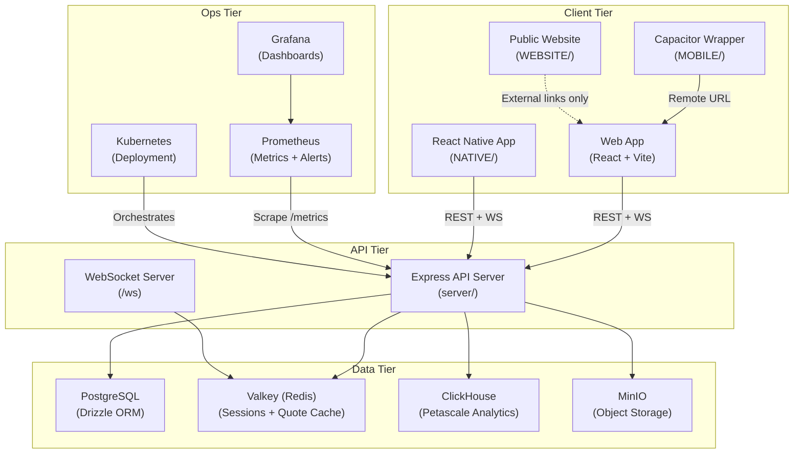

# System Overview

> **Diátaxis quadrant:** Explanation
> **Sources:** `README.md`, `AGENTS.md`, `PROJECT_STRUCTURE.md`

---

## What is TradeQuip?

TradeQuip (codebase `TD.2.ANTIGRAVITY`) is a self-hosted, low-latency trading platform built for institutional-grade security, compliance, and performance. It provides:

- **Real-time quote streaming** over WebSocket (`/ws`) with deterministic trade lifecycle behavior
- **Institutional-grade security** — policy gating, jurisdiction controls, legal acceptance chains, and tamper-evident audit trails
- **Aggressive startup performance** — quote-first readiness model with tiered prefetch, encrypted persistent cache, and service-worker shell caching
- **Multi-platform delivery** — web (React + Vite), Capacitor wrapper (Android/iOS), and React Native (Android/iOS)

---

## Component Topology

---

## Technology Stack

| Component | Path | Technology | Dependencies |
|---|---|---|---|
| Public Website | `WEBSITE/` | React 18 + Vite + Express | `WEBSITE/node_modules/` |
| Web Frontend | `client/` | React 18 + Vite + Tailwind + shadcn/ui | `node_modules/` (root) |
| Backend API | `server/` | Express + Node + TypeScript | `node_modules/` (root) |
| Shared Contracts | `shared/` | TypeScript + Zod + Drizzle ORM | `node_modules/` (root) |
| Database Layer | `db/` | Drizzle ORM + PostgreSQL | `node_modules/` (root) |
| Capacitor Wrapper | `MOBILE/` | Capacitor 8 (remote WebView) | `MOBILE/node_modules/` |
| Native Apps | `NATIVE/` | React Native 0.83 | `NATIVE/node_modules/` |
| Observability | `ops/` | Grafana + Prometheus + K8s | N/A (shell/YAML) |
| Petascale Analytics | `petascale/` | ClickHouse + Prometheus | N/A (docker-compose) |
| Kubernetes | `k8s/` | YAML manifests | N/A |
| E2E Tests | `e2e/` | Playwright | `node_modules/` (root) |

---

## Multi-Role Process Model

The server supports multi-process role separation for horizontal scaling:

| Role | Responsibilities | Env Config |
|---|---|---|
| `monolith` | All roles combined (default) | `APP_ROLE=monolith` |
| `api` | REST API + WebSocket server | `APP_ROLE=api` |
| `worker` | Background jobs, schedulers, admin views | `APP_ROLE=worker` |
| `ingestor` | Quote feed ingestion, auto-close, margin calls | `APP_ROLE=ingestor` |

Roles can be combined: `APP_ROLE=api,ws` or run individually for targeted scaling.

---

## Key Invariants (Non-Negotiable)

1. **Deterministic trade state transitions** — no invalid transitions, no silent partial writes
2. **Append-only audit trails** — attributable with correlation IDs (who/what/when)
3. **Server-side policy gating** — cannot be bypassed from the client
4. **Jurisdiction enforcement** — consistent across signup, login, and active sessions
5. **Legal acceptance integrity** — tamper-evident via HMAC signing/verification
6. **Trade ledger guardrails** — PostgreSQL triggers prevent accidental deletion/truncation of trade data

---

## Related Pages

- [Quick Start →](01_Quick_Start.md)
- [Project Deep Map →](02_Project_Deep_Map.md)
- [Architecture Reference →](../02_Architecture_Reference/00_System_Overview.md)
- [Security Guardrails →](../05_Security_Reference/00_Security_Guardrails.md)
