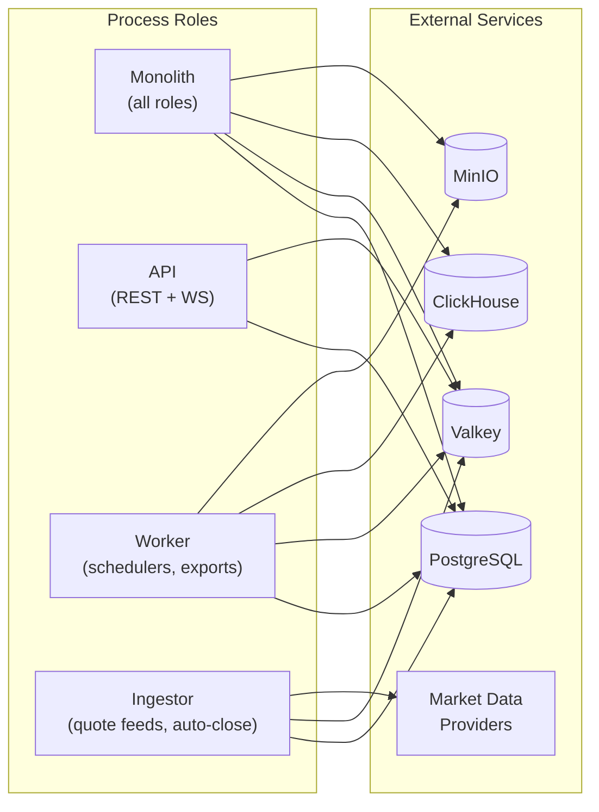
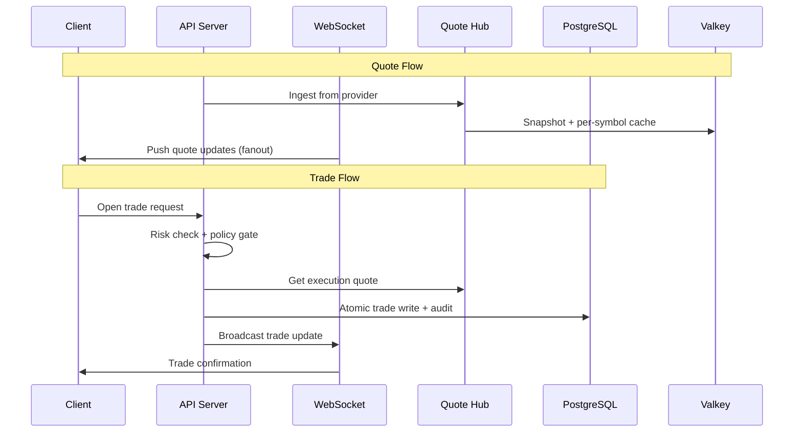

# Architecture Overview

> **Diátaxis quadrant:** Explanation
> **Sources:** `AGENTS.md`, `README.md`, `server/index.ts`

---

## System Architecture

TradeQuip runs as a monolithic Node.js application that can be split into role-separated processes for horizontal scaling.

### Role Separation

The `APP_ROLE` environment variable controls which subsystems run in each process:

- **`monolith`** (default) — runs everything: API server, WebSocket, quote ingestion, all schedulers
- **`api`** — HTTP routes, WebSocket server, quote hub. No background jobs.
- **`worker`** — admin views, data exports, ClickHouse sync, grift evaluation, challenge evaluation, account lifecycle sweeps, i18n worker
- **`ingestor`** — quote feed, excursion tracking, auto-close scheduler, margin-call scheduler

### Startup Sequence

1. Environment validation (`validateEnvVars()`) — fail-fast on missing critical secrets
2. OpenTelemetry tracing initialization
3. Trade ledger guardrail assertion — verifies PostgreSQL anti-deletion triggers exist
4. Express middleware stack (security headers, TLS enforcement, CORS, JSON parsing)
5. Route registration + WebSocket server setup
6. Vite dev server (development) or static serving (production)
7. Server listen on port `5000`
8. **Deferred initialization** (via `setImmediate`) — quote hub bootstrap, legal seeding, market data sync, i18n ingest, all schedulers

> The deferred initialization pattern ensures health checks at `/status` and `/ready` pass quickly during deployment before expensive operations complete.

---

## Data Flow

---

## Related Pages

- [Client Frontend →](01_Client_Frontend.md)
- [Server Backend →](02_Server_Backend.md)
- [Trading Engine →](07_Trading_Engine.md)
- [WebSocket Protocol →](05_WebSocket_Protocol.md)
- [Background Jobs →](06_Background_Jobs.md)
