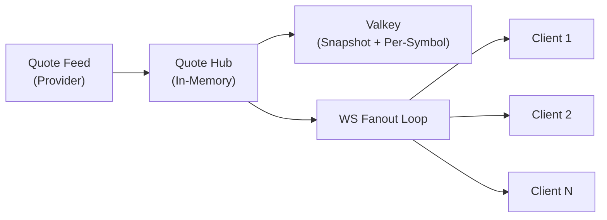

# WebSocket Protocol

> **Diátaxis quadrant:** Reference
> **Sources:** `.agents/deep-context.md` §Quotes, `.agents/performance.md` §Bandwidth, `shared/ws/protocol.ts`, `server/routes/wsCore.ts`

---

## Connection

- **Endpoint:** `/ws`
- **Transport:** WebSocket over HTTPS (WSS in production)
- **Authentication:** Session-based (same cookies as REST API)
- **Origin validation:** Server rejects connections from disallowed origins (close code `4403`)

---

## Abuse Controls

| Control | Env Variable | Behavior |
|---|---|---|
| Per-user connection cap | `WS_MAX_CONNECTIONS_PER_USER` | New connections rejected (close `4409`) |
| Message rate limit | `WS_MESSAGE_RATE_LIMIT` / `WS_MESSAGE_RATE_WINDOW_MS` | Excess messages close connection (`4408`) |
| Payload size cap | `WS_MAX_MESSAGE_BYTES` | Oversized frames rejected by transport |

---

## Message Types

| Direction | Type | Purpose |
|---|---|---|
| Server → Client | `quotes:update` | Quote snapshot/delta push |
| Server → Client | `trades:update` | Trade state changes |
| Server → Client | `account:update` | Account recalculation results |
| Server → Client | `global-settings:updated` | Live config propagation |
| Client → Server | `subscribe` | Quote symbol subscription |
| Client → Server | `unsubscribe` | Quote symbol unsubscription |

---

## Fanout Architecture

**Performance rules:**
- Subscription keying must be stable (no per-message recomputation of symbol sets)
- Send loops must be non-blocking (no synchronous heavy work)
- Admin-configured `wsPushFrequencyMs` controls fanout pacing (batching)
- Prefer compact payloads; avoid redundant fields

---

## Metrics

| Metric | Type |
|---|---|
| `ws_active_connections` | Gauge |
| `ws_origin_rejected_total` | Counter |
| `ws_user_connection_limit_rejected_total` | Counter |
| `ws_message_rate_limited_total` | Counter |

---

## Related Pages

- [Client Frontend →](01_Client_Frontend.md)
- [Server Backend →](02_Server_Backend.md)
- [WebSocket Messages (API Reference) →](../03_API_Reference/01_WebSocket_Messages.md)
