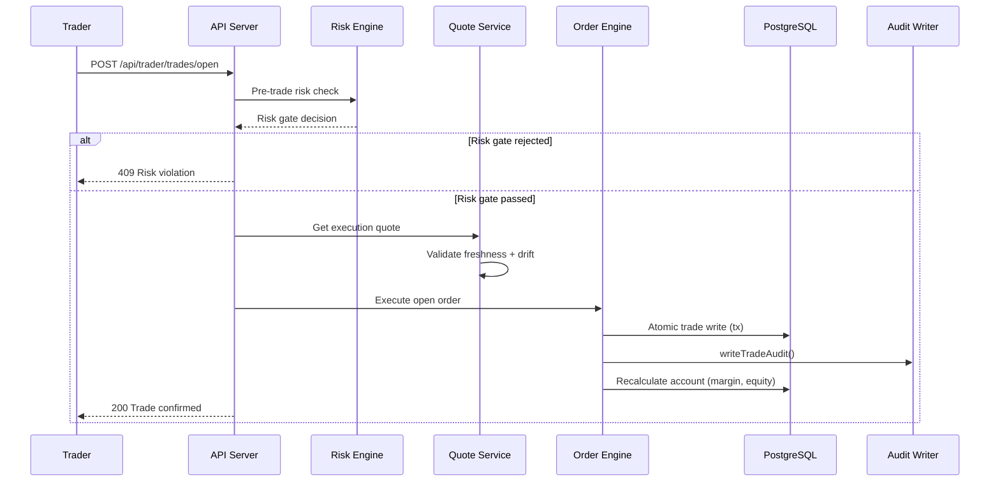

# Trading Engine

> **Diátaxis quadrant:** Explanation + Reference
> **Sources:** `.agents/deep-context.md` §Trading lifecycle, `.agents/security.md` §Financial invariants

---

## Overview

The trading engine is the safety-critical core of TradeQuip. It handles order execution, risk validation, margin calculation, and audit trail generation with deterministic state transitions.

---

## Execution Flow

---

## Key Components

| Component | File | Responsibility |
|---|---|---|
| **Order Engine** | `server/engine/orderEngine.ts` | Open/close/modify execution logic |
| **Risk Engine** | `server/risk.ts` | Pre-trade validation (limits, stale quote guard, market hours, maintenance) |
| **Margin Calculator** | `server/lib/margin.ts` | Margin requirement computation |
| **P&L Calculator** | `server/lib/realizedPnl.ts` | Realized profit/loss |
| **Account Recalculation** | `server/recalcAccount.ts` | Post-trade equity/margin updates |
| **Audit Writer** | `server/lib/auditWriter.ts` | Append-only audit trail with correlation IDs |
| **Excursion Tracker** | `server/trades/excursionTracking.ts` | Intraday high/low (MFE/MAE) via Valkey |
| **Quote Service** | `server/services/quoteService.ts` | Quote retrieval with fallback chain |

---

## Quote Revalidation at Commit

Trades revalidate execution quotes inside the commit transaction:

- **Stale quote:** Rejected if quote age exceeds `QUOTE_REVALIDATE_MAX_AGE_MS`
- **Timestamp regression:** Rejected if quote timestamp has regressed
- **Price drift:** Rejected if price moves beyond `QUOTE_REVALIDATE_MAX_EXEC_PRICE_DRIFT_BPS`

---

## Financial System Invariants

1. **Deterministic state transitions** — no invalid transitions, no silent partial writes
2. **Idempotency** where applicable (order creation/close, background engines)
3. **Audit trails** are append-only and attributable (who/what/when; correlation IDs)
4. **Policy gating** stays server-side and cannot be bypassed from the client
5. **Jurisdiction restrictions** enforced consistently (signup, login, active sessions)
6. **Legal acceptance integrity** — tamper-evident (HMAC signing/verification)

---

## Related Pages

- [Server Backend →](02_Server_Backend.md)
- [Security Guardrails →](../05_Security_Reference/00_Security_Guardrails.md)
- [Background Jobs →](06_Background_Jobs.md)
