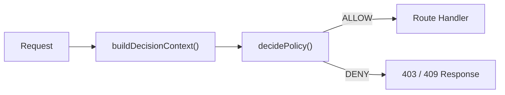

# Policy Decision Gates

> **Diátaxis quadrant:** Reference
> **Sources:** `shared/policyDecision.ts`, `server/middleware/requirePolicy.ts`, `server/policy/buildDecisionContext.ts`

---

## Overview

Policy gates enforce server-side authorization for trading actions. They cannot be bypassed from the client.

---

## How It Works



1. `buildDecisionContext()` assembles inputs (user state, jurisdiction, verification status, legal coverage, account status)
2. `decidePolicy()` evaluates the context against configured rules
3. `requirePolicy()` middleware rejects requests that fail the gate

---

## Discovery Command

```bash
rg -n "requirePolicy\(|decidePolicy\(|featureGates\(" server shared
```

---

## Key Files

| File | Purpose |
|---|---|
| `shared/policyDecision.ts` | Policy types and decision logic (~14KB) |
| `server/middleware/requirePolicy.ts` | Express middleware enforcement |
| `server/policy/buildDecisionContext.ts` | Context assembly from session/DB state |
| `server/policy/jurisdictionControl.ts` | Jurisdiction-specific controls |

---

## Related Pages

- [Security Guardrails →](../05_Security_Reference/00_Security_Guardrails.md)
- [Server Backend →](../02_Architecture_Reference/02_Server_Backend.md)
