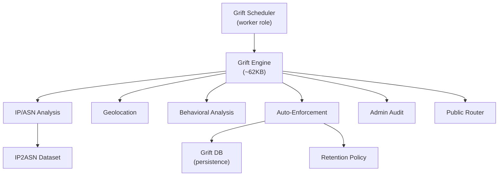

# Anti-Fraud (Grift) Engine

> **Diátaxis quadrant:** Explanation + Reference
> **Sources:** `.agents/deep-context.md` §Grift, `server/grift/` (13 files)

---

## Overview

The Grift engine detects and enforces against fraudulent trader behavior. It runs as a background scheduler on the `worker` role, processing trader account signals through IP/ASN analysis, geolocation comparison, and behavioral pattern detection.

---

## Architecture

---

## Components

| File | Size | Purpose |
|---|---|---|
| `server/grift/griftEngine.ts` | ~62KB | Core detection engine — IP/ASN correlation, geolocation comparison, behavioral scoring, multi-signal aggregation |
| `server/grift/griftIpAsn.ts` | ~13KB | IP address to Autonomous System Number resolution and enrichment |
| `server/grift/griftIp2AsnDataset.ts` | ~11KB | IP2ASN dataset loader and lookup |
| `server/grift/griftGeo.ts` | ~8KB | Geolocation analysis — coordinate comparison, region validation, impossible travel detection |
| `server/grift/griftAutoEnforcement.ts` | ~6KB | Automated enforcement actions — account restrictions, session termination, trading blocks |
| `server/grift/griftAdminAudit.ts` | ~5KB | Admin-facing audit trail for grift decisions |
| `server/grift/griftScheduler.ts` | ~5KB | Periodic evaluation scheduler with dynamic interval configuration |
| `server/grift/griftRetention.ts` | ~4KB | Data retention policies for grift detection artifacts |
| `server/grift/griftTypes.ts` | ~4KB | TypeScript types and interfaces for the grift domain |
| `server/grift/griftDb.ts` | ~4KB | Database persistence layer for grift signals and decisions |
| `server/grift/griftDefaults.ts` | ~1KB | Default configuration values |
| `server/grift/griftPublicRouter.ts` | ~2KB | Public-facing routes for grift status |
| `server/grift/griftEngine.test.ts` | ~3KB | Unit tests for detection logic |
| `server/routes/grift.ts` | — | Admin grift management routes (view, override, configure) |

---

## Detection Signals

| Signal | Source | What It Detects |
|---|---|---|
| IP/ASN analysis | `griftIpAsn.ts` + `griftIp2AsnDataset.ts` | VPN/proxy usage, datacenter IPs, ASN anomalies |
| Geolocation | `griftGeo.ts` | Impossible travel, jurisdiction mismatch, coordinate spoofing |
| Behavioral | `griftEngine.ts` | Trading pattern anomalies, account velocity, multi-account correlation |

## Enforcement Actions

The auto-enforcement module can apply graduated restrictions:

- Account flagging (investigation queue)
- Trading restrictions (read-only mode)
- Session termination
- Account freeze/disable

All enforcement actions are audit-logged with correlation IDs and admin-reversible.

---

## Schema

Grift data is stored in tables defined in `shared/schema.pg.grift.ts` (~19KB), including:
- Signal detection records
- Decision audit trail
- Enforcement action history
- IP/ASN enrichment cache

---

## Related Pages

- [Security Guardrails →](00_Security_Guardrails.md)
- [Legal & Compliance →](02_Legal_Compliance.md)
- [Trading Engine →](../02_Architecture_Reference/07_Trading_Engine.md)
- [Background Jobs →](../02_Architecture_Reference/06_Background_Jobs.md)
