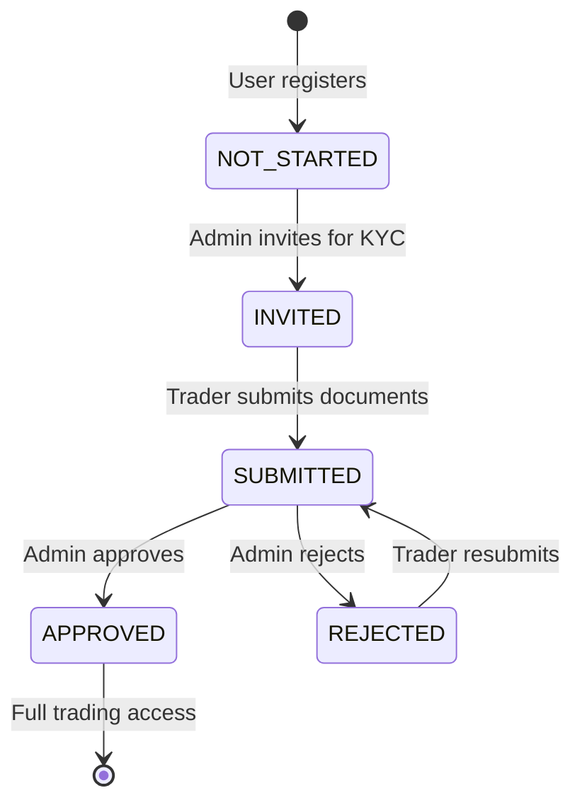

# Legal & Compliance

> **Diátaxis quadrant:** Explanation + Reference
> **Sources:** `.agents/deep-context.md` §Legal terms, `server/legal/`, `server/routes/profileCore.ts`, `server/routes/adminKyc.ts`, `server/routes/verification.ts`, `shared/schema.pg.identity.ts`

---

## Overview

TradeQuip implements multi-layered compliance: legal document acceptance with tamper-evident HMAC tokens, KYC/AML identity verification with policy gating, email/SMS verification with keyed hashing, and jurisdiction-level access controls.

---

## Legal Document Acceptance

Legal compliance uses HMAC-signed tokens to ensure tamper-evident acceptance records.

| File | Purpose |
|---|---|
| `server/legal/cryptoUtils.ts` | HMAC signing + token verification |
| `server/legal/coverageGate.ts` | Terms coverage gates — blocks trading if docs not accepted |
| `server/legal/regionRules.ts` | Region-specific legal rules |
| `server/legal/legalAcceptanceService.ts` | Acceptance recording (transaction-aware) |
| `server/legal/legalDocChangeAuditService.ts` | Document change audit trail |
| `server/legal/bootstrapDoc1Seed.ts` | Document 1 seeding |
| `server/legal/bootstrapDoc2Seed.ts` | Document 2 seeding |
| `scripts/legalSeedDoc2.ts` | Doc 2 seed script |

### Key Invariants

- **Atomic signup:** User creation and mandatory legal acceptance commit in one DB transaction — no orphaned accounts
- **Fail-closed reacceptance:** If legal reacceptance computation is unavailable and no snapshot can assert status, `/api/auth/current-user` blocks trading (`legalReacceptRequired=true`, `legalReacceptBlocked=true`, reason `LEGAL_STATUS_UNAVAILABLE`)
- **Impersonation isolation:** Impersonated sessions never expose `realAdminId`/`realAdminEmail`
- **HMAC secret:** `LEGAL_TERMS_HMAC_SECRET` must be ≥ 32 chars

---

## KYC / AML Identity Verification

### KYC Lifecycle

### KYC Architecture

| Component | File | Purpose |
|---|---|---|
| KYC schema | `shared/schema.pg.identity.ts` (~8KB) | `userKycProfiles` table definition |
| Trader KYC routes | `server/routes/profileCore.ts` | `GET /api/profile/kyc`, `POST /api/profile/kyc/submit` |
| Admin KYC routes | `server/routes/adminKyc.ts` | Admin KYC review, approve, reject, invite |
| Policy gates | `server/routes/profileCore.ts` | `requirePolicy("KYC_VIEW")`, `requirePolicy("KYC_SUBMIT")` |
| Identity audit | `server/services/identityAudit.ts` | Identity change tracking |

### KYC Policy Integration

KYC status feeds into the policy decision engine:

- **`KYC_VIEW`** — Controls whether a trader can see the KYC section
- **`KYC_SUBMIT`** — Controls whether a trader can submit KYC documents
- **Challenge eligibility** — `requireKycApproved` gate blocks challenge enrollment if KYC is not `APPROVED`
- **Payout access** — Payout endpoints are guarded by `requirePolicy("KYC_VIEW")`
- **Mailbox KYC notifications** — `messagingKycMailboxEnabled`, `notificationKycUpdatesEnabled` settings

---

## Email & SMS Verification

| Component | File | Purpose |
|---|---|---|
| Email token hashing | `server/security/emailVerificationToken.ts` | HMAC-based token derivation |
| Verification routes | `server/routes/verification.ts` | Email verify, resend, SMS OTP |
| Verification cron | `server/cron/verificationReminders.ts` | Reminder emails for unverified users |
| SMS OTP security | `server/security/smsOtpToken.ts` | HMAC + timing-safe comparison |
| Captcha | `server/security/captcha.ts` | Slider CAPTCHA single-use with distributed lock |

### Key Requirements

- **Email verification tokens** use HMAC with `EMAIL_VERIFY_TOKEN_SECRET` — plain SHA fallback is forbidden
- **SMS OTPs** use keyed HMAC + timing-safe comparison
- **CAPTCHA** is single-use across multi-process deployments via Valkey `SET NX PX`

---

## Jurisdiction Controls

| Component | File | Purpose |
|---|---|---|
| Jurisdiction guard | `server/middleware/jurisdictionSessionGuard.ts` | Active session jurisdiction enforcement |
| Jurisdiction control | `server/policy/jurisdictionControl.ts` | Country/timezone access rules |
| Compliance runbooks | `JURISDICTION_CONTROLS_VERIFICATION_RUNBOOK.md` | Verification procedures |
| Country/timezone controls | `CODEX_COUNTRY_TIMEZONE_CONTROLS.md` | Control definitions |

Jurisdiction enforcement is **consistent across signup, login, and active sessions** — a core non-negotiable invariant.

---

## Related Pages

- [Security Guardrails →](00_Security_Guardrails.md)
- [Production Requirements →](04_Production_Requirements.md)
- [Policy Decision Gates →](../03_API_Reference/02_Policy_Gates.md)
- [Trading Engine →](../02_Architecture_Reference/07_Trading_Engine.md)
