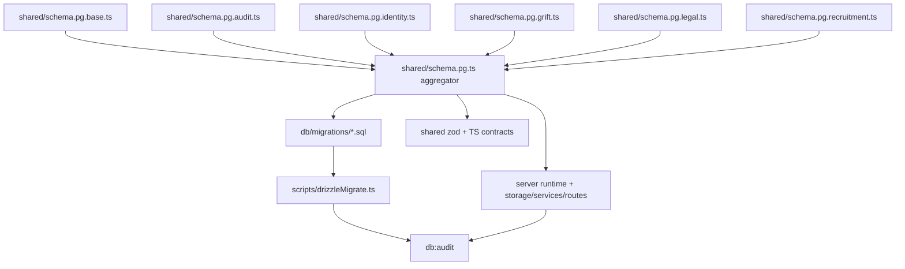

# Database Architecture

## Schema Shape

The Postgres schema is intentionally split by domain:

- `schema.pg.base.ts`: core product tables such as users, sessions, trades, quotes, mailbox, notifications, push devices, global settings, and system config
- `schema.pg.audit.ts`: audit and historical tables
- `schema.pg.identity.ts`: verification, MFA, KYC, payout, and identity audit surfaces
- `schema.pg.grift.ts`: fraud signals, scores, links, and enforcement state
- `schema.pg.legal.ts`: legal documents, pointers, acceptances, and legal-change audit
- `schema.pg.recruitment.ts`: challenge, scouting, recruitment, and partner-adjacent recruitment data

`shared/schema.pg.ts` is the aggregator and re-export layer. New tables should be added to a domain file first, then surfaced through the aggregator.

## Topology

## Runtime Coupling

- the Express session store is backed by the `session` table
- trade, audit, and order-intent durability rely on schema plus migration guardrails
- runtime config, policy decisions, legal coverage, i18n, partner, and admin-export paths all depend on schema-backed state

## Migration Path

1. change the correct `shared/schema.pg.*.ts` file
2. generate SQL with `npm run db:generate`
3. apply with `npm run db:migrate:drizzle`
4. validate with `npm run db:audit`

`scripts/drizzleMigrate.ts` is not a thin shell. It ensures `drizzle.__drizzle_migrations` exists, computes missing hashes from `db/migrations/`, and applies each missing migration transactionally.

## Gold-Standard Rules

- do not collapse domain files back into one schema dumping ground
- treat schema changes as contract changes when web/mobile/server consumers rely on them
- when the table affects trading, audit, identity, or legal state, verify the adjacent runtime invariants explicitly
