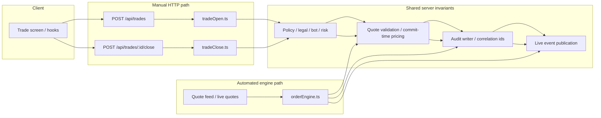

# Trading Engine

## Separation Of Responsibilities

- manual trade open is handled by `server/routes/trader/tradeOpen.ts`
- manual trade close is handled by `server/routes/trader/tradeClose.ts`
- `server/engine/orderEngine.ts` processes pending orders and SL/TP events against live quotes

That split is intentional and replaces the old legacy documentation error that treated `orderEngine.ts` as the manual HTTP execution path.

## Execution Topology

## Manual Trade Path

The manual trade routes layer:

- auth and legal acceptance
- server-side policy gating through `requirePolicy`
- bot guard
- risk middleware
- server-authoritative quote lookup and quote revalidation
- audit writes and correlation IDs
- balance/margin mutation helpers
- live-event broadcasts

## Engine Path

The order engine is a system actor. It consumes live quotes, evaluates pending orders and stops/targets, recalculates accounts, emits notifications, and writes audit events using system provenance.

## Invariants

- trade decisions stay server-side
- quote revalidation remains authoritative at commit time
- audit trails remain attributable and append-oriented
- pending-order and SL/TP automation must not be described as client-driven behavior
