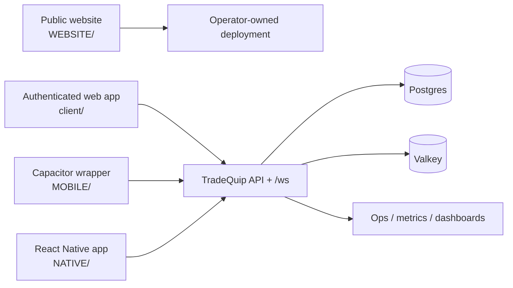

# Platform Overview

TradeQuip is a self-hosted trading platform that combines:

- real-time quote streaming
- deterministic trade lifecycle handling
- web delivery plus mobile surfaces
- compliance, jurisdiction, and audit controls
- operator-owned deployment and observability boundaries

Platform surfaces:

- authenticated web application for traders, admins, and partners
- public website and education experience
- Capacitor wrapper for the authenticated web application
- React Native mobile application for native-device workflows

## Platform Topology

Non-negotiable platform goals:

- low-latency market data delivery
- predictable trade behavior
- institutional-grade security and auditability
- bandwidth-aware live updates

Public-safe product summary:

- the authenticated product exposes HTTP APIs plus a WebSocket transport for live market and account updates
- compliance controls are part of the product design, not an add-on; verification, legal acceptance, and policy gating are part of normal user flow
- mobile support exists in two forms: a wrapper that preserves same-origin app behavior and a separate native app that reuses backend contracts
- the public website is intentionally a separate module and does not share authenticated runtime state with the trading app

## Technology Snapshot

| Surface | Repo path | Current stack | Notes |
| --- | --- | --- | --- |
| Authenticated web application | `client/` + root runtime | React 19.2 + Vite 7 + TanStack Query | This is the main trading app. |
| Backend transport | `server/` | Express 5 + HTTP API + `/ws` transport | Serves authenticated app, mobile, and live updates. |
| Public website | `WEBSITE/` | React 18.3 + Vite 7 + Express 4 | Separate public-safe marketing and education module. |
| Wrapper mobile shell | `MOBILE/` | Capacitor 8 remote WebView shell | Reuses authenticated web behavior rather than reimplementing screens. |
| Native mobile app | `NATIVE/` | React Native 0.83 | Reuses backend contracts while owning native navigation/device APIs. |

The React-version correction is surface-specific: the authenticated app is on React 19, while the separate `WEBSITE/` module remains on React 18.
