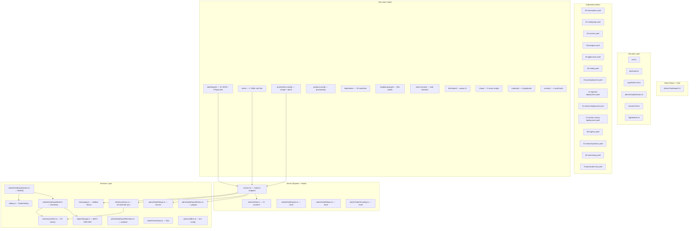

# DEEP_MAP.md — Petascale & Dashboard Integration Audit Map

> **Purpose:** Complete file-by-file reference for auditing how **every component** of the Petascale enhancement, dashboard integration, and Systems Ready Plan fits together. Every file is annotated with its role, what it wires to, and which enhancement iteration produced it.

---

## Architecture Overview

---

## 1. Server Core — Metrics Emission

### [wsCore.ts](file:///\\wsl.localhost\Ubuntu\home\bcodex\TD.2.ANTIGRAVITY\server\routes\wsCore.ts) (55 KB)
<!-- Enhancement: Iteration 1 (Systems Ready Plan WS-B) — added /metrics endpoint -->
<!-- Enhancement: Iteration 2 (Dashboard wiring) — expanded from ~20 to 60+ metrics -->
- **Role:** Express route file. Hosts the `/metrics` HTTP GET endpoint that emits **all 60+ Prometheus metrics** in text exposition format.
- **Wires to:**
  - `metricsState.ts` → 13 core counters (login attempts, CSRF 403s, bot challenges, WS origin/limit/rate, trade rejections)
  - `adminDataExportMetrics.ts` → 18 export pipeline gauges/counters
  - `adminDataRollups.ts` → 8 rollup refresh metrics via `getAdminDataRollupMetricsSnapshot()`
  - `clickhouseSync.ts` → 10+ CH sync metrics via `getClickHouseSyncMetricsSnapshot()`
  - `messaging.ts` → 5 mailbox fanout metrics via `getMessagingMetrics()`
  - `quoteService.ts` → rate limiter stats via `getProviderRateLimitStats()`
  - `quoteHub.ts` → QuoteHub state (size, seq, asof)
- **Consumed by:** All 4 custom Grafana dashboards, Prometheus scrape job `tradehub-app`, all 20 alert rules

### [metricsState.ts](file:///\\wsl.localhost\Ubuntu\home\bcodex\TD.2.ANTIGRAVITY\server\routes\metricsState.ts) (2.5 KB)
<!-- Enhancement: Iteration 1 (Systems Ready WS-B7) — created with initial counters -->
- **Role:** Defines and exports **13 atomic counters** with increment functions
- **Metrics:** `login_attempts_total{result}`, `http_responses_total{status,route}`, `bot_challenges_issued_total`, `ws_origin_rejected_total`, `ws_user_connection_limit_rejected_total`, `ws_message_rate_limited_total`, `ws_quote_permission_refresh_total`, `ws_quote_permission_refresh_errors_total`, `admin_active_sessions`, `trade_close_rejected_quote_stale_total`, `trade_targets_rejected_quote_stale_total`, `trade_open_rejected_quote_revalidation_total`, `trade_close_rejected_quote_revalidation_total`
- **Wired from:** `authCore.ts`, `csrf.ts`, `botGuard.ts`, `wsCore.ts` WebSocket handlers, `tradeAtomic.ts`
- **Consumed by:** `wsCore.ts` → `/metrics`, then → `security-events.json`, `app-red-metrics.json`, `ops-overview.json` dashboards

---

## 2. Petascale Services Layer

### [objectStorage.ts](file:///\\wsl.localhost\Ubuntu\home\bcodex\TD.2.ANTIGRAVITY\server\services\objectStorage.ts) (6.6 KB)
<!-- Enhancement: Iteration 1 — created with AES256 SSE-S3 -->
<!-- Enhancement: Final Gap Closure — PATCHED to aws:kms SSE-KMS for KES key rotation -->
- **Role:** MinIO client wrapper. Handles artifact upload (SSE-KMS encrypted), pre-signed download links (TTL-bound), local disk fallback, artifact deletion
- **Key line:** `"X-Amz-Server-Side-Encryption": "aws:kms"` (line 104)
- **Wires to:** `petascaleEnv.ts` (config), `adminDataExportBuild.ts` (caller)
- **Consumed by:** `adminDataExports.ts` route (download link generation)

### [clickhouseClient.ts](file:///\\wsl.localhost\Ubuntu\home\bcodex\TD.2.ANTIGRAVITY\server\services\clickhouseClient.ts) (2.1 KB)
<!-- Enhancement: Iteration 1 (WS-05) — ClickHouse client factory -->
- **Role:** Factory for `@clickhouse/client` connection with TLS, auth, and database config
- **Wires to:** `petascaleEnv.ts` (env: `CLICKHOUSE_URL`, `CLICKHOUSE_DATABASE`, etc.)
- **Consumed by:** `clickhouseSync.ts`, `adminDataExportBuildClickhouse.ts`

### [clickhouseSync.ts](file:///\\wsl.localhost\Ubuntu\home\bcodex\TD.2.ANTIGRAVITY\server\services\clickhouseSync.ts) (39.7 KB)
<!-- Enhancement: Iteration 1 (WS-05) — incremental sync with high-watermark -->
- **Role:** Incremental sync worker (Postgres → ClickHouse). Syncs users, trades, daily closes, events tables. Exports snapshot metrics
- **Metrics emitted:** `clickhouse_sync_running`, `clickhouse_sync_last_duration_ms`, `clickhouse_sync_rows_total`, `clickhouse_sync_last_{users,trades,daily,event}_rows`
- **Wires to:** `clickhouseClient.ts`, `petascaleEnv.ts`
- **Consumed by:** `wsCore.ts` `/metrics` → `export-analytics-pipeline.json`, `ops-overview.json`

### [adminDataExportQueue.ts](file:///\\wsl.localhost\Ubuntu\home\bcodex\TD.2.ANTIGRAVITY\server\services\adminDataExportQueue.ts) (12.7 KB)
<!-- Enhancement: Iteration 1 (WS-04) — BullMQ queue + worker lifecycle -->
- **Role:** BullMQ queue definition, worker processor, stall recovery, dedup logic, `startAdminDataExportWorker()` entrypoint
- **Wires to:** `valkey.ts` (Redis connection), `adminDataExportBuild.ts` (job processor), `adminDataExportMetrics.ts` (job lifecycle counters), `petascaleEnv.ts` (concurrency, backoff, max attempts)
- **Started by:** `server/index.ts:532` under `APP_ROLE=worker`

### [adminDataExportBuild.ts](file:///\\wsl.localhost\Ubuntu\home\bcodex\TD.2.ANTIGRAVITY\server\services\adminDataExportBuild.ts) (87.5 KB)
<!-- Enhancement: Iteration 1 (WS-04) — streaming export with safeCsv -->
- **Role:** Core export builder. Generates CSV/JSONL/Parquet artifacts for all admin data types. Uses `createStreamingExportWriter()` for memory-safe streaming
- **Key defenses:** `safeCsv()` (line 135-143) neutralizes `=+-@` CSV injection prefixes
- **Wires to:** `objectStorage.ts` (artifact upload), `adminDataExportRepo.ts` (DB queries), `adminDataExportBuildClickhouse.ts` (CH-sourced queries)

### [adminDataExportBuildClickhouse.ts](file:///\\wsl.localhost\Ubuntu\home\bcodex\TD.2.ANTIGRAVITY\server\services\adminDataExportBuildClickhouse.ts) (24.6 KB)
<!-- Enhancement: Iteration 1 (WS-05) — CH-backed export queries -->
- **Role:** ClickHouse-native SQL queries for heavy export jobs (billions of rows)
- **Wires to:** `clickhouseClient.ts`

### [adminDataExportMetrics.ts](file:///\\wsl.localhost\Ubuntu\home\bcodex\TD.2.ANTIGRAVITY\server\services\adminDataExportMetrics.ts) (2.7 KB)
<!-- Enhancement: Iteration 1 (WS-04) — export pipeline Prometheus metrics -->
- **Role:** 18 gauges/counters for export pipeline: job lifecycle (created, started, succeeded, failed, canceled, expired, deduped), queue depth (waiting, active, delayed, failed, completed), retention sweeps, last job duration
- **Consumed by:** `wsCore.ts` `/metrics` → `export-analytics-pipeline.json`

### [adminDataExportRetention.ts](file:///\\wsl.localhost\Ubuntu\home\bcodex\TD.2.ANTIGRAVITY\server\services\adminDataExportRetention.ts) (4 KB)
<!-- Enhancement: Iteration 1 (WS-04) — stuck job sweeper + retention -->
- **Role:** Periodic retention sweeper for completed/failed export jobs. Cleans up MinIO artifacts
- **Wires to:** `objectStorage.ts` (delete artifacts), `adminDataExportMetrics.ts` (sweep counter)

### [adminDataExportRepo.ts](file:///\\wsl.localhost\Ubuntu\home\bcodex\TD.2.ANTIGRAVITY\server\services\adminDataExportRepo.ts) (12.5 KB)
<!-- Enhancement: Iteration 1 (WS-04) — export job DB CRUD -->
- **Role:** Postgres CRUD for `admin_data_export_jobs` and `admin_data_export_job_events` tables

### [adminDataRollups.ts (service)](file:///\\wsl.localhost\Ubuntu\home\bcodex\TD.2.ANTIGRAVITY\server\services\adminDataRollups.ts) (24.1 KB)
<!-- Enhancement: Iteration 1 (WS-02) — background rollup aggregation -->
- **Role:** Background rollup calculator. Periodically aggregates KPI/funnel/analytics/compliance into `admin_data_rollups` table for O(1) dashboard reads
- **Metrics emitted:** `admin_data_rollup_refresh_running`, `_total`, `_failed_total`, `_last_duration_ms`, `_last_refreshed_metric_count`, `_recompute_total`
- **Consumed by:** `wsCore.ts` `/metrics` → `export-analytics-pipeline.json` rollup section

### [petascaleEnv.ts](file:///\\wsl.localhost\Ubuntu\home\bcodex\TD.2.ANTIGRAVITY\server\services\petascaleEnv.ts) (5.3 KB)
<!-- Enhancement: Iteration 1 (WS-04/05/06) — centralized petascale config -->
- **Role:** Centralized env config for all Petascale services. Reads `CLICKHOUSE_*`, `OBJECT_STORAGE_*`, `EXPORT_QUEUE_*`, `VALKEY_*` with production validation and sensible defaults
- **Consumed by:** Every Petascale service file

### [traderScoutQuery.ts](file:///\\wsl.localhost\Ubuntu\home\bcodex\TD.2.ANTIGRAVITY\server\services\traderScoutQuery.ts) (6.7 KB)
<!-- Enhancement: Iteration 1 (WS-03) — extracted from admin.ts, CTE-based batch -->
- **Role:** Extracted SQL for trader scouting. Uses CTE-based batch aggregation instead of N+1 inner loops
- **Note:** Uses OFFSET pagination (accepted deviation — bounded by 5M row LIMIT)

### [valkey.ts](file:///\\wsl.localhost\Ubuntu\home\bcodex\TD.2.ANTIGRAVITY\server\services\valkey.ts) (5 KB)
<!-- Pre-existing — Petascale iteration wired BullMQ through this -->
- **Role:** Valkey/Redis connection factory with TLS support
- **Consumed by:** `adminDataExportQueue.ts` (BullMQ), `sessionStore.ts`

### [messaging.ts](file:///\\wsl.localhost\Ubuntu\home\bcodex\TD.2.ANTIGRAVITY\server\services\messaging.ts) (72.2 KB)
<!-- Pre-existing — Petascale iteration added getMessagingMetrics() -->
- **Role:** Core messaging/mailbox system with E2EE. Exports `getMessagingMetrics()` for mailbox fanout depth/counters
- **Metrics:** `mailbox_fanout_queue_depth`, `_running`, `_enqueued_total`, `_processed_total`, `_failed_total`

---

## 3. Server Routes — Admin Data Surface

### [adminDataExports.ts](file:///\\wsl.localhost\Ubuntu\home\bcodex\TD.2.ANTIGRAVITY\server\routes\adminDataExports.ts) (17.5 KB)
<!-- Enhancement: Iteration 1 (WS-04) — async export API -->
- **Role:** REST API for export jobs: `POST create-job`, `GET status/list`, `POST cancel/retry`, `GET download-link`
- **Wires to:** `adminDataExportQueue.ts`, `adminDataExportRepo.ts`, `objectStorage.ts`

### [adminDataRollups.ts (route)](file:///\\wsl.localhost\Ubuntu\home\bcodex\TD.2.ANTIGRAVITY\server\routes\adminDataRollups.ts) (4.6 KB)
<!-- Enhancement: Iteration 1 (WS-02) — rollup-backed API -->
- **Role:** Serves pre-aggregated rollup data to the Admin Dashboard (O(1) reads)

### [adminTraderScouting.ts](file:///\\wsl.localhost\Ubuntu\home\bcodex\TD.2.ANTIGRAVITY\server\routes\adminTraderScouting.ts) (17.3 KB)
<!-- Enhancement: Iteration 1 (WS-03) — optimized trader search -->
- **Role:** Admin trader scouting endpoints
- **Wires to:** `traderScoutQuery.ts` (SQL)

### [adminDataLegacyCompat.ts](file:///\\wsl.localhost\Ubuntu\home\bcodex\TD.2.ANTIGRAVITY\server\routes\adminDataLegacyCompat.ts) (11.8 KB)
<!-- Enhancement: Iteration 1 — isolates legacy endpoints -->
- **Role:** Legacy compatibility layer, isolating old synchronous endpoints from the new async pipeline

---

## 4. Shared Contracts (Zod Schemas)

### [shared/admin/dataTab.ts](file:///\\wsl.localhost\Ubuntu\home\bcodex\TD.2.ANTIGRAVITY\shared\admin\dataTab.ts) (4.3 KB)
<!-- Enhancement: Gap closure — unified DataTab Zod validation -->
- **Role:** Unified Zod schemas for all DataTab request params (KPI, funnel, analytics, compliance, deactivated, all trades). Enforces bounded integers, range filters, strict typing

### [shared/admin/dataExports.ts](file:///\\wsl.localhost\Ubuntu\home\bcodex\TD.2.ANTIGRAVITY\shared\admin\dataExports.ts) (6.2 KB)
<!-- Enhancement: Iteration 1 (WS-04) — export type contracts -->
- **Role:** TypeScript types and Zod schemas for export job requests/responses

### [shared/admin/traderSearch.ts](file:///\\wsl.localhost\Ubuntu\home\bcodex\TD.2.ANTIGRAVITY\shared\admin\traderSearch.ts) (3.1 KB)
<!-- Enhancement: Iteration 1 (WS-03) — trader search contracts -->
- **Role:** Zod schemas for trader search row shapes, response shapes, breakdown, and trade extremes

---

## 5. Security Layer

### [server/security/csrf.ts](file:///\\wsl.localhost\Ubuntu\home\bcodex\TD.2.ANTIGRAVITY\server\security\csrf.ts) (5.7 KB)
- **Role:** Double-submit cookie CSRF pattern, SameSite enforcement
- **Wires to:** `metricsState.ts` (increments `http_responses_total{status=403}` on CSRF failure)

### [server/security/botGuard.ts](file:///\\wsl.localhost\Ubuntu\home\bcodex\TD.2.ANTIGRAVITY\server\security\botGuard.ts) (10.5 KB)
- **Wires to:** `metricsState.ts` (increments `bot_challenges_issued_total`)

### [server/security/loginRateLimit.ts](file:///\\wsl.localhost\Ubuntu\home\bcodex\TD.2.ANTIGRAVITY\server\security\loginRateLimit.ts) (4.4 KB)
- **Role:** IP+email compound rate limiting for login attempts

### [server/security/adminScopeSession.ts](file:///\\wsl.localhost\Ubuntu\home\bcodex\TD.2.ANTIGRAVITY\server\security\adminScopeSession.ts) (3.2 KB)
- **Role:** Admin scope session management, impersonation controls

### [server/security/sessionTrail.ts](file:///\\wsl.localhost\Ubuntu\home\bcodex\TD.2.ANTIGRAVITY\server\security\sessionTrail.ts) (14.6 KB)
- **Role:** Immutable audit trail with device fingerprinting

### [server/security/logSanitizer.ts](file:///\\wsl.localhost\Ubuntu\home\bcodex\TD.2.ANTIGRAVITY\server\security\logSanitizer.ts) (2.9 KB)
- **Role:** PII/secret stripping from server logs (PRD-SEC-019)

---

## 6. Kubernetes Manifests (k8s/)

### Core Infrastructure

| File | Role | Security |
|---|---|---|
| [00-namespace.yaml](file:///\\wsl.localhost\Ubuntu\home\bcodex\TD.2.ANTIGRAVITY\k8s\00-namespace.yaml) | `tradehub` namespace | — |
| [01-configmap.yaml](file:///\\wsl.localhost\Ubuntu\home\bcodex\TD.2.ANTIGRAVITY\k8s\01-configmap.yaml) | All env config incl. Petascale vars | — |
| [02-secrets.yaml](file:///\\wsl.localhost\Ubuntu\home\bcodex\TD.2.ANTIGRAVITY\k8s\02-secrets.yaml) | `ENCRYPTION_KEY`, DB creds, MinIO keys | PRD-K8S-001 |
| [03-postgres.yaml](file:///\\wsl.localhost\Ubuntu\home\bcodex\TD.2.ANTIGRAVITY\k8s\03-postgres.yaml) | PostgreSQL StatefulSet | — |
| [04-pgbouncer.yaml](file:///\\wsl.localhost\Ubuntu\home\bcodex\TD.2.ANTIGRAVITY\k8s\04-pgbouncer.yaml) | Connection pooler | — |
| [05-valkey.yaml](file:///\\wsl.localhost\Ubuntu\home\bcodex\TD.2.ANTIGRAVITY\k8s\05-valkey.yaml) | Valkey (Redis fork) for BullMQ + cache | — |

### App Deployments

| File | Role | Security Context |
|---|---|---|
| [10-api-deployment.yaml](file:///\\wsl.localhost\Ubuntu\home\bcodex\TD.2.ANTIGRAVITY\k8s\10-api-deployment.yaml) | API pods (`APP_ROLE=api`) | `runAsNonRoot`, `readOnlyRootFilesystem`, `drop: ALL` |
| [11-ingestor-deployment.yaml](file:///\\wsl.localhost\Ubuntu\home\bcodex\TD.2.ANTIGRAVITY\k8s\11-ingestor-deployment.yaml) | Market data ingestor | Same security pattern |
| [12-worker-deployment.yaml](file:///\\wsl.localhost\Ubuntu\home\bcodex\TD.2.ANTIGRAVITY\k8s\12-worker-deployment.yaml) | Export workers (`APP_ROLE=worker`) | Same security pattern |
| [13-worker-canary-deployment.yaml](file:///\\wsl.localhost\Ubuntu\home\bcodex\TD.2.ANTIGRAVITY\k8s\13-worker-canary-deployment.yaml) | Worker canary for safe rollouts | PRD-OPS-005 |

### Networking & Security

| File | Role |
|---|---|
| [30-ingress.yaml](file:///\\wsl.localhost\Ubuntu\home\bcodex\TD.2.ANTIGRAVITY\k8s\30-ingress.yaml) | TLS forced, RPS 200, connections 100 |
| [31-network-policies.yaml](file:///\\wsl.localhost\Ubuntu\home\bcodex\TD.2.ANTIGRAVITY\k8s\31-network-policies.yaml) | 5 NetworkPolicies isolating API, Worker, Ingestor, MinIO, ClickHouse |

### Monitoring & Petascale

| File | Role |
|---|---|
| [60-monitoring.yaml](file:///\\wsl.localhost\Ubuntu\home\bcodex\TD.2.ANTIGRAVITY\k8s\60-monitoring.yaml) | Prometheus (7 scrape jobs, 7 SLO alerts, 20Gi PVC, custom metrics adapter) |
| [70-petascale-infra.yaml](file:///\\wsl.localhost\Ubuntu\home\bcodex\TD.2.ANTIGRAVITY\k8s\70-petascale-infra.yaml) | ClickHouse StatefulSet, MinIO StatefulSet, KES deployment (TLS auto-cert), Valkey Exporter, Headlamp v0.29.2 |
| [RUNBOOK_WORKER_CANARY_API_CUTOVER.md](file:///\\wsl.localhost\Ubuntu\home\bcodex\TD.2.ANTIGRAVITY\k8s\RUNBOOK_WORKER_CANARY_API_CUTOVER.md) | Canary rollout procedure |

---

## 7. Ops Layer — Dashboards

### Custom TradeHub Grafana Dashboards (all real PromQL)

| File | Panels | Metrics Queried | Enhancement |
|---|---|---|---|
| [app-red-metrics.json](file:///\\wsl.localhost\Ubuntu\home\bcodex\TD.2.ANTIGRAVITY\ops\dashboards\app-red-metrics.json) (30 KB) | 14 | `ws_active_connections`, `quotehub_*`, `mailbox_fanout_*`, `marketdata_provider_ratelimit_*`, `trade_*_rejected_*` | Deep Dashboard Enhancement |
| [security-events.json](file:///\\wsl.localhost\Ubuntu\home\bcodex\TD.2.ANTIGRAVITY\ops\dashboards\security-events.json) (27 KB) | 10 | `login_attempts_total`, `http_responses_total{403}`, `bot_challenges_issued_total`, `ws_origin/limit/rate_*`, `ws_quote_permission_*` | Deep Dashboard Enhancement |
| [export-analytics-pipeline.json](file:///\\wsl.localhost\Ubuntu\home\bcodex\TD.2.ANTIGRAVITY\ops\dashboards\export-analytics-pipeline.json) (46 KB) | 21 | `admin_data_export_*` (18), `admin_data_rollup_*` (8), `clickhouse_sync_*` (10+) | Deep Dashboard Enhancement |
| [ops-overview.json](file:///\\wsl.localhost\Ubuntu\home\bcodex\TD.2.ANTIGRAVITY\ops\dashboards\ops-overview.json) (38 KB) | 14 | All 60+ metrics combined — executive single-pane view | Deep Dashboard Enhancement |

### Pre-existing / Scaffolded Dashboards

| File | Source |
|---|---|
| [bare-metal-health.json](file:///\\wsl.localhost\Ubuntu\home\bcodex\TD.2.ANTIGRAVITY\ops\dashboards\bare-metal-health.json) | Node Exporter metrics (WS-B1) |
| [cache-session-health.json](file:///\\wsl.localhost\Ubuntu\home\bcodex\TD.2.ANTIGRAVITY\ops\dashboards\cache-session-health.json) | Valkey Exporter metrics (WS-B5) |
| [clickhouse-olap.json](file:///\\wsl.localhost\Ubuntu\home\bcodex\TD.2.ANTIGRAVITY\ops\dashboards\clickhouse-olap.json) | ClickHouse native metrics (WS-B7) |
| [kubernetes-health.json](file:///\\wsl.localhost\Ubuntu\home\bcodex\TD.2.ANTIGRAVITY\ops\dashboards\kubernetes-health.json) | kube-state-metrics (WS-B2) |
| [minio-storage.json](file:///\\wsl.localhost\Ubuntu\home\bcodex\TD.2.ANTIGRAVITY\ops\dashboards\minio-storage.json) | MinIO cluster metrics (WS-B6) |
| [pigsty-master.json](file:///\\wsl.localhost\Ubuntu\home\bcodex\TD.2.ANTIGRAVITY\ops\dashboards\pigsty-master.json) | 56 Pigsty dashboards master |

### Pigsty Dashboard Directories (56 dashboards total)

| Directory | Content |
|---|---|
| `ops/dashboards/pigsty-pgsql/` | PostgreSQL deep monitoring |
| `ops/dashboards/pigsty-minio/` | MinIO cluster monitoring |
| `ops/dashboards/pigsty-node/` | Bare metal node monitoring |
| `ops/dashboards/pigsty-infra/` | Infrastructure overview |
| `ops/dashboards/pigsty-redis/` | Valkey/Redis monitoring |

---

## 8. Ops Layer — Prometheus Config

### [tradehub-scrape.yml](file:///\\wsl.localhost\Ubuntu\home\bcodex\TD.2.ANTIGRAVITY\ops\prometheus-config\tradehub-scrape.yml) (3.8 KB)
<!-- Enhancement: Deep Dashboard Enhancement — production scrape config -->
- **8 scrape targets:**
  1. `tradehub-app:3000` → `/metrics` (60+ app metrics)
  2. `postgres-exporter:9187` → PostgreSQL metrics
  3. `minio:9000` → `/minio/v2/metrics/cluster` (cluster-level)
  4. `minio:9000` → `/minio/v2/metrics/node` (node-level)
  5. `clickhouse:9363` → `/metrics` (CH native)
  6. `redis-exporter:9121` → Valkey metrics
  7. `node-exporter:9100` → Host metrics
  8. `tradehub-grafana:3000` → Grafana self-monitoring

### [tradehub-alerts.yml](file:///\\wsl.localhost\Ubuntu\home\bcodex\TD.2.ANTIGRAVITY\ops\prometheus-config\tradehub-alerts.yml) (7.9 KB)
<!-- Enhancement: Deep Dashboard Enhancement — 20 production alert rules -->
- **20 alert rules:**
  - Security (5): `HighLoginFailureRate`, `CsrfFailureSpike`, `BotChallengeSpike`, `WsOriginRejectionSpike`, `WsRateLimitTriggered`
  - Connectivity (3): `NoActiveWsConnections`, `QuoteHubEmpty`, `QuoteHubStale`
  - Trades (1): `TradeRejectionSpike`
  - Exports (2): `ExportQueueBacklog`, `ExportJobFailures`
  - ClickHouse (2): `ClickHouseSyncDown`, `ClickHouseSyncSlow`
  - Messaging (2): `MailboxFanoutBacklog`, `MailboxFanoutFailures`
  - Market Data (2): `ProviderRateLimitQueueHigh`, `ProviderRequestsRejected`
  - Rollups (2): `RollupRefreshFailing`, `RollupRefreshSlow`

---

## 9. Ops Layer — Kubernetes Manifests

| File | Role |
|---|---|
| [grafana-deployment.yaml](file:///\\wsl.localhost\Ubuntu\home\bcodex\TD.2.ANTIGRAVITY\ops\kubernetes\grafana-deployment.yaml) | Grafana OSS K8s Deployment + Service with ConfigMap volume mounts for all 64 dashboards |
| [grafana-provisioning.yaml](file:///\\wsl.localhost\Ubuntu\home\bcodex\TD.2.ANTIGRAVITY\ops\kubernetes\grafana-provisioning.yaml) | Auto-provisioning ConfigMap for datasources + dashboard folders |
| [headlamp-deployment.yaml](file:///\\wsl.localhost\Ubuntu\home\bcodex\TD.2.ANTIGRAVITY\ops\kubernetes\headlamp-deployment.yaml) | Headlamp K8s admin frontend Deployment |
| [headlamp-ingress.yaml](file:///\\wsl.localhost\Ubuntu\home\bcodex\TD.2.ANTIGRAVITY\ops\kubernetes\headlamp-ingress.yaml) | Headlamp ingress under `/headlamp` with admin-only access |
| [headlamp-rbac.yaml](file:///\\wsl.localhost\Ubuntu\home\bcodex\TD.2.ANTIGRAVITY\ops\kubernetes\headlamp-rbac.yaml) | Read-only ClusterRole + ServiceAccount for Headlamp |
| [headlamp-plugins.yaml](file:///\\wsl.localhost\Ubuntu\home\bcodex\TD.2.ANTIGRAVITY\ops\kubernetes\headlamp-plugins.yaml) | ConfigMap with Prometheus/MinIO/ClickHouse Headlamp plugin configs |
| [node-exporter.yaml](file:///\\wsl.localhost\Ubuntu\home\bcodex\TD.2.ANTIGRAVITY\ops\kubernetes\node-exporter.yaml) | Node Exporter DaemonSet for host-level metrics |
| [kube-state-metrics.yaml](file:///\\wsl.localhost\Ubuntu\home\bcodex\TD.2.ANTIGRAVITY\ops\kubernetes\kube-state-metrics.yaml) | Kube-State-Metrics Deployment for K8s object metrics |
| [75-internal-tls.yaml](file:///\\wsl.localhost\Ubuntu\home\bcodex\TD.2.ANTIGRAVITY\ops\kubernetes\75-internal-tls.yaml) | cert-manager Certificates for internal TLS |
| [prometheus-ops-config.yaml](file:///\\wsl.localhost\Ubuntu\home\bcodex\TD.2.ANTIGRAVITY\ops\kubernetes\prometheus-ops-config.yaml) | Additional Prometheus config for ops scraping |

---

## 10. Ops Layer — Grafana Auto-Provisioning

### [provisioning/dashboards/tradehub.yaml](file:///\\wsl.localhost\Ubuntu\home\bcodex\TD.2.ANTIGRAVITY\ops\grafana-config\provisioning\dashboards\tradehub.yaml)
- **Role:** Auto-provisions all 64 dashboards into 6 Grafana folders: TradeHub, PostgreSQL, MinIO, Bare Metal/Node, Infrastructure, Valkey/Redis

### [provisioning/datasources/tradehub.yaml](file:///\\wsl.localhost\Ubuntu\home\bcodex\TD.2.ANTIGRAVITY\ops\grafana-config\provisioning\datasources\tradehub.yaml)
- **Role:** Auto-provisions Prometheus + Alertmanager as Grafana datasources

---

## 11. Ops Layer — Web Frontends

### [minio-monitor/static/index.html](file:///\\wsl.localhost\Ubuntu\home\bcodex\TD.2.ANTIGRAVITY\ops\minio-monitor\static\index.html)
<!-- Enhancement: Deep Dashboard Enhancement — dark-themed Chart.js 4 frontend -->
- **Role:** Standalone MinIO dashboard with doughnut (bucket sizes), line (API rates), bar (disk/network) charts
- **Data source:** Queries Prometheus API for `minio_cluster_*`, `minio_s3_requests_total`, `minio_bucket_usage_total_bytes`
- **Auto-refresh:** Every 30 seconds

### [bull-board/bullBoardSetup.ts](file:///\\wsl.localhost\Ubuntu\home\bcodex\TD.2.ANTIGRAVITY\ops\bull-board\bullBoardSetup.ts) (2.5 KB)
<!-- Enhancement: Petascale integration -->
- **Role:** Express adapter mounting BullMQ queue monitoring UI at `/admin/queues`
- **Queues monitored:** 6 export pipeline queues

### [headlamp-plugin/](file:///\\wsl.localhost\Ubuntu\home\bcodex\TD.2.ANTIGRAVITY\ops\headlamp-plugin)
<!-- Enhancement: Headlamp deep integration -->
- **Contents:** `src/index.tsx` (8 custom views), `deploy.sh`, `Dockerfile`, `package.json`, `tsconfig.json`
- **Role:** K8s admin frontend with custom TradeHub views (export pipeline, ClickHouse, MinIO, Valkey)

---

## 12. Ops Layer — Alerting

### [petascale-alerts.yaml](file:///\\wsl.localhost\Ubuntu\home\bcodex\TD.2.ANTIGRAVITY\ops\alerts\petascale-alerts.yaml) (4.9 KB)
<!-- Enhancement: Systems Ready Plan WS-C -->
- **14 rules:** `ExportQueueStarvation`, `ExportThroughputStalled`, `ClickHouseSyncLagCritical`, `ClickHouseDiskFillForecast`, `MinIODiskFillForecast`, `ValkeyMemoryPressure`, `CacheHitRateDegraded`, `PodOOMKillSpike`, `NodeDiskPressure`, `SuspiciousExportVolume`, `CSRFFailureSpike`, `BruteForceLoginAttempts`, etc.

### [internal-tls-alerts.yaml](file:///\\wsl.localhost\Ubuntu\home\bcodex\TD.2.ANTIGRAVITY\ops\alerts\internal-tls-alerts.yaml) (1 KB)
- **Role:** Advisory alert `InternalTLSNotEnabled` for pre-production TLS readiness

---

## 13. Ops Layer — Chaos Engineering

| File | Test Scenario |
|---|---|
| [billion-row-synthetic.ts](file:///\\wsl.localhost\Ubuntu\home\bcodex\TD.2.ANTIGRAVITY\ops\chaos\billion-row-synthetic.ts) | 1M synthetic trades → ClickHouse → assert <1s KPI query |
| [valkey-eviction-stress.js](file:///\\wsl.localhost\Ubuntu\home\bcodex\TD.2.ANTIGRAVITY\ops\chaos\valkey-eviction-stress.js) | Flood 500MB → verify BullMQ survives eviction |
| [queue-crash-recovery.sh](file:///\\wsl.localhost\Ubuntu\home\bcodex\TD.2.ANTIGRAVITY\ops\chaos\queue-crash-recovery.sh) | 1K export jobs → kill worker → assert recovery |
| [pgbouncer-connection-storm.js](file:///\\wsl.localhost\Ubuntu\home\bcodex\TD.2.ANTIGRAVITY\ops\chaos\pgbouncer-connection-storm.js) | 10K TCP connections → assert graceful rejection |
| [tls-downgrade-test.sh](file:///\\wsl.localhost\Ubuntu\home\bcodex\TD.2.ANTIGRAVITY\ops\chaos\tls-downgrade-test.sh) | HTTP→HTTPS redirect, TLS 1.0/1.1 rejection |

---

## 14. Ops Layer — Incident Runbooks

| File | Trigger Alert |
|---|---|
| [RUNBOOK_EXPORT_PIPELINE_STALL.md](file:///\\wsl.localhost\Ubuntu\home\bcodex\TD.2.ANTIGRAVITY\ops\runbooks\RUNBOOK_EXPORT_PIPELINE_STALL.md) | `ExportQueueStarvation` / `ExportThroughputStalled` |
| [RUNBOOK_ANALYTICS_STALENESS.md](file:///\\wsl.localhost\Ubuntu\home\bcodex\TD.2.ANTIGRAVITY\ops\runbooks\RUNBOOK_ANALYTICS_STALENESS.md) | `RollupRefreshStale` / `ClickHouseSyncLagCritical` |
| [RUNBOOK_DDOS_DOS_RESPONSE.md](file:///\\wsl.localhost\Ubuntu\home\bcodex\TD.2.ANTIGRAVITY\ops\runbooks\RUNBOOK_DDOS_DOS_RESPONSE.md) | `BruteForceLoginAttempts` / Ingress RPS spike |
| [RUNBOOK_DATA_EXFILTRATION.md](file:///\\wsl.localhost\Ubuntu\home\bcodex\TD.2.ANTIGRAVITY\ops\runbooks\RUNBOOK_DATA_EXFILTRATION.md) | `SuspiciousExportVolume` |
| [RUNBOOK_CACHE_COLLAPSE.md](file:///\\wsl.localhost\Ubuntu\home\bcodex\TD.2.ANTIGRAVITY\ops\runbooks\RUNBOOK_CACHE_COLLAPSE.md) | `ValkeyMemoryPressure` / `CacheHitRateDegraded` |
| [RUNBOOK_INTERNAL_TLS.md](file:///\\wsl.localhost\Ubuntu\home\bcodex\TD.2.ANTIGRAVITY\ops\runbooks\RUNBOOK_INTERNAL_TLS.md) | Pre-production TLS enablement guide |

---

## 15. Ops Layer — Security Auditing Tools

| File | Purpose |
|---|---|
| [THREAT_MODEL.md](file:///\\wsl.localhost\Ubuntu\home\bcodex\TD.2.ANTIGRAVITY\ops\security\THREAT_MODEL.md) | Attack vector matrix: CSRF, XSS, CSV injection, SSRF, data exfiltration, DDoS, brute force, replay |
| [csrf-coverage-audit.ts](file:///\\wsl.localhost\Ubuntu\home\bcodex\TD.2.ANTIGRAVITY\ops\security\csrf-coverage-audit.ts) | Enumerates Express routes, flags unprotected POST/PUT/DELETE |
| [csv-injection-fuzzer.ts](file:///\\wsl.localhost\Ubuntu\home\bcodex\TD.2.ANTIGRAVITY\ops\security\csv-injection-fuzzer.ts) | Injects `=cmd` payloads, triggers export, asserts `safeCsv()` neutralization |
| [export-encryption-audit.ts](file:///\\wsl.localhost\Ubuntu\home\bcodex\TD.2.ANTIGRAVITY\ops\security\export-encryption-audit.ts) | Verifies `objectStorage.ts` sends SSE headers on `fPutObject` |

---

## 16. Load Testing Scripts

| File | Target |
|---|---|
| [scripts/loadtest/adminDataTab.ts](file:///\\wsl.localhost\Ubuntu\home\bcodex\TD.2.ANTIGRAVITY\scripts\loadtest\adminDataTab.ts) | Admin DataTab endpoint stress test |
| [scripts/loadtest/exportPipeline.ts](file:///\\wsl.localhost\Ubuntu\home\bcodex\TD.2.ANTIGRAVITY\scripts\loadtest\exportPipeline.ts) | Export job creation + completion pipeline |
| [scripts/loadtest/wsFanout.ts](file:///\\wsl.localhost\Ubuntu\home\bcodex\TD.2.ANTIGRAVITY\scripts\loadtest\wsFanout.ts) | WebSocket message fanout stress |
| [scripts/loadtest/publishQuotes.ts](file:///\\wsl.localhost\Ubuntu\home\bcodex\TD.2.ANTIGRAVITY\scripts\loadtest\publishQuotes.ts) | Quote publishing throughput |

---

## 17. Deployment Scripts

| File | Purpose |
|---|---|
| [ops/deploy-grafana.sh](file:///\\wsl.localhost\Ubuntu\home\bcodex\TD.2.ANTIGRAVITY\ops\deploy-grafana.sh) | One-command: namespace + ConfigMaps + Grafana deployment with 64 dashboards |
| [ops/copy-petascale-dashboards.sh](file:///\\wsl.localhost\Ubuntu\home\bcodex\TD.2.ANTIGRAVITY\ops\copy-petascale-dashboards.sh) | Copies all Petascale-data assets into repo structure |
| [ops/headlamp-plugin/deploy.sh](file:///\\wsl.localhost\Ubuntu\home\bcodex\TD.2.ANTIGRAVITY\ops\headlamp-plugin\deploy.sh) | One-command Headlamp deployment with custom plugins |

---

## 18. Production Requirements Ledger

### [.agents/PRODUCTION_REQUIREMENTS.md](file:///\\wsl.localhost\Ubuntu\home\bcodex\TD.2.ANTIGRAVITY\.agents\PRODUCTION_REQUIREMENTS.md) (107 KB, 1232 lines)
- **Petascale entries (lines 1185-1231):**
  - `PRD-PETASCALE-001`: ClickHouse OLAP deployment + sync worker
  - `PRD-PETASCALE-002`: MinIO SSE-KMS + bucket config
  - `PRD-PETASCALE-003`: BullMQ export queue on Valkey
  - `PRD-PETASCALE-004`: Shared DataTab Zod validation schemas

---

## Enhancement Timeline (Iterations)

| Iteration | Scope | Key Files Created/Changed |
|---|---|---|
| **1. Petascale Core (WS-01→WS-06)** | Route decomposition, rollups, trader scout optimization, async export pipeline, ClickHouse sync, MinIO storage | `adminDataExport*.ts`, `clickhouse*.ts`, `objectStorage.ts`, `adminDataRollups.ts`, `traderScoutQuery.ts`, `petascaleEnv.ts` |
| **2. Observability & Security (WS-07→WS-08)** | Metrics emission, dashboards, alerts, CSRF audit, CSV fuzzer, threat model | `metricsState.ts`, `wsCore.ts /metrics`, `ops/dashboards/`, `ops/alerts/`, `ops/security/` |
| **3. K8s Hardening (WS-09)** | Pod security, network policies, internal TLS, Headlamp RBAC | `k8s/31-network-policies.yaml`, `ops/kubernetes/75-internal-tls.yaml`, `ops/kubernetes/headlamp-*.yaml` |
| **4. Test & Chaos (WS-10)** | Load tests, chaos scripts, runbooks | `scripts/loadtest/`, `ops/chaos/`, `ops/runbooks/` |
| **5. Petascale Package Integration** | Pigsty dashboards, MinIO Monitor, Bull-Board, Grafana provisioning | `ops/dashboards/pigsty-*/`, `ops/minio-monitor/`, `ops/bull-board/`, `ops/grafana-config/` |
| **6. Deep Dashboard Enhancement** | All 4 custom dashboards wired to real PromQL, Prometheus scrape config, 20 alert rules, enhanced MinIO frontend | `app-red-metrics.json`, `security-events.json`, `export-analytics-pipeline.json`, `ops-overview.json`, `tradehub-scrape.yml`, `tradehub-alerts.yml`, `minio-monitor/static/index.html` |
| **7. Gap Closure** | SSE-KMS patch, DataTab Zod creation, Production Requirements update | `objectStorage.ts:104`, `shared/admin/dataTab.ts`, `.agents/PRODUCTION_REQUIREMENTS.md` |
