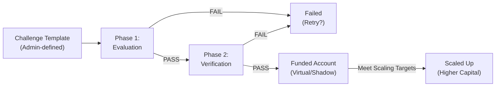
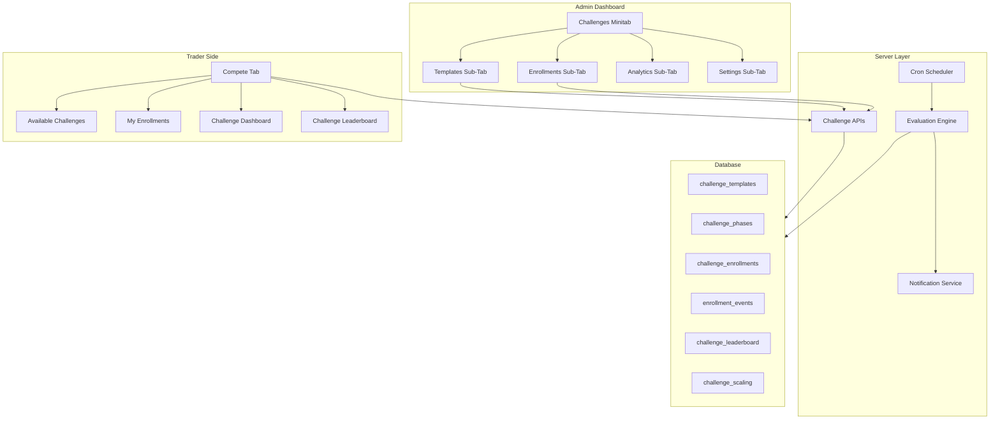
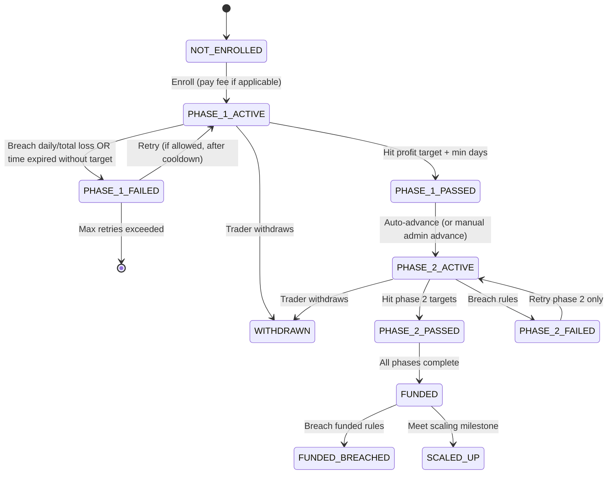
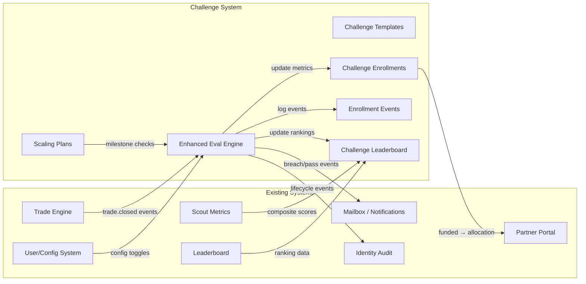
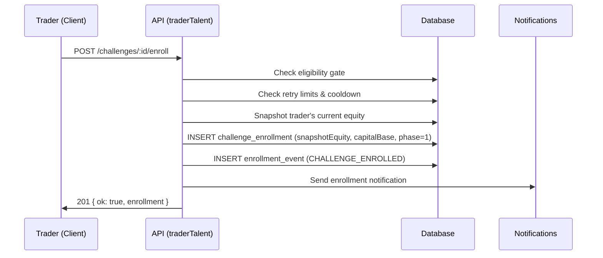
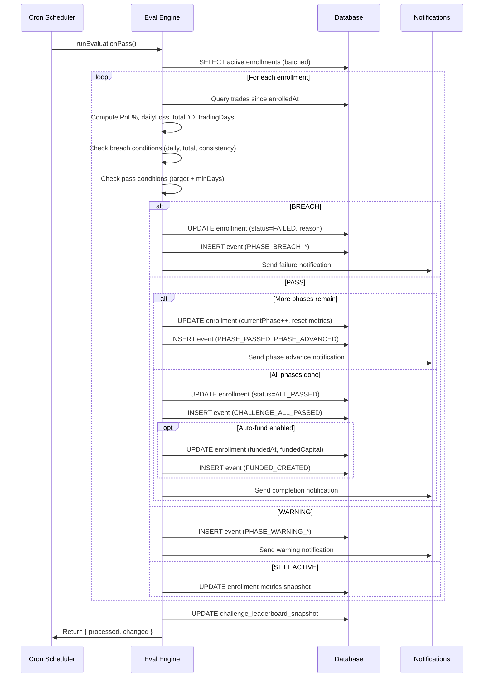
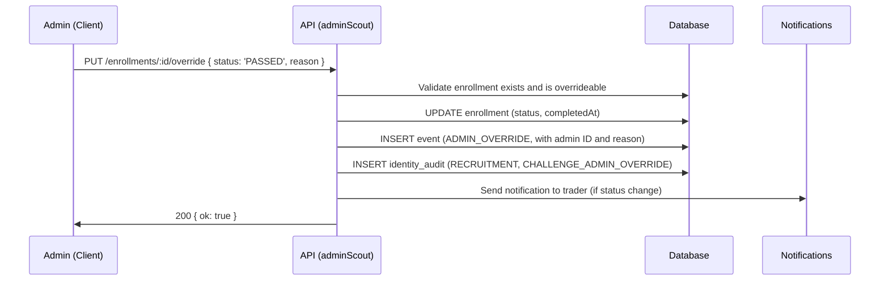

# TradeQuip Challenges System — Enhanced Design & Functionality Specification

> **Document Type:** Design & Functionality (Ideation Only — NO CODE)
> **Date:** 2026-02-09
> **Scope:** Admin Dashboard (Challenges Minitab) + Trader-Side Participation + Data Propagation

---

## Table of Contents

1. [Current State Gap Analysis](#1-current-state-gap-analysis)
2. [Industry Research Summary](#2-industry-research-summary)
3. [Architecture Overview](#3-architecture-overview)
4. [Challenge Template Design (Admin)](#4-challenge-template-design-admin)
5. [Multi-Phase Challenge System](#5-multi-phase-challenge-system)
6. [Capital Base Isolation](#6-capital-base-isolation)
7. [Admin Dashboard — Challenges Minitab Redesign](#7-admin-dashboard--challenges-minitab-redesign)
8. [Trader-Side Experience](#8-trader-side-experience)
9. [Evaluation Engine Enhancements](#9-evaluation-engine-enhancements)
10. [Challenge Leaderboard & Rankings](#10-challenge-leaderboard--rankings)
11. [Scaling Plans](#11-scaling-plans)
12. [Notifications & Lifecycle Events](#12-notifications--lifecycle-events)
13. [Analytics & Reporting](#13-analytics--reporting)
14. [Schema Additions](#14-schema-additions)
15. [API Surface Design](#15-api-surface-design)
16. [Integration Map](#16-integration-map)
17. [Data Flow Diagrams](#17-data-flow-diagrams)

---

## 1. Current State Gap Analysis

### What Exists Today

| Layer | File | Status |
|-------|------|--------|
| **Schema** | `challenges` table | Basic: name, description, profit_target_pct, max_daily_loss_pct, max_total_loss_pct, min_trading_days, duration_days, start_at, end_at, is_active |
| **Schema** | `challenge_enrollments` table | Basic: status (ACTIVE/PASSED/FAILED/WITHDRAWN), current_pnl_pct, max_daily_loss_hit, trading_days |
| **Admin UI** | `ScoutWorkbench.tsx` Challenges tab | Flat table with Create form (name, profit target, daily loss, duration, description) + Activate/Deactivate/Delete per row |
| **Trader UI** | `LeaderboardScreen.tsx` Compete tab | Flat table with Enroll/Withdraw buttons, shows PnL % and trading days |
| **API** | `adminScout.ts` | CRUD: GET/POST/PUT/DELETE challenges |
| **API** | `traderTalent.ts` | GET challenges, POST enroll, POST withdraw, GET status |
| **Engine** | `engines.ts` | Single-pass PASS/FAIL evaluation based on PnL vs targets |
| **Cron** | `evaluateChallenges.ts` | Periodic batch evaluation (configurable interval) |

### Critical Gaps Identified

| Gap | Impact |
|-----|--------|
| **No multi-phase challenges** | Cannot model industry-standard 1-Phase / 2-Phase / 3-Phase evaluation pipelines |
| **No capital base snapshot on enrollment** | When a trader joins, their starting equity at enrollment time is NOT captured — PnL is calculated from ALL-TIME trades since enrollment timestamp, using the global `starting_equity` from `users` table. This means joining a challenge doesn't create an isolated capital reference |
| **No enrollment detail management** | Admin cannot view individual enrollments, their progress, override status, or extend duration |
| **No challenge categories/tiers** | No way to group challenges (e.g., Standard Challenge, Express Challenge, Instant Funding) |
| **No challenge pricing/fees** | No entry fee tracking for monetized challenges |
| **No consistency rules** | No max single-day profit cap, no max position sizing rules |
| **No prohibited instrument/strategy rules** | No per-challenge trading restrictions |
| **No challenge-specific leaderboard** | No competitive ranking within a challenge |
| **No scaling plan** | No progression path after passing a challenge |
| **No retry / re-enrollment rules** | Trader can re-enroll unlimited times with no cooldown, fee, or attempt tracking |
| **No admin analytics** | No pass/fail rates, no enrollment trends, no revenue tracking |
| **No notification system** | No email/in-app alerts for enrollment, breach, pass, or fail events |
| **No enrollment lifecycle audit** | No timestamped event log for each enrollment |
| **No time-remaining or countdown** | Trader has no visibility into how much time is left |
| **No drawdown type selection** | Cannot choose between static drawdown (from initial balance) vs trailing drawdown (from peak equity) |
| **No max overall drawdown tracking** | `maxTotalLossPct` is in schema but not wired into admin create form UI |
| **No min trading days** in admin create form | Schema supports `min_trading_days` but the admin UI doesn't expose it |

---

## 2. Industry Research Summary

Based on research of FTMO, City Traders Imperium, GoatFundedTrader, FundingPips, Seacrest Markets, PropFirmApp, and others:

### Standard Challenge Architecture (Industry Consensus)



### Key Features from Industry Leaders

| Feature | FTMO | City Traders Imperium | GoatFunded | Our Gap |
|---------|------|----------------------|------------|---------|
| Multi-phase (1/2/3 step) | 2-step | 1-step & 2-step | 2-step | ❌ Missing |
| Static vs trailing drawdown | Both | Static | Trailing | ❌ Missing |
| Consistency rule | No | Yes (40% rule) | No | ❌ Missing |
| Scaling plan | Yes (25% milestone) | Yes | Yes | ❌ Missing |
| Challenge leaderboard | No | No | No | ❌ Missing (competitive advantage!) |
| Entry fee & refund on pass | Yes | Yes | Yes | ❌ Missing |
| Profit split config | 80-90% | 70-100% | 75-95% | ❌ Missing |
| News trading restriction toggle | Add-on | Varies | Add-on | ❌ Missing |
| Weekend holding restriction | Add-on | Varies | Add-on | ❌ Missing |
| Max account size per trader | $400K total | Varies | Varies | ❌ Missing |
| Enrollment time limit | 30d / unlimited | Varies | Unlimited | ⚠️ Partial (duration_days exists) |
| Time extension (add-ons) | Purchasable | N/A | N/A | ❌ Missing |
| Retry with fee discount | Yes | Yes | Yes | ❌ Missing |
| KYC gate for funded stage | Yes | Yes | Yes | ❌ Missing |
| Payout schedule | Bi-weekly | Monthly | Bi-weekly | ❌ Missing |

---

## 3. Architecture Overview

### System Architecture



---

## 4. Challenge Template Design (Admin)

### Template Configuration Fields

The admin should be able to configure every aspect of a challenge template. The create/edit form should be a **multi-card layout** (not a single flat form):

#### Card 1: Identity & Description

| Field | Type | Validation | Notes |
|-------|------|------------|-------|
| `name` | text | 3-120 chars | Display name (e.g., "Standard $100K Challenge") |
| `slug` | text | Auto-generated from name | URL-safe identifier |
| `description` | textarea | max 4000 chars | Rich description shown to traders |
| `category` | select | STANDARD / EXPRESS / INSTANT / CUSTOM | Challenge type grouping |
| `tier` | select | STARTER / GROWTH / PROFESSIONAL / ELITE | Account size tier |
| `tags` | multi-select chips | max 10 | Searchable tags (e.g., "Forex", "No Time Limit") |
| `iconColor` | color picker | hex | Visual accent for cards |

#### Card 2: Account & Capital Configuration

| Field | Type | Validation | Notes |
|-------|------|------------|-------|
| `virtualCapitalUsd` | number | 1,000 – 10,000,000 | The simulated account size for this challenge |
| `leverageMultiplier` | number | 1x – 500x | Max leverage allowed during challenge |
| `currencyBase` | select | USD / EUR / GBP | Settlement currency |

#### Card 3: Phase Configuration (Repeatable)

Each challenge template can have **1–3 phases** configured. Each phase is a sub-card:

| Field | Type | Validation | Notes |
|-------|------|------------|-------|
| `phaseNumber` | integer | 1, 2, or 3 | Phase order |
| `phaseName` | text | max 60 chars | E.g., "Evaluation", "Verification" |
| `profitTargetPct` | decimal | 0.01 – 1.0 | E.g., 0.10 = 10% profit target |
| `maxDailyLossPct` | decimal | 0.01 – 1.0 | E.g., 0.05 = 5% max daily loss |
| `maxTotalLossPct` | decimal | 0.01 – 1.0 | E.g., 0.10 = 10% max overall drawdown |
| `drawdownType` | select | STATIC / TRAILING | How drawdown is calculated |
| `durationDays` | integer | 0 (unlimited) – 365 | 0 = no time limit |
| `minTradingDays` | integer | 0 – 365 | Minimum active trading days required |
| `maxSingleDayProfitPct` | decimal (optional) | 0.01 – 1.0 | Consistency rule: max profit from a single day as % of target |
| `allowWeekendHolding` | boolean | | Override global setting |
| `allowNewsTrading` | boolean | | Override global setting |
| `restrictedSymbolsCsv` | text (optional) | | Comma-separated list of blocked symbols |
| `maxConcurrentPositions` | integer (optional) | | Override global max positions |
| `maxLotSize` | decimal (optional) | | Override global max lot |

#### Card 4: Enrollment & Pricing Rules

| Field | Type | Validation | Notes |
|-------|------|------------|-------|
| `entryFeeUsd` | decimal | 0 – 100,000 | 0 = free challenge |
| `refundFeeOnPass` | boolean | | Industry standard: refund entry fee on passing |
| `maxEnrollments` | integer (optional) | 0 = unlimited | Total enrollment cap |
| `maxActiveEnrollments` | integer (optional) | | Concurrent active enrollment cap |
| `maxRetriesPerTrader` | integer | 0 = unlimited | How many times a trader can retry |
| `retryCooldownHours` | integer | 0 = no cooldown | Hours between retry attempts |
| `retryFeeDiscount Pct` | decimal | 0 – 1.0 | Discount on retry (e.g., 0.15 = 15% off) |
| `eligibilityGate` | select | NONE / EMAIL_VERIFIED / KYC_BASIC / KYC_FULL / CONTENDER | Minimum requirement to enroll |

#### Card 5: Scheduling & Availability

| Field | Type | Validation | Notes |
|-------|------|------------|-------|
| `isActive` | boolean | | Master toggle |
| `startAt` | datetime (optional) | | Registration opens |
| `endAt` | datetime (optional) | | Registration closes |
| `enrollmentStartAt` | datetime (optional) | | Window when new enrollments accepted |
| `enrollmentEndAt` | datetime (optional) | | Enrollment cutoff |
| `visibleToTraders` | boolean | | Show in trader browse list |
| `featuredOrder` | integer | | Display priority (lower = first) |

#### Card 6: Funded Stage Configuration (If All Phases Passed)

| Field | Type | Validation | Notes |
|-------|------|------------|-------|
| `fundedAccountEnabled` | boolean | | Enable funded stage after passing all phases |
| `fundedCapitalUsd` | decimal | | Funded account capital |
| `profitSplitTraderPct` | decimal | 0.50 – 1.00 | Trader's share (e.g., 0.80 = 80%) |
| `fundedMaxDailyLossPct` | decimal | | Funded stage daily loss limit |
| `fundedMaxTotalLossPct` | decimal | | Funded stage total loss limit |
| `fundedDrawdownType` | select | STATIC / TRAILING | |
| `payoutSchedule` | select | WEEKLY / BIWEEKLY / MONTHLY / ON_DEMAND | |
| `payoutMinBalanceUsd` | decimal | | Minimum payout threshold |
| `kycRequiredForFunding` | boolean | | Gate funded access behind KYC |
| `scalingPlanId` | FK (optional) | | Link to a scaling plan template |

---

## 5. Multi-Phase Challenge System

### Phase Progression Flow



### Key Behaviors

1. **Phase transition does NOT change the trader's actual capital base.** The trader's real `starting_equity` in the `users` table is never modified, avoiding balance resets across the platform.

2. **Each enrollment captures a `snapshotEquity` at enrollment time.** All challenge PnL calculations use this snapshot as the reference, NOT the user's current or global equity.

3. **Phase advancement resets the PnL tracking window** — the `enrolledAt` timestamp is updated for the new phase, creating a new measurement period. The `snapshotEquity` carries forward (representing the same virtual capital for the challenge).

4. **Retry behavior:**
   - If a trader fails Phase 1 and retries, a new enrollment row is created (or the existing one is reset) with a fresh `enrolledAt` and zeroed PnL metrics.
   - Retry count is tracked per trader per challenge template.
   - Admin can configure a cooldown period between retries.

---

## 6. Capital Base Isolation

> [!CAUTION]
> **This is the most critical design decision.** The current system uses the trader's `users.starting_equity` (default 1,000,000) to compute challenge PnL percentages. This means challenge performance is measured against the trader's GLOBAL capital base, which can change independently of the challenge.

### Proposed Solution: Enrollment-level Capital Snapshot

When a trader **enrolls** in a challenge:

1. **Capture `snapshotEquity`** — The trader's current balance (starting_equity + realized P&L) at the exact moment of enrollment. Store this on the `challenge_enrollments` row.

2. **All challenge PnL calculations use `snapshotEquity`** as the denominator, not `users.starting_equity`.

3. **The challenge defines a `virtualCapitalUsd`** — This is the "account size" advertised to the trader (e.g., $100K Challenge). Used for display purposes and for calculating rule thresholds when the admin prefers to use the template's capital base rather than the trader's actual equity.

4. **Admin configurable mode:**
   - **Mode A (Trader Equity):** Use the trader's snapshotted equity at enrollment time.
   - **Mode B (Virtual Capital):** Use the challenge template's `virtualCapitalUsd` regardless of the trader's actual equity.
   - Mode B is the industry standard (prop firm model). Mode A is for internal talent evaluation.

5. **Trades are NOT filtered or isolated.** The challenge evaluates ALL of the trader's trades within the enrollment time window. This is by design — the challenge measures the trader's OVERALL trading behavior, not just trades on a separate "challenge account."

### PnL Recalculation Formula (Enhanced)

```
capitalBase = (mode === 'VIRTUAL') ? challenge.virtualCapitalUsd : enrollment.snapshotEquity

totalPnl = SUM(trade.net_profit_usd) WHERE trade.user_id = enrollment.user_id
                                     AND trade.status = 'CLOSED'
                                     AND trade.closed_at >= enrollment.enrolledAt
                                     AND trade.closed_at <= (enrollment.enrolledAt + phase.durationDays * 86400)  // if time-limited

currentPnlPct = totalPnl / capitalBase

// Daily loss calculation (for STATIC drawdown):
dailyPnl[day] = SUM(trades closed on day) / capitalBase
maxDailyLoss = MAX(ABS(MIN(dailyPnl[day], 0)))

// For TRAILING drawdown:
peakEquity = MAX(capitalBase + running cumulative PnL at each point)
trailingDrawdown = (peakEquity - currentEquity) / peakEquity
```

---

## 7. Admin Dashboard — Challenges Minitab Redesign

The current "Challenges" tab is a single card with a create form and a flat table. It needs to become a full **mini-tab system** with 4 sub-tabs:

### Sub-Tab Architecture

```
┌────────────────────────────────────────────────────────────────┐
│  Scout Workbench  │ Discovery │ Watchlist │ Challenges │ ...   │
├────────────────────────────────────────────────────────────────┤
│  ┌──────────┬──────────────┬───────────┬──────────┐           │
│  │Templates │ Enrollments  │ Analytics │ Settings │           │
│  └──────────┴──────────────┴───────────┴──────────┘           │
│                                                               │
│  [Sub-tab content area]                                       │
│                                                               │
└────────────────────────────────────────────────────────────────┘
```

---

### Sub-Tab 1: Templates

**Purpose:** CRUD management for challenge templates.

#### Section A: Create/Edit Challenge (Collapsible Card)

A collapsible card form organized into the 6 configuration cards described in [Section 4](#4-challenge-template-design-admin). Each card is a bordered section within the form, visually distinct with subtle color-coded headers:

- 🔵 **Identity** — Blue accent
- 🟢 **Capital** — Green accent
- 🟡 **Phase Rules** — Amber accent (repeatable)
- 🟣 **Enrollment Rules** — Purple accent
- ⚪ **Scheduling** — Gray accent
- 🟠 **Funded Config** — Orange accent

#### Section B: Templates Table

An enhanced table replacing the current flat list:

| Column | Content |
|--------|---------|
| **Name** | Template name + category badge (STANDARD / EXPRESS / INSTANT pill) |
| **Phases** | "1-Step" / "2-Step" / "3-Step" badge |
| **Capital** | $100K, $200K, etc. |
| **Target** | Phase 1 profit target % |
| **Max DD** | Max daily + total loss % |
| **Duration** | Days (or "∞" for unlimited) |
| **Status** | Active / Inactive / Scheduled pill |
| **Enrolled** | Total / Active enrollment count |
| **Pass Rate** | % of completed enrollments that passed |
| **Revenue** | Total fees collected (if applicable) |
| **Actions** | Edit / Duplicate / Activate / Deactivate / Archive / Delete |

#### Key Interactions:
- **Duplicate** — Copy a template to create a variation (e.g., "$50K Standard" → "$100K Standard")
- **Archive** — Soft-delete: hides from trader view but retains data
- **Inline edit** — Click template name to expand detail card inline
- **Expandable row** — Click to see phase details, restrictions, and funded configuration

---

### Sub-Tab 2: Enrollments

**Purpose:** View and manage all trader enrollments across all challenges.

#### Filter Bar

| Filter | Type | Options |
|--------|------|---------|
| Challenge | dropdown | All templates |
| Status | pills | ALL / ACTIVE / PASSED / FAILED / WITHDRAWN / FUNDED / BREACHED |
| Phase | pills | ANY / PHASE_1 / PHASE_2 / PHASE_3 / FUNDED |
| Trader Search | text | Username / email / ID |
| Date Range | date pickers | Enrolled between |

#### Enrollments Table

| Column | Content |
|--------|---------|
| **Trader** | Username + email (truncated) |
| **Challenge** | Template name + category badge |
| **Phase** | Current phase badge (Phase 1 / Phase 2 / Funded) |
| **Status** | ACTIVE / PASSED / FAILED pill with color coding |
| **Progress** | Visual progress bar showing PnL % vs target, color-coded |
| **PnL** | Current PnL % (green/red) |
| **Daily Loss** | Current max daily loss hit vs limit |
| **Trading Days** | Active days / minimum required |
| **Time Left** | Countdown timer or "∞" |
| **Enrolled** | Date enrolled |
| **Actions** | View Details / Extend / Override / Disqualify |

#### Individual Enrollment Detail Panel (Slide-out or expandable)

When clicking an enrollment, show a detail panel with:

**Card A: Enrollment Overview**
- Trader info (username, email, tier, KYC status)
- Challenge name, current phase, status
- Enrolled at, time remaining, attempt number

**Card B: Performance Gauges**
- Circular gauge: PnL % vs profit target
- Circular gauge: Max daily loss hit vs limit
- Circular gauge: Max total drawdown vs limit
- Bar chart: Trading days vs minimum required

**Card C: Equity Curve**
- Line chart showing the trader's equity curve since enrollment
- Overlay: profit target line, drawdown limit line
- Highlight breach points in red

**Card D: Trade Activity**
- Mini table of most recent trades during enrollment period
- Columns: Time, Symbol, Side, Lots, PnL, Duration

**Card E: Enrollment Event Log (Timeline)**
- Chronological list of all enrollment lifecycle events:
  - ENROLLED, PHASE_ADVANCED, DAILY_LOSS_WARNING (80%), DAILY_LOSS_BREACH, 
    PROFIT_TARGET_HIT, PASSED, FAILED, WITHDRAWN, EXTENDED, ADMIN_OVERRIDE, etc.
- Each event shows timestamp, actor (SYSTEM / ADMIN / TRADER), and details

**Card F: Admin Actions**

| Action | Description |
|--------|-------------|
| **Extend Duration** | Add extra days to current phase |
| **Override Status** | Manually set PASSED / FAILED (with reason) |
| **Advance Phase** | Manually move to next phase |
| **Reset Phase** | Reset current phase metrics (fresh start) |
| **Disqualify** | DQ for rule violation (with reason field) |
| **Add Note** | Admin annotation |
| **Send Notification** | Send a custom message to the trader |

---

### Sub-Tab 3: Analytics

**Purpose:** Aggregated metrics and trends for the challenges program.

#### Row A: Summary Stat Cards

| Card | Metric |
|------|--------|
| **Total Enrollments** | All-time count |
| **Active Now** | Currently active enrollments |
| **Pass Rate** | Overall % (with trend arrow) |
| **Avg Time to Pass** | Average days to complete all phases |
| **Revenue** | Total entry fees collected (if applicable) |
| **Funded Traders** | Count of traders in funded stage |

#### Row B: Charts

| Chart | Type | Data |
|-------|------|------|
| **Enrollment Funnel** | Funnel / Sankey | ENROLLED → PHASE_1 → PHASE_2 → FUNDED (with drop-off counts) |
| **Pass/Fail Trend** | Line chart | Monthly pass vs fail counts |
| **Breach Type Distribution** | Donut chart | Daily Loss / Total DD / Time Expired / Withdrawn |
| **Top Performers** | Ranked list | Top 10 traders by challenge PnL or composite score |
| **Challenge Popularity** | Bar chart | Enrollments per challenge template |

#### Row C: Cohort Analysis (Optional Advanced)

| Analysis | Description |
|----------|-------------|
| **Cohort Retention** | Of traders who enrolled in Month X, how many passed Phase 1, Phase 2, got funded |
| **Revenue per Attempt** | Average revenue per enrollment attempt |
| **Time-to-Completion Distribution** | Histogram of days to complete each phase |

---

### Sub-Tab 4: Settings

**Purpose:** Global challenge system configuration.

#### Card A: System Toggles

| Setting | Type | Default | Notes |
|---------|------|---------|-------|
| `traderCompeteEnabled` | switch | false | Master toggle (already exists in systemConfig) |
| `challengeAutoAdvancePhase` | switch | true | Auto-advance on phase pass, or require admin approval |
| `challengeAutoFund` | switch | false | Auto-create funded enrollment on all-pass |
| `challengeEvalIntervalMin` | number | 60 | Evaluation cron frequency (minutes) |
| `challengeEvalMaxRows` | number | 500 | Batch size per cron pass |
| `challengeNotifyOnEnroll` | switch | true | Send notification on enrollment |
| `challengeNotifyOnBreach` | switch | true | Send notification on breach (email + in-app) |
| `challengeNotifyOnPass` | switch | true | Send notification on phase pass |
| `challengeNotifyOnFail` | switch | true | Send notification on fail |
| `challengeWarningThresholdPct` | number | 0.80 | Trigger warning at 80% of daily/total loss limit |

#### Card B: Default Challenge Values

| Setting | Type | Default | Notes |
|---------|------|---------|-------|
| `defaultDrawdownType` | select | STATIC | Default for new templates |
| `defaultCapitalMode` | select | VIRTUAL | VIRTUAL vs TRADER_EQUITY |
| `defaultMaxRetries` | number | 3 | Default retry limit |
| `defaultRetryCooldownHours` | number | 24 | Default cooldown between retries |
| `defaultEligibilityGate` | select | EMAIL_VERIFIED | Default enrollment requirement |
| `defaultProfitSplitPct` | number | 0.80 | Default funded profit split |

#### Card C: Scaling Plan Templates

Mini-CRUD for scaling plan templates (see [Section 11](#11-scaling-plans)).

---

## 8. Trader-Side Experience

### Current State
The trader sees a flat table in the "Compete" tab of the LeaderboardScreen with columns: Challenge, Target, Max Daily Loss, Duration, Status, Progress, Actions.

### Enhanced Design

#### 8.1 Challenge Browse View (Replacing Flat Table)

Replace the flat table with a **card grid layout**:

```
┌──────────────────────────────────────────────────────────────┐
│  🏆 Compete                                                  │
│  ┌────────────┬──────────────┬───────────────┐               │
│  │ Available  │ My Challenges│ Leaderboard   │               │
│  └────────────┴──────────────┴───────────────┘               │
│                                                              │
│  [Filter Pills: ALL | STANDARD | EXPRESS | INSTANT]          │
│                                                              │
│  ┌─────────────────────┐  ┌──────────────────────┐           │
│  │  $100K STANDARD     │  │  $50K EXPRESS         │           │
│  │  ─────────────────  │  │  ──────────────────   │           │
│  │  📈 10% Target      │  │  📈 8% Target         │           │
│  │  📉 5% Daily Loss   │  │  📉 4% Daily Loss     │           │
│  │  ⏱ 30 Days          │  │  ⏱ ∞ No Time Limit   │           │
│  │  🔄 2 Phases        │  │  🔄 1 Phase           │           │
│  │  💰 $199 Entry      │  │  💰 FREE              │           │
│  │                     │  │                       │           │
│  │  [Enroll Now]       │  │  [Enroll Now]         │           │
│  └─────────────────────┘  └──────────────────────┘           │
└──────────────────────────────────────────────────────────────┘
```

Each challenge card shows:
- Challenge name with tier icon
- Category badge (STANDARD / EXPRESS / INSTANT)
- Phase count pill
- Key metrics (profit target, daily loss, duration)
- Entry fee (or "FREE")
- Number of active participants
- "Enroll Now" CTA button

Clicking a card opens a **detail modal** with:
- Full description
- Phase-by-phase breakdown (rules for each phase)
- Restrictions (blocked symbols, no weekend holding, etc.)
- Funded stage details (profit split, payout schedule)
- Scaling plan info
- Historical pass rate (social proof)

---

#### 8.2 My Challenges Dashboard

When a trader has active enrollments, the "My Challenges" mini-tab shows a dashboard per enrollment:

**Enrollment Card Layout:**

```
┌──────────────────────────────────────────────────────────────┐
│  $100K Standard Challenge — Phase 1: Evaluation              │
│  Status: ACTIVE  │  Day 12 of 30  │  Attempt #1              │
│                                                              │
│  ┌─────────┐  ┌─────────┐  ┌─────────┐  ┌──────────┐        │
│  │ PnL     │  │ Daily   │  │ Total   │  │ Trading  │        │
│  │ +4.2%   │  │ Loss    │  │ Drawdown│  │ Days     │        │
│  │ ━━━━━━━ │  │ -1.8%   │  │ -3.1%   │  │ 8 / 5   │        │
│  │ ───42%──│  │ ──36%── │  │ ──31%── │  │ ✅ Met   │        │
│  │ of 10%  │  │ of 5%   │  │ of 10%  │  │         │        │
│  └─────────┘  └─────────┘  └─────────┘  └──────────┘        │
│                                                              │
│  [📊 Equity Curve]  [📋 Trade Log]  [⏸ Withdraw]            │
└──────────────────────────────────────────────────────────────┘
```

**Each metric gauge** uses:
- Green fill when within safe range (0-60% of limit)
- Amber fill when approaching limit (60-80%)
- Red fill when near breach (80-100%)
- Animated pulse when in warning zone

**Equity Curve** shows:
- Line chart of daily equity from enrollment start
- Horizontal lines for: profit target (green dashed), daily loss limit (red dashed), total DD limit (red solid)
- Time axis with remaining days highlighted

**Trade Log:** Mini-table of the trader's recent trades during this enrollment period.

---

#### 8.3 Challenge Leaderboard

A real-time ranking of all participants in a specific challenge:

| Rank | Trader | PnL % | Daily Loss | Trading Days | Status |
|------|--------|-------|------------|--------------|--------|
| 🥇 1 | @trader_a | +7.2% | -1.1% | 14 | ACTIVE |
| 🥈 2 | @trader_b | +5.8% | -2.3% | 12 | ACTIVE |
| 🥉 3 | @trader_c | +4.5% | -0.9% | 10 | ACTIVE |
| 4 | **You** | +4.2% | -1.8% | 8 | ACTIVE |

- Privacy: Only username (or anonymized ID) shown
- "My Position" highlighted
- Admin-configurable: enable/disable per challenge

---

## 9. Evaluation Engine Enhancements

### Current Engine (engines.ts `evaluateChallengeEnrollmentsPass`)

The current engine runs a single-pass evaluation:
1. Fetch active enrollments
2. For each, compute PnL %, trading days, max daily loss
3. Mark as PASSED, FAILED, or keep ACTIVE

### Enhanced Engine

#### 9.1 Multi-Phase Evaluation

```
For each active enrollment:
  1. Determine current phase from enrollment.currentPhase
  2. Load phase-specific rules from challenge_phases table
  3. Compute metrics using capital base (virtual or snapshot)
  4. Check all failure conditions:
     a. Daily loss breach (STATIC or TRAILING)
     b. Total drawdown breach (STATIC or TRAILING)
     c. Consistency rule violation (if enabled)
     d. Duration expired without hitting target
  5. Check pass condition:
     a. Profit target met
     b. Minimum trading days met
     c. Not in breach of any rule
  6. If FAILED:
     a. Update enrollment status
     b. Log FAILURE event with reason
     c. Trigger notification
  7. If PASSED:
     a. Check if more phases exist
     b. If yes: advance to next phase (update currentPhase, reset PnL window)
     c. If no more phases: mark as ALL_PHASES_PASSED
     d. If funded config exists: create funded enrollment
     e. Log PHASE_PASSED event
     f. Trigger notification
  8. Update enrollment metrics snapshot
```

#### 9.2 Warning Threshold Checks

In addition to breach checks (which finalize status), add **warning events**:
- When daily loss hits X% of limit (configurable, default 80%), log a WARNING event
- When total drawdown hits X% of limit, log WARNING
- These trigger in-app notifications and optional email alerts

#### 9.3 Trailing Drawdown Calculation

For TRAILING drawdown mode:
```
peakEquity = capitalBase
for each day_pnl in daily_pnl_series:
    runningEquity = capitalBase + cumulative_pnl_up_to_day
    peakEquity = MAX(peakEquity, runningEquity)
    trailingDD = (peakEquity - runningEquity) / peakEquity
    if trailingDD >= maxTotalLossPct:
        FAIL (trailing drawdown breach)
```

#### 9.4 Consistency Rule Check

If `maxSingleDayProfitPct` is configured on the phase:
```
targetPnl = capitalBase * profitTargetPct
for each trading day:
    dayProfit = SUM(trades closed on day).net_profit_usd
    if dayProfit > (targetPnl * maxSingleDayProfitPct):
        Flag consistency violation
        // Note: Some firms fail immediately, others just flag it
        // Admin configurable: FAIL_IMMEDIATELY or WARN_ONLY
```

---

## 10. Challenge Leaderboard & Rankings

### Admin Configuration

| Setting | Type | Notes |
|---------|------|-------|
| `challengeLeaderboardEnabled` | switch | Global toggle |
| Per-template: `leaderboardEnabled` | switch | Per-challenge toggle |
| Per-template: `leaderboardAnonymize` | switch | Show usernames or anonymized IDs |
| Per-template: `leaderboardMaxVisible` | number | Top N shown |
| `leaderboardRankingMetric` | select | PNL_PCT / COMPOSITE_SCORE / SHARPE_RATIO |
| `leaderboardRefreshIntervalSec` | number | How often rankings recalculate |

### Ranking Calculation

The challenge evaluation cron job should also update a `challenge_leaderboard_snapshot` table:

```sql
INSERT INTO challenge_leaderboard_snapshot (challenge_id, user_id, rank, pnl_pct, ...)
SELECT
    ce.challenge_id,
    ce.user_id,
    ROW_NUMBER() OVER (PARTITION BY ce.challenge_id ORDER BY ce.current_pnl_pct DESC),
    ce.current_pnl_pct,
    ...
FROM challenge_enrollments ce
WHERE ce.status = 'ACTIVE'
  AND ce.current_phase = (current active phase)
```

### Trader Visibility
- Show on trader's "Challenge Leaderboard" mini-tab
- Highlight trader's own position
- Show top N (configurable)
- Optional: show "My Rank" even if not in top N

---

## 11. Scaling Plans

### What Is a Scaling Plan?

After a trader passes all challenge phases and enters the "funded" stage, a **scaling plan** defines milestones for increasing their funded capital. This is a core feature of FTMO and similar firms.

### Scaling Plan Template (Admin CRUD)

| Field | Type | Notes |
|-------|------|-------|
| `id` | serial PK | |
| `name` | text | E.g., "Standard Scaling" |
| `description` | text | |
| `milestones` | JSON array | Array of milestone objects |

Each milestone in the array:

```json
{
  "milestoneNumber": 1,
  "profitTargetPct": 0.10,
  "minTradingDays": 30,
  "minConsecutivePayouts": 2,
  "capitalIncreasePct": 0.25,
  "profitSplitIncreasePct": 0.05,
  "maxCapitalUsd": 400000
}
```

### How It Works:

1. Trader completes all challenge phases → enters FUNDED with `fundedCapitalUsd`
2. After meeting milestone 1 targets (e.g., 10% profit over 30 days with 2 consecutive payouts), their funded capital increases by 25%
3. Each milestone can also increase the profit split (e.g., from 80% → 85%)
4. There's a global max capital cap (e.g., $400K total across all challenges)

### Admin View:
- Scaling plan templates are managed in a mini-CRUD within the Settings sub-tab
- When creating a challenge, admin can optionally link a scaling plan
- On the Enrollments sub-tab, funded traders show their scaling progress

---

## 12. Notifications & Lifecycle Events

### Event Types

| Event | Trigger | Notification Channel | Admin Dashboard |
|-------|---------|---------------------|-----------------|
| `CHALLENGE_ENROLLED` | Trader clicks Enroll | In-app toast + email (optional) | Event log |
| `PHASE_WARNING_DAILY_LOSS` | Daily loss hit 80% of limit | In-app + push | Event log + flag |
| `PHASE_WARNING_TOTAL_DD` | Total DD hit 80% of limit | In-app + push | Event log + flag |
| `PHASE_BREACH_DAILY_LOSS` | Daily loss exceeded limit | In-app + email | Event log + status change |
| `PHASE_BREACH_TOTAL_DD` | Total DD exceeded limit | In-app + email | Event log + status change |
| `PHASE_PASSED` | Profit target + min days met | In-app + email | Event log + status change |
| `PHASE_ADVANCED` | Moved to next phase | In-app + email | Event log |
| `CHALLENGE_FAILED` | Failed (any reason) | In-app + email | Event log + status change |
| `CHALLENGE_ALL_PASSED` | All phases completed | In-app + email + confetti | Event log |
| `FUNDED_CREATED` | Funded enrollment created | In-app + email | Event log |
| `FUNDED_PAYOUT` | Payout processed | In-app + email | Event log |
| `FUNDED_BREACHED` | Funded stage rules violated | In-app + email | Event log |
| `SCALING_MILESTONE` | Scaling milestone reached | In-app + email | Event log |
| `ADMIN_OVERRIDE` | Admin manually changed status | N/A | Event log with admin ID |
| `ADMIN_EXTENDED` | Admin extended duration | In-app to trader | Event log |
| `TRADER_WITHDRAWN` | Trader self-withdrew | N/A | Event log |
| `CONSISTENCY_WARNING` | Single day profit exceeds threshold | In-app | Event log |

### Integration Points:
- **Mailbox system** — Send enrollment notifications via the existing mailbox infrastructure
- **Identity audit trail** — Log all events to the existing `identity_audit` system
- **Admin dashboard** — Show recent events in the Enrollments detail panel timeline

---

## 13. Analytics & Reporting

### Admin Analytics Queries

#### Pass Rate by Challenge
```sql
SELECT
    c.name,
    COUNT(*) as total_enrollments,
    COUNT(CASE WHEN ce.status = 'PASSED' THEN 1 END) as passed,
    COUNT(CASE WHEN ce.status = 'FAILED' THEN 1 END) as failed,
    ROUND(100.0 * COUNT(CASE WHEN ce.status = 'PASSED' THEN 1 END) / NULLIF(COUNT(*), 0), 1) as pass_rate_pct
FROM challenge_enrollments ce
JOIN challenges c ON c.id = ce.challenge_id
WHERE ce.status IN ('PASSED', 'FAILED')
GROUP BY c.id, c.name
```

#### Enrollment Trend (Monthly)
```sql
SELECT
    to_char(to_timestamp(enrolled_at), 'YYYY-MM') as month,
    COUNT(*) as enrollments,
    COUNT(CASE WHEN status = 'PASSED' THEN 1 END) as passed,
    COUNT(CASE WHEN status = 'FAILED' THEN 1 END) as failed
FROM challenge_enrollments
GROUP BY month
ORDER BY month DESC
```

#### Average Time to Pass
```sql
SELECT
    c.name,
    AVG(ce.completed_at - ce.enrolled_at) / 86400.0 as avg_days_to_complete
FROM challenge_enrollments ce
JOIN challenges c ON c.id = ce.challenge_id
WHERE ce.status = 'PASSED' AND ce.completed_at IS NOT NULL
GROUP BY c.id, c.name
```

#### Breach Type Distribution
```sql
SELECT
    ee.event_type,
    COUNT(*) as count
FROM enrollment_events ee
WHERE ee.event_type LIKE '%BREACH%' OR ee.event_type LIKE '%FAILED%'
GROUP BY ee.event_type
ORDER BY count DESC
```

---

## 14. Schema Additions

### New Tables

#### `challenge_phases`
```
id                    SERIAL PK
challenge_id          FK → challenges.id ON DELETE CASCADE
phase_number          INTEGER NOT NULL (1, 2, 3)
phase_name            TEXT NOT NULL
profit_target_pct     REAL NOT NULL
max_daily_loss_pct    REAL NOT NULL
max_total_loss_pct    REAL
drawdown_type         TEXT NOT NULL DEFAULT 'STATIC'  -- STATIC | TRAILING
duration_days         INTEGER NOT NULL  -- 0 = unlimited
min_trading_days      INTEGER DEFAULT 0
max_single_day_profit_pct  REAL  -- Consistency rule (nullable = disabled)
allow_weekend_holding BOOLEAN DEFAULT true
allow_news_trading    BOOLEAN DEFAULT true
restricted_symbols_csv TEXT
max_concurrent_positions  INTEGER
max_lot_size          REAL
created_at            INTEGER NOT NULL
updated_at            INTEGER NOT NULL

UNIQUE INDEX: (challenge_id, phase_number)
```

#### Enhanced `challenges` table (added columns)
```
category              TEXT DEFAULT 'STANDARD'  -- STANDARD | EXPRESS | INSTANT | CUSTOM
tier                  TEXT DEFAULT 'STARTER'   -- STARTER | GROWTH | PROFESSIONAL | ELITE
slug                  TEXT UNIQUE
tags                  TEXT DEFAULT '[]'        -- JSON array
icon_color            TEXT DEFAULT '#3b82f6'
virtual_capital_usd   REAL DEFAULT 100000
capital_mode          TEXT DEFAULT 'VIRTUAL'   -- VIRTUAL | TRADER_EQUITY
leverage_multiplier   REAL DEFAULT 50
currency_base         TEXT DEFAULT 'USD'
entry_fee_usd         REAL DEFAULT 0
refund_fee_on_pass    BOOLEAN DEFAULT false
max_enrollments       INTEGER                  -- null = unlimited
max_active_enrollments INTEGER
max_retries_per_trader INTEGER DEFAULT 3
retry_cooldown_hours  INTEGER DEFAULT 24
retry_fee_discount_pct REAL DEFAULT 0
eligibility_gate      TEXT DEFAULT 'NONE'      -- NONE | EMAIL_VERIFIED | KYC_BASIC | KYC_FULL | CONTENDER
enrollment_start_at   INTEGER
enrollment_end_at     INTEGER
visible_to_traders    BOOLEAN DEFAULT true
featured_order        INTEGER DEFAULT 100
funded_account_enabled BOOLEAN DEFAULT false
funded_capital_usd    REAL
profit_split_trader_pct REAL DEFAULT 0.80
funded_max_daily_loss_pct REAL
funded_max_total_loss_pct REAL
funded_drawdown_type  TEXT DEFAULT 'STATIC'
payout_schedule       TEXT DEFAULT 'BIWEEKLY'   -- WEEKLY | BIWEEKLY | MONTHLY | ON_DEMAND
payout_min_balance_usd REAL DEFAULT 100
kyc_required_for_funding BOOLEAN DEFAULT true
scaling_plan_id       INTEGER  -- FK to challenge_scaling_plans (nullable)
```

#### Enhanced `challenge_enrollments` table (added columns)
```
current_phase         INTEGER NOT NULL DEFAULT 1
snapshot_equity       REAL NOT NULL             -- Trader's equity at enrollment time
capital_base_used     REAL NOT NULL             -- The denominator for PnL calculations
attempt_number        INTEGER NOT NULL DEFAULT 1
max_total_loss_hit    REAL DEFAULT 0            -- Track max total drawdown hit
peak_equity           REAL                      -- For trailing drawdown
phase_started_at      INTEGER                   -- When current phase started
funded_at             INTEGER                   -- When moved to funded stage
funded_pnl_usd        REAL DEFAULT 0            -- Cumulative funded PnL
scaled_capital_usd    REAL                      -- Current scaled capital (if scaling plan active)
scaling_milestone     INTEGER DEFAULT 0         -- Current scaling milestone number
admin_notes           TEXT
last_warning_event    TEXT                      -- Last warning type sent
last_warning_at       INTEGER                   -- When last warning was sent
```

#### `challenge_enrollment_events`
```
id                    SERIAL PK
enrollment_id         FK → challenge_enrollments.id ON DELETE CASCADE
event_type            TEXT NOT NULL              -- See event types in Section 12
event_at              INTEGER NOT NULL
actor_type            TEXT DEFAULT 'SYSTEM'      -- SYSTEM | ADMIN | TRADER
actor_user_id         INTEGER
phase_number          INTEGER
details_json          TEXT DEFAULT '{}'           -- Arbitrary event-specific data
pnl_snapshot_pct      REAL                       -- PnL at time of event
daily_loss_snapshot   REAL                       -- Daily loss at time of event
total_dd_snapshot     REAL                       -- Total DD at time of event
trading_days_snapshot INTEGER
note                  TEXT

INDEX: (enrollment_id, event_at)
INDEX: (event_type, event_at)
```

#### `challenge_scaling_plans`
```
id                    SERIAL PK
name                  TEXT NOT NULL
description           TEXT
milestones_json       TEXT NOT NULL DEFAULT '[]'  -- JSON array of milestone configs
is_active             BOOLEAN DEFAULT true
created_by            FK → users.id
created_at            INTEGER NOT NULL
updated_at            INTEGER NOT NULL
```

#### `challenge_leaderboard_snapshot`
```
challenge_id          FK → challenges.id ON DELETE CASCADE
user_id               FK → users.id ON DELETE CASCADE
rank                  INTEGER NOT NULL
pnl_pct               REAL NOT NULL
trading_days          INTEGER
max_daily_loss_hit    REAL
composite_score       REAL
calculated_at         INTEGER NOT NULL

PRIMARY KEY: (challenge_id, user_id)
INDEX: (challenge_id, rank)
```

### Enhanced `system_config` table (added columns)
```
challenge_auto_advance_phase    BOOLEAN DEFAULT true
challenge_auto_fund             BOOLEAN DEFAULT false
challenge_default_drawdown_type TEXT DEFAULT 'STATIC'
challenge_default_capital_mode  TEXT DEFAULT 'VIRTUAL'
challenge_default_max_retries   INTEGER DEFAULT 3
challenge_default_retry_cooldown_hours INTEGER DEFAULT 24
challenge_default_eligibility   TEXT DEFAULT 'EMAIL_VERIFIED'
challenge_default_profit_split  REAL DEFAULT 0.80
challenge_notify_on_enroll      BOOLEAN DEFAULT true
challenge_notify_on_breach      BOOLEAN DEFAULT true
challenge_notify_on_pass        BOOLEAN DEFAULT true
challenge_notify_on_fail        BOOLEAN DEFAULT true
challenge_warning_threshold_pct REAL DEFAULT 0.80
challenge_leaderboard_enabled   BOOLEAN DEFAULT false
challenge_leaderboard_refresh_sec INTEGER DEFAULT 300
```

---

## 15. API Surface Design

### Admin APIs (adminScout router)

| Method | Endpoint | Description |
|--------|----------|-------------|
| **GET** | `/api/admin/challenges` | List all challenge templates with enrollment stats |
| **POST** | `/api/admin/challenges` | Create challenge template (with phases) |
| **GET** | `/api/admin/challenges/:id` | Get full challenge template detail |
| **PUT** | `/api/admin/challenges/:id` | Update challenge template |
| **DELETE** | `/api/admin/challenges/:id` | Delete (with enrollment check) |
| **POST** | `/api/admin/challenges/:id/duplicate` | Duplicate a template |
| **PUT** | `/api/admin/challenges/:id/archive` | Soft archive a template |
| **GET** | `/api/admin/challenges/:id/phases` | Get phase configurations |
| **POST** | `/api/admin/challenges/:id/phases` | Add/update phase config |
| **DELETE** | `/api/admin/challenges/:id/phases/:phaseNum` | Remove a phase |
| **GET** | `/api/admin/challenges/enrollments` | List all enrollments (filtered, paginated) |
| **GET** | `/api/admin/challenges/enrollments/:id` | Get enrollment detail |
| **PUT** | `/api/admin/challenges/enrollments/:id/override` | Admin override status |
| **PUT** | `/api/admin/challenges/enrollments/:id/extend` | Extend phase duration |
| **PUT** | `/api/admin/challenges/enrollments/:id/advance` | Manually advance phase |
| **PUT** | `/api/admin/challenges/enrollments/:id/reset` | Reset current phase |
| **PUT** | `/api/admin/challenges/enrollments/:id/disqualify` | DQ enrollment |
| **PUT** | `/api/admin/challenges/enrollments/:id/notes` | Add admin notes |
| **GET** | `/api/admin/challenges/enrollments/:id/events` | Get enrollment event timeline |
| **GET** | `/api/admin/challenges/analytics` | Aggregated analytics data |
| **GET** | `/api/admin/challenges/analytics/funnel` | Phase funnel data |
| **GET** | `/api/admin/challenges/analytics/breach-distribution` | Breach type distribution |
| **GET** | `/api/admin/challenges/analytics/trend` | Monthly enrollment trend |
| **GET** | `/api/admin/challenges/scaling-plans` | List scaling plans |
| **POST** | `/api/admin/challenges/scaling-plans` | Create scaling plan |
| **PUT** | `/api/admin/challenges/scaling-plans/:id` | Update scaling plan |
| **DELETE** | `/api/admin/challenges/scaling-plans/:id` | Delete scaling plan |

### Trader APIs (traderTalent router)

| Method | Endpoint | Description |
|--------|----------|-------------|
| **GET** | `/api/trader/challenges` | List available active challenges (with enrollment status) |
| **GET** | `/api/trader/challenges/:id` | Get challenge detail (with phase breakdown) |
| **POST** | `/api/trader/challenges/:id/enroll` | Enroll in challenge (captures equity snapshot) |
| **POST** | `/api/trader/challenges/:id/withdraw` | Withdraw from active enrollment |
| **GET** | `/api/trader/challenges/my-enrollments` | List all my enrollments (active + history) |
| **GET** | `/api/trader/challenges/enrollment/:id` | Get my enrollment detail (gauges, equity curve) |
| **GET** | `/api/trader/challenges/enrollment/:id/trades` | Get trades during enrollment period |
| **GET** | `/api/trader/challenges/enrollment/:id/events` | Get my enrollment event timeline |
| **GET** | `/api/trader/challenges/:id/leaderboard` | Get challenge leaderboard (if enabled) |

---

## 16. Integration Map



### Key Integration Points:

1. **Trade Engine → Evaluation Engine:** The evaluation engine queries `trades` table for closed trades within the enrollment window. No changes to the trade engine are needed — it's read-only.

2. **Evaluation Engine → Mailbox:** When a breach, pass, or warning event occurs, the engine pushes a notification via the existing mailbox/notification infrastructure.

3. **Evaluation Engine → Identity Audit:** All lifecycle events (enroll, pass, fail, override) are logged to the `identity_audit` table for compliance.

4. **Challenge Enrollment → Partner Portal:** When a trader completes all challenge phases and enters the "funded" stage, this can optionally create a partner allocation record, linking the challenge graduate to the partner ecosystem.

5. **Scout Metrics → Challenge Leaderboard:** The existing `scout_metrics_snapshot` (Sharpe, Sortino, composite score) can be used as secondary ranking metrics for challenge leaderboards.

6. **System Config → All:** The master `traderCompeteEnabled` toggle and all challenge-specific settings flow from `system_config` to gate features at every layer.

---

## 17. Data Flow Diagrams

### Trader Enrollment Flow



### Evaluation Cron Pass



### Admin Override Flow



---

> [!IMPORTANT]
> **Key Design Principle: Capital Base Isolation**
> When a trader joins a challenge, their existing capital base and trading history **ARE NOT RESET**. The challenge creates a measurement window (from `enrolledAt` to `enrolledAt + durationDays`) and uses either the challenge's `virtualCapitalUsd` (prop firm model) or the trader's `snapshotEquity` (internal evaluation model) as the denominator for all percentage calculations. The trader continues trading on their normal account — the challenge simply **observes** their performance within the time window.

> [!NOTE]
> **Competitive Advantage: Challenge Leaderboard**
> Most prop firms do NOT offer real-time challenge leaderboards. This would be a differentiating feature for TradeQuip — gamifying the challenge experience and increasing trader engagement and retention. Combined with the existing overall Leaderboard, this creates a multi-layer competitive ecosystem.

> [!TIP]
> **Phased Implementation Suggestion**
> This is a large feature set. Consider implementing in phases:
> 1. **Phase A:** Schema additions, enhanced admin CRUD (templates with phases), capital base isolation, enhanced evaluation engine
> 2. **Phase B:** Admin enrollments management, enrollment events, notifications, trader dashboard
> 3. **Phase C:** Challenge leaderboard, analytics dashboard, scaling plans
> 4. **Phase D:** Pricing/fees, payout system, funded stage management
