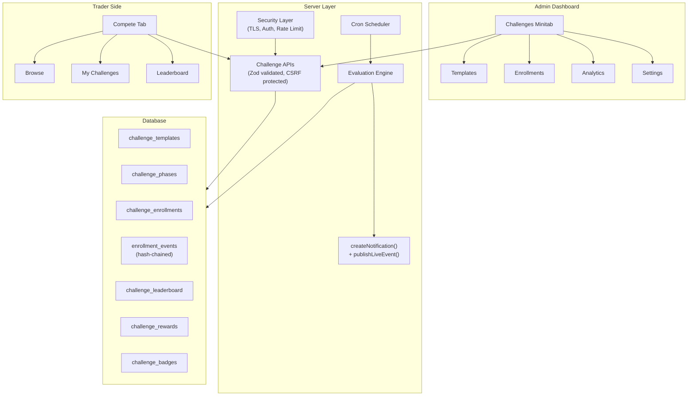
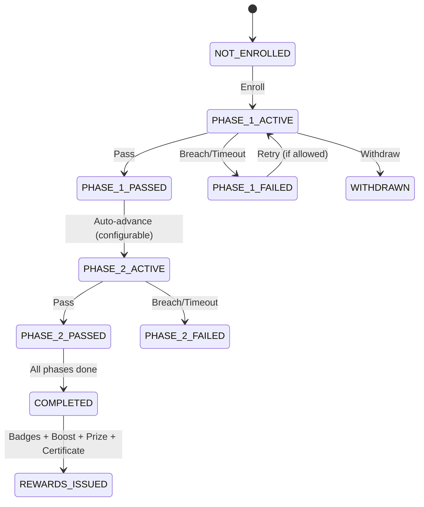
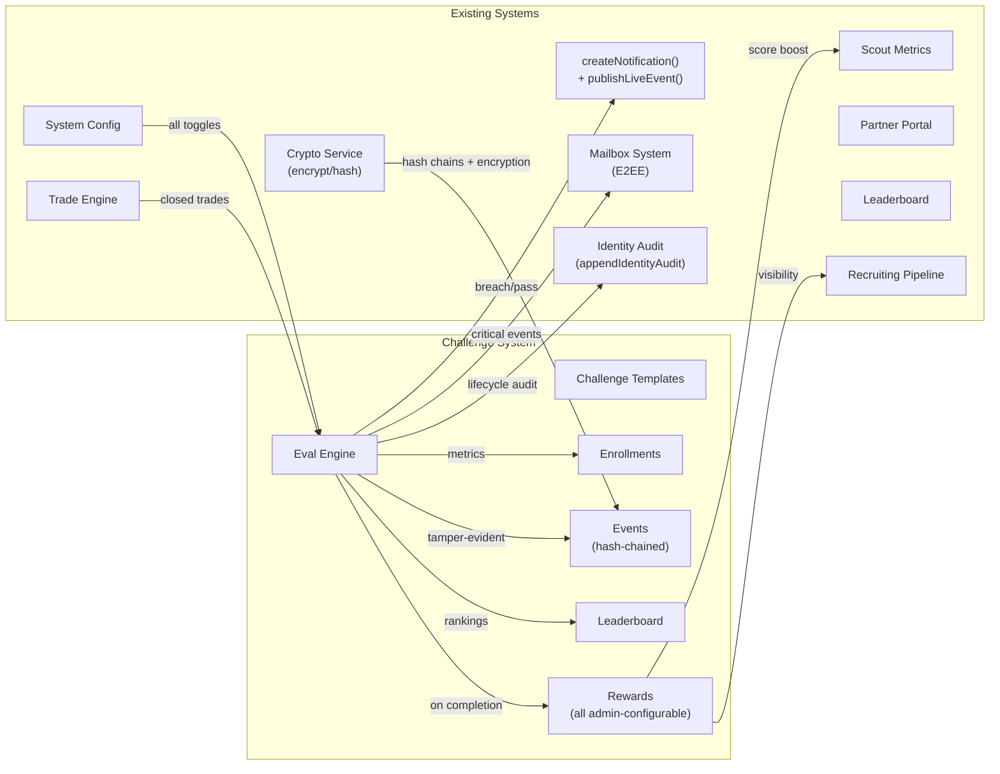
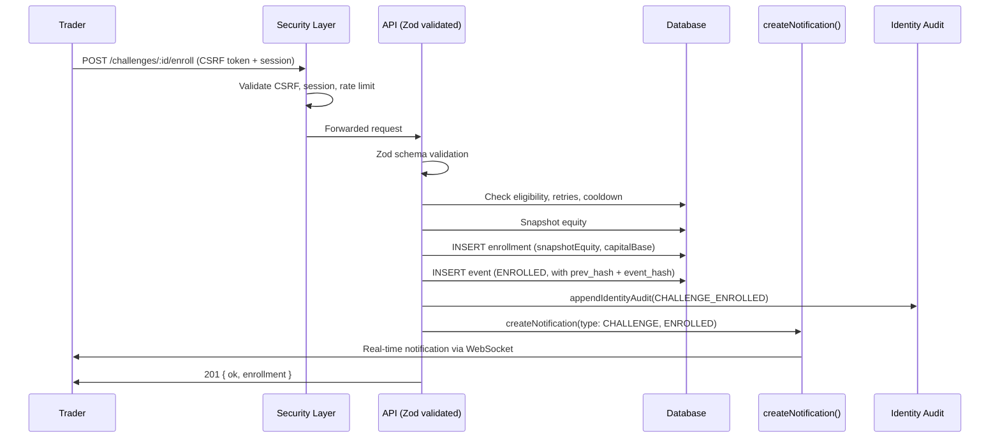
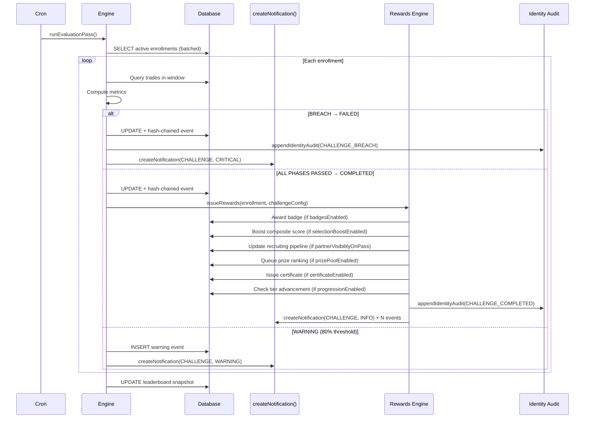

# TradeQuip Challenges System — Enhanced Design & Functionality Specification

> **Document Type:** Design & Functionality (Ideation Only — NO CODE)
> **Date:** 2026-02-10 (v4)
> **Scope:** Admin Dashboard (Challenges Minitab) + Trader-Side Participation + Data Propagation

> [!IMPORTANT]
> **Platform Identity:** TradeQuip is a **free hiring evaluation/assessment platform**, NOT a funded trader firm. Challenges serve as structured skill assessments for talent discovery, with rewards in the form of **prize money**, **selection consideration** (partner/firm visibility), and **gamified recognition** (badges, ranks, certificates). There is NO funded account stage, NO profit splits, NO payouts from trading capital.

> [!CAUTION]
> **Three Governing Principles:**
> 1. **All features are admin-configurable** — Every toggle, threshold, reward type, badge, certificate option, and display element can be turned on/off and customized by the admin. No hardcoded behavior.
> 2. **All notifications use the existing infrastructure** — `createNotification()` + `publishLiveEvent()` + mailbox threads + E2EE, with a new `CHALLENGE` notification type and granular admin toggles.
> 3. **Security-first** — Injection-proof inputs, secure transport (TLS), authenticated WebSockets, CSRF protection, E2E encryption for sensitive data exchanges, tamper-evident audit trails.

---

## Table of Contents

1. [Current State Gap Analysis](#1-current-state-gap-analysis)
2. [Industry Research Summary](#2-industry-research-summary)
3. [Architecture Overview](#3-architecture-overview)
4. [Challenge Template Design (Admin — Fully Configurable)](#4-challenge-template-design-admin--fully-configurable)
5. [Multi-Phase Challenge System](#5-multi-phase-challenge-system)
6. [Capital Base Isolation](#6-capital-base-isolation)
7. [Admin Dashboard — Challenges Minitab Redesign](#7-admin-dashboard--challenges-minitab-redesign)
8. [Trader-Side Experience](#8-trader-side-experience)
9. [Evaluation Engine Enhancements](#9-evaluation-engine-enhancements)
10. [Challenge Leaderboard & Rankings](#10-challenge-leaderboard--rankings)
11. [Rewards & Recognition System (Fully Admin-Configurable)](#11-rewards--recognition-system-fully-admin-configurable)
12. [Notifications & Mailing Integration](#12-notifications--mailing-integration)
13. [Security Hardening Specification](#13-security-hardening-specification)
14. [Analytics & Reporting](#14-analytics--reporting)
15. [Schema Additions](#15-schema-additions)
16. [API Surface Design](#16-api-surface-design)
17. [Integration Map](#17-integration-map)
18. [Data Flow Diagrams](#18-data-flow-diagrams)
19. [Repo-Grounded Design + Algorithm Addendum](#19-repo-grounded-design--algorithm-addendum-2026-02-10)

---

## 1. Current State Gap Analysis

### What Exists Today

| Layer | File | Status |
|-------|------|--------|
| **Schema** | `challenges` + `challenge_enrollments` | Basic fields: name, profit target, daily loss, duration, status |
| **Admin UI** | `ScoutWorkbench.tsx` Challenges tab | Simple create form + flat table |
| **Trader UI** | `LeaderboardScreen.tsx` Compete tab | Flat table with Enroll/Withdraw |
| **API** | `adminScout.ts` + `traderTalent.ts` | Basic CRUD + enroll/withdraw/status |
| **Engine** | `engines.ts` + `evaluateChallenges.ts` | Single-pass PASS/FAIL evaluation |
| **Notifications** | `messaging.ts` + `notifications.ts` | `createNotification()` with E2EE, `publishLiveEvent()` for real-time, types: TRADE/SYSTEM/ACCOUNT/SECURITY/KYC |
| **Mailbox** | `mailbox.ts` | Compose/reply/broadcast with rate limiting, E2EE envelopes, Zod validation |

### Critical Gaps

| Gap | Impact |
|-----|--------|
| No multi-phase challenges | Cannot model 1/2/3-phase evaluations |
| No capital base snapshot | PnL uses all-time trades, not challenge window |
| No admin configurability for rewards | No prize pools, badges, or certificates |
| No challenge notification type | Existing `createNotification()` lacks `CHALLENGE` type |
| No enrollment management UI | Admin cannot view/override individual enrollments |
| No challenge leaderboard | No competitive ranking |
| No consistency rules | No max single-day profit cap |
| No drawdown type selection (static/trailing) | Cannot customize per challenge |
| No retry rules or tracking | Unlimited retries |
| No analytics dashboard | No pass/fail rates, trends |
| No security hardening specific to challenges | No injection prevention, transport security for challenge data |

---

## 2. Industry Research Summary

### Platform Identity: Assessment vs. Funded Firm

| Aspect | Funded Trader Firm | TradeQuip (Assessment Platform) |
|--------|---|----|
| **Purpose** | Fund traders to trade firm's capital | Find talent for hiring/recruitment |
| **Cost** | Entry fee ($100–$1,000+) | **Free** |
| **Reward** | Funded account + profit split | **Prize money + selection + badges + certificates** |
| **Revenue** | Entry fees + spread markup | Partner subscriptions + platform value |

### What We Borrow (Evaluation Mechanics)
- Multi-phase evaluation, profit targets, drawdown limits, consistency rules, duration limits, leaderboards

### What We Replace (Rewards — All Admin-Configurable)

| Reward | Admin Controls |
|--------|---------------|
| 🏆 Prize Money Pool | Enable/disable, pool amount, distribution brackets, min completions, award timing |
| 🏅 Achievement Badges | Enable/disable globally + per-challenge, badge templates CRUD, criteria config |
| 🎯 Selection Boost | Enable/disable, boost points amount, auto partner visibility, auto watchlist |
| 🎓 Digital Certificates | Enable/disable globally, enable/disable downloadability, enable/disable sharing, template customization |
| 🔥 Progression Tiers | Enable/disable, tier definitions CRUD, criteria per tier |

---

## 3. Architecture Overview



---

## 4. Challenge Template Design (Admin — Fully Configurable)

> [!IMPORTANT]
> **Every field below is admin-configurable.** For custom challenges, the admin can override ANY default, enable/disable ANY feature, and create arbitrary reward configurations. There are NO hardcoded challenge behaviors.

### Card 1: Identity & Description 🔵

| Field | Type | Admin Configurable? |
|-------|------|:---:|
| `name` | text (3-120 chars) | ✅ |
| `slug` | text (auto-generated, editable) | ✅ |
| `description` | textarea (max 4000) | ✅ |
| `category` | select: STANDARD / EXPRESS / SPRINT / CUSTOM | ✅ + custom values |
| `tier` | select: STARTER / GROWTH / PROFESSIONAL / ELITE | ✅ + custom values |
| `tags` | multi-select chips (max 10) | ✅ CRUD on tag list |
| `iconColor` | color picker | ✅ |

### Card 2: Capital & Account Rules 🟢

| Field | Type | Admin Configurable? |
|-------|------|:---:|
| `virtualCapitalUsd` | number (1K–10M) | ✅ |
| `capitalMode` | VIRTUAL / TRADER_EQUITY | ✅ + default in Settings |
| `leverageMultiplier` | number (1x–500x) | ✅ |

### Card 3: Phase Configuration 🟡 (1–3 phases, repeatable sub-cards)

| Field | Admin Configurable? | Notes |
|-------|:---:|-------|
| `phaseNumber` (1, 2, 3) | ✅ | Admin chooses 1/2/3-step |
| `phaseName` | ✅ | E.g., "Evaluation", "Verification" |
| `profitTargetPct` | ✅ | 0.01–1.0 |
| `maxDailyLossPct` | ✅ | 0.01–1.0 |
| `maxTotalLossPct` | ✅ | 0.01–1.0 |
| `drawdownType` | ✅ | STATIC / TRAILING |
| `durationDays` | ✅ | 0 = unlimited |
| `minTradingDays` | ✅ | |
| `maxSingleDayProfitPct` | ✅ | Consistency rule (null = disabled) |
| `allowWeekendHolding` | ✅ | Override global |
| `allowNewsTrading` | ✅ | Override global |
| `restrictedSymbolsCsv` | ✅ | Comma-separated |
| `maxConcurrentPositions` | ✅ | null = use global |
| `maxLotSize` | ✅ | null = use global |

### Card 4: Enrollment Rules 🟣

| Field | Admin Configurable? |
|-------|:---:|
| `maxEnrollments` (total cap) | ✅ |
| `maxActiveEnrollments` (concurrent) | ✅ |
| `maxRetriesPerTrader` | ✅ |
| `retryCooldownHours` | ✅ |
| `eligibilityGate` (NONE / EMAIL_VERIFIED / CONTENDER / ADMIN_APPROVED) | ✅ |

### Card 5: Scheduling & Availability ⚪

| Field | Admin Configurable? |
|-------|:---:|
| `isActive` (master toggle) | ✅ |
| `startAt` / `endAt` | ✅ |
| `enrollmentStartAt` / `enrollmentEndAt` | ✅ |
| `visibleToTraders` | ✅ |
| `featuredOrder` | ✅ |

### Card 6: Rewards Configuration 🟠 (Fully Configurable)

> [!IMPORTANT]
> **Every reward type can be independently enabled/disabled per challenge.** Admin has maximum granularity.

| Field | Type | Admin Configurable? | Notes |
|-------|------|:---:|-------|
| `prizePoolEnabled` | switch | ✅ | Toggle prize money for this challenge |
| `prizePoolUsd` | decimal | ✅ | Total pool amount |
| `prizeDistribution` | JSON editor | ✅ | `[{rank: 1, pct: 0.50}, ...]` — admin sets who gets what |
| `prizeMinCompletions` | integer | ✅ | Min completions before prizes activate |
| `prizeAwardTiming` | select | ✅ | ON_CHALLENGE_END / ON_COMPLETION |
| `badgesEnabled` | switch | ✅ | Toggle badges for this challenge |
| `badgeOnPass` | select from badge templates | ✅ | Which badge on passing |
| `badgeOnTop3` | select from badge templates | ✅ | Additional badge for podium |
| `certificateEnabled` | switch | ✅ | Toggle certificates on/off per challenge |
| `certificateDownloadable` | switch | ✅ | Whether traders can download the certificate PDF |
| `certificateShareable` | switch | ✅ | Whether the shareable link is generated |
| `certificateTemplateId` | select | ✅ | Which certificate template to use |
| `certificateIncludeMetrics` | switch | ✅ | Whether PnL/DD metrics appear on cert |
| `selectionBoostEnabled` | switch | ✅ | Toggle scout score boost |
| `selectionBoostPoints` | decimal | ✅ | How many points to add |
| `partnerVisibilityOnPass` | switch | ✅ | Auto-set partner visibility |
| `autoWatchlistTier` | select (null / A_LIST / B_LIST / INCUBATOR) | ✅ | Auto-add to watchlist |
| `progressionTierId` | FK select | ✅ | Which progression tier system |
| `customRewardJson` | JSON (freeform) | ✅ | For truly custom rewards not covered above |

---

## 5. Multi-Phase Challenge System

### Phase Progression



### Key Behaviors
1. Trader's actual `starting_equity` is **never modified**
2. Each enrollment captures `snapshotEquity` at enrollment time
3. Phase advancement resets PnL window; `phaseStartedAt` updates
4. Auto-advance is **admin-configurable** (`challengeAutoAdvancePhase` toggle)
5. On completion: rewards issued per challenge config (all configurable)

---

## 6. Capital Base Isolation

| Mode | Capital Base | Admin Toggle |
|------|-------------|:---:|
| **VIRTUAL** | Challenge's `virtualCapitalUsd` | ✅ (default in Settings) |
| **TRADER_EQUITY** | Trader's snapshot at enrollment | ✅ |

```
capitalBase = (mode === 'VIRTUAL') ? challenge.virtualCapitalUsd : enrollment.snapshotEquity
currentPnlPct = totalPnl / capitalBase
```

Trades are NOT filtered — challenge evaluates ALL trades within the time window.

---

## 7. Admin Dashboard — Challenges Minitab Redesign

```
┌──────────┬──────────────┬───────────┬──────────┐
│Templates │ Enrollments  │ Analytics │ Settings │
└──────────┴──────────────┴───────────┴──────────┘
```

### Sub-Tab 1: Templates
Table with: Name (+ pills), Phases, Capital, Target %, Max DD, Duration, Status, Enrolled, Pass Rate, Prize Pool, Actions (Edit/Duplicate/Archive/Delete). Inline expand for phase + reward details.

### Sub-Tab 2: Enrollments
Filter bar (challenge, status, phase, trader, date). Table with: Trader, Challenge, Phase, Status (color pill), Progress bar, PnL%, Daily Loss, Trading Days, Time Left, Actions.

**Detail Panel:** Overview, Performance Gauges (green/amber/red), Equity Curve, Trade Activity, Event Timeline, Admin Actions (Extend/Override/Advance/Reset/DQ/Note/Send Notification).

### Sub-Tab 3: Analytics
Cards: Total Enrollments, Active, Pass Rate, Avg Time to Pass, Prize Money Awarded, Selection Conversions.
Charts: Enrollment Funnel, Pass/Fail Trend, Breach Distribution, Top Performers, Popularity, Reward Distribution.

### Sub-Tab 4: Settings (Full Admin Configurability)

#### Card A: System Toggles

| Setting | Type | Default | Admin Configurable? |
|---------|------|---------|:---:|
| `traderCompeteEnabled` | switch | false | ✅ |
| `challengeAutoAdvancePhase` | switch | true | ✅ |
| `challengeEvalIntervalMin` | number | 60 | ✅ |
| `challengeEvalMaxRows` | number | 500 | ✅ |
| `challengeWarningThresholdPct` | number | 0.80 | ✅ |

#### Card B: Default Challenge Values (all overridable per template)

| Setting | Default | Admin Configurable? |
|---------|---------|:---:|
| `defaultDrawdownType` | STATIC | ✅ |
| `defaultCapitalMode` | VIRTUAL | ✅ |
| `defaultMaxRetries` | 3 | ✅ |
| `defaultRetryCooldownHours` | 24 | ✅ |
| `defaultEligibilityGate` | EMAIL_VERIFIED | ✅ |
| `defaultCategory` | STANDARD | ✅ |
| `defaultTier` | STARTER | ✅ |

#### Card C: Rewards System Configuration (Global Toggles)

| Setting | Type | Default | Affects |
|---------|------|---------|---------|
| `challengeRewardsEnabled` | switch | true | Master rewards toggle |
| `challengePrizePoolsEnabled` | switch | true | Enable/disable prize money feature globally |
| `challengeBadgesEnabled` | switch | true | Enable/disable badge system globally |
| `challengeCertificatesEnabled` | switch | true | Enable/disable certificate generation globally |
| `challengeCertificatesDownloadable` | switch | true | Enable/disable certificate download globally |
| `challengeCertificatesShareable` | switch | true | Enable/disable certificate share links globally |
| `challengeSelectionBoostEnabled` | switch | true | Enable/disable scout score boost globally |
| `challengeDefaultSelectionBoost` | number | 5.0 | Default composite score bonus |
| `challengeProgressionEnabled` | switch | true | Enable/disable progression tiers |
| `challengeCustomRewardsEnabled` | switch | false | Enable freeform custom reward JSON |

> [!NOTE]
> **Configurability Hierarchy:** Global settings → Per-template overrides. If a global toggle is OFF, the per-template toggle is ignored (global wins). If global is ON, each template can independently enable/disable.

#### Card D: Notification Toggles (Challenge-Specific)

| Setting | Type | Default |
|---------|------|---------|
| `challengeNotifyOnEnroll` | switch | true |
| `challengeNotifyOnPhaseWarning` | switch | true |
| `challengeNotifyOnBreach` | switch | true |
| `challengeNotifyOnPhasePass` | switch | true |
| `challengeNotifyOnFail` | switch | true |
| `challengeNotifyOnComplete` | switch | true |
| `challengeNotifyOnBadgeAward` | switch | true |
| `challengeNotifyOnPrizeAward` | switch | true |
| `challengeNotifyOnCertIssue` | switch | true |
| `challengeNotifyOnTierUp` | switch | true |
| `challengeNotifyOnAdminAction` | switch | true |
| `challengeNotifyViaMailbox` | switch | false |
| `challengeMailboxCategory` | select | SYSTEM |

#### Card E: Badge Templates (Admin CRUD)

Admin can create/edit/delete badge templates. Each badge has:

| Field | Admin Configurable? |
|-------|:---:|
| `key` (unique slug) | ✅ |
| `name` (display name) | ✅ |
| `description` | ✅ |
| `iconEmoji` or `iconUrl` | ✅ |
| `category` (CHALLENGE / RISK / SPEED / CONSISTENCY / VETERAN) | ✅ |
| `criteriaJson` (rules for auto-award) | ✅ |
| `isActive` | ✅ |

#### Card F: Certificate Templates (Admin CRUD)

| Field | Admin Configurable? |
|-------|:---:|
| `name` (template name) | ✅ |
| `headerText` | ✅ |
| `bodyText` (with merge fields: `{{trader_name}}`, `{{challenge_name}}`, `{{completion_date}}`, etc.) | ✅ |
| `includeMetrics` (PnL, DD, days) | ✅ |
| `includeVerificationCode` | ✅ |
| `brandColor` | ✅ |
| `logoUrl` | ✅ |
| `isDownloadable` | ✅ |
| `isShareable` | ✅ |

#### Card G: Progression Tier Templates (Admin CRUD)

```json
{
  "name": "Standard Progression",
  "tiers": [
    {"name": "Bronze", "minPasses": 1, "scoreBonusPct": 0.05, "icon": "🥉"},
    {"name": "Silver", "minPasses": 3, "minAvgPnl": 0.05, "scoreBonusPct": 0.10},
    {"name": "Gold", "minPasses": 5, "minTop3": 1, "scoreBonusPct": 0.15},
    {"name": "Elite", "minPasses": 8, "minTop3": 3, "maxDqs": 0, "scoreBonusPct": 0.25}
  ]
}
```

All tier names, criteria, icons, and bonuses are fully admin-editable.

---

## 8. Trader-Side Experience

### 8.1 Challenge Browse (Card Grid)

Cards show: Name, Target %, Daily Loss, Duration, Phases, Prize Pool (if enabled), Badge reward (if enabled), Active participants, "Enroll Now" button. Detail modal shows full phase breakdown, restrictions, and rewards.

### 8.2 My Challenges Dashboard

Per-enrollment card with: Status badge, Day count, Attempt #, PnL gauge, Daily Loss gauge, Total DD gauge, Trading Days gauge (all color-coded green/amber/red), Prize rank (if prize pool enabled), Equity Curve, Trade Log, Withdraw button.

### 8.3 Challenge Leaderboard

Real-time ranking (if enabled per challenge by admin). Privacy: admin-configurable anonymization. "My Position" highlighted.

### 8.4 Rewards Display (on Pro Profile)

- Badges grid (if `challengeBadgesEnabled`)
- Challenge history with stats
- Certificates (if `challengeCertificatesEnabled`, download if `certificateDownloadable`, share if `certificateShareable`)
- Progression tier badge (if `challengeProgressionEnabled`)

**All visibility controlled by admin toggles.**

---

## 9. Evaluation Engine Enhancements

### Enhanced Evaluation Pass

```
For each active enrollment:
  1. Load phase rules (challenge_phases)
  2. Compute metrics (PnL, daily loss, total DD, trading days)
  3. Check failures → mark FAILED, log event, send notification
  4. Check warnings (80% threshold, configurable) → log event, send notification
  5. Check pass → advance phase or mark COMPLETED
  6. On COMPLETED:
     ▸ Award badge (if badgesEnabled && badgeOnPass configured)
     ▸ Boost composite score (if selectionBoostEnabled)
     ▸ Update recruiting pipeline (if partnerVisibilityOnPass)
     ▸ Add to prize ranking (if prizePoolEnabled)
     ▸ Issue certificate (if certificateEnabled)
     ▸ Check progression tier advancement (if progressionEnabled)
     ▸ All via createNotification() with type 'CHALLENGE'
  7. Update leaderboard snapshot
```

### Trailing Drawdown
```
peakEquity tracks highest equity; breach when (peak - current) / peak >= limit
```

### Consistency Rule
```
If maxSingleDayProfitPct set: flag/fail if single day > target * threshold
```

---

## 10. Challenge Leaderboard & Rankings

All admin-configurable: global enable, per-challenge enable, anonymization, max visible, ranking metric (PNL_PCT / COMPOSITE_SCORE), refresh interval.

---

## 11. Rewards & Recognition System (Fully Admin-Configurable)

### Admin Controls Summary

| Reward Type | Global Toggle | Per-Challenge Toggle | Customizable |
|-------------|:---:|:---:|:---:|
| Prize Money Pool | `challengePrizePoolsEnabled` | `prizePoolEnabled` | Amount, distribution, timing, min completions |
| Badges | `challengeBadgesEnabled` | `badgesEnabled` | Badge template CRUD (name, icon, criteria) |
| Selection Boost | `challengeSelectionBoostEnabled` | `selectionBoostEnabled` | Boost points, partner visibility, watchlist tier |
| Certificates | `challengeCertificatesEnabled` | `certificateEnabled` | Template CRUD, downloadable, shareable, metrics inclusion |
| Progression Tiers | `challengeProgressionEnabled` | `progressionTierId` | Tier template CRUD (names, criteria, bonuses) |
| Custom Rewards | `challengeCustomRewardsEnabled` | `customRewardJson` | Freeform JSON for future extensibility |

### Configurability Hierarchy

```
Global OFF → Feature disabled everywhere (per-challenge ignored)
Global ON + Per-Challenge OFF → Feature disabled for that specific challenge
Global ON + Per-Challenge ON → Feature active with per-challenge config
```

### Prize Distribution Example

Admin configures: `prizePoolUsd: 1000`, `prizeDistribution: [{rank:1, pct:0.50}, {rank:2, pct:0.30}, {rank:3, pct:0.20}]`
- 1st place: $500
- 2nd place: $300
- 3rd place: $200
- Requires `prizeMinCompletions` traders to complete before prizes are distributed

### Certificate Feature Controls

| Control | Level | Description |
|---------|-------|-------------|
| `challengeCertificatesEnabled` | Global | Whether certificates exist AT ALL in the platform |
| `certificateEnabled` | Per-Challenge | Whether THIS challenge issues certificates |
| `challengeCertificatesDownloadable` | Global | Can ANY certificate be downloaded (PDF) |
| `certificateDownloadable` | Per-Challenge | Can THIS challenge's certificate be downloaded |
| `challengeCertificatesShareable` | Global | Can ANY certificate generate a shareable link |
| `certificateShareable` | Per-Challenge | Can THIS challenge's certificate be shared |
| `certificateIncludeMetrics` | Per-Challenge | Whether PnL/DD metrics appear on the cert |
| `certificateTemplateId` | Per-Challenge | Which visual template to use |

---

## 12. Notifications & Mailing Integration

> [!IMPORTANT]
> **All challenge notifications use the existing `createNotification()` API** from `messaging.ts`, which already supports E2EE, real-time via `publishLiveEvent()`, severity levels, sound control, and configurable toggles. We add a new `CHALLENGE` notification type and granular admin toggles.

### Existing Infrastructure Used

| Component | Location | How Challenges Use It |
|-----------|----------|----------------------|
| `createNotification()` | `messaging.ts:1177` | Create in-app bell notifications with E2EE |
| `publishLiveEvent()` | `liveBus.ts` → WebSocket | Push real-time notification to connected trader |
| `NotificationType` | `messaging.ts:18` | Add `CHALLENGE` to existing TRADE/SYSTEM/ACCOUNT/SECURITY/KYC |
| `CommunicationSettingsResolved` | `messaging.ts:65` | Add challenge-specific toggles to config |
| `isNotificationEnabledForEvent()` | `messaging.ts` | Gate notifications per admin toggles |
| `mailboxThreads` + `mailboxMessages` | `schema.pg.ts` | Optional: send challenge events as mailbox messages |
| `appendIdentityAudit()` | `identityAudit.ts` | Log challenge actions to identity audit trail |
| Rate limiting | `mailbox.ts:117-159` | Existing rate limit infrastructure reused |

### New Notification Type: `CHALLENGE`

Add `CHALLENGE` to the existing `NotificationType` union. All challenge notifications use:

```typescript
createNotification({
  userId: enrollment.userId,
  type: 'CHALLENGE',
  severity: 'INFO' | 'WARNING' | 'CRITICAL',
  title: 'Challenge Phase Passed!',
  message: 'You passed Phase 1 of the Monthly Challenge...',
  link: '/compete/enrollment/123',
  sourceEvent: 'PHASE_PASSED',
  playSound: true,
});
```

### Notification Events & Admin Toggles

Each event below is **independently toggleable by admin** in the Settings sub-tab:

| Event | Admin Toggle | Type | Severity | Channel |
|-------|:---:|------|----------|---------|
| `CHALLENGE_ENROLLED` | `challengeNotifyOnEnroll` | CHALLENGE | INFO | In-app + real-time |
| `PHASE_WARNING_DAILY_LOSS` | `challengeNotifyOnPhaseWarning` | CHALLENGE | WARNING | In-app + real-time + sound |
| `PHASE_WARNING_TOTAL_DD` | `challengeNotifyOnPhaseWarning` | CHALLENGE | WARNING | In-app + real-time + sound |
| `PHASE_BREACH_DAILY_LOSS` | `challengeNotifyOnBreach` | CHALLENGE | CRITICAL | In-app + real-time + mailbox |
| `PHASE_BREACH_TOTAL_DD` | `challengeNotifyOnBreach` | CHALLENGE | CRITICAL | In-app + real-time + mailbox |
| `PHASE_PASSED` | `challengeNotifyOnPhasePass` | CHALLENGE | INFO | In-app + real-time |
| `PHASE_ADVANCED` | `challengeNotifyOnPhasePass` | CHALLENGE | INFO | In-app + real-time |
| `CHALLENGE_FAILED` | `challengeNotifyOnFail` | CHALLENGE | CRITICAL | In-app + real-time + mailbox |
| `CHALLENGE_COMPLETED` | `challengeNotifyOnComplete` | CHALLENGE | INFO | In-app + real-time + mailbox + sound |
| `REWARD_BADGE_AWARDED` | `challengeNotifyOnBadgeAward` | CHALLENGE | INFO | In-app + real-time |
| `REWARD_PRIZE_AWARDED` | `challengeNotifyOnPrizeAward` | CHALLENGE | INFO | In-app + real-time + mailbox |
| `REWARD_CERTIFICATE_ISSUED` | `challengeNotifyOnCertIssue` | CHALLENGE | INFO | In-app + real-time |
| `SELECTION_BOOST_APPLIED` | (silent) | — | — | Event log only |
| `PROGRESSION_TIER_UP` | `challengeNotifyOnTierUp` | CHALLENGE | INFO | In-app + real-time + sound |
| `ADMIN_OVERRIDE` | `challengeNotifyOnAdminAction` | CHALLENGE | INFO | In-app (to trader) |
| `ADMIN_EXTENDED` | `challengeNotifyOnAdminAction` | CHALLENGE | INFO | In-app (to trader) |
| `CONSISTENCY_WARNING` | `challengeNotifyOnPhaseWarning` | CHALLENGE | WARNING | In-app + real-time |

### Mailbox Thread Integration (Optional, Admin-Configurable)

If `challengeNotifyViaMailbox` is enabled:
- Critical challenge events (breach, fail, complete, prize) also create a **mailbox message** in a system thread
- Uses existing `composeThread()` / `appendReply()` from `messaging.ts`
- Category: configurable via `challengeMailboxCategory` (default: SYSTEM)
- Supports E2EE if enabled globally on the platform
- Subject/body templates use merge fields: `{{challenge_name}}`, `{{phase}}`, `{{pnl_pct}}`, `{{status}}`

### Admin Notification from Dashboard

Admins can send **custom notifications** to individual traders from the Enrollment Detail panel:
- Uses existing `createNotification()` with `type: 'CHALLENGE'`
- Optional: also send as mailbox message
- Logged to identity audit with `actorType: 'ADMIN'`

---

## 13. Security Hardening Specification

> [!CAUTION]
> **All challenge system components MUST implement the security measures below.** The system handles sensitive evaluation data, prize money allocations, and affects trader recruitment outcomes.

### 13.1 Injection Attack Prevention

| Layer | Measure | Implementation |
|-------|---------|---------------|
| **SQL Injection** | Parameterized queries ONLY | All DB queries via Drizzle ORM (parameterized by default). **NO raw SQL string concatenation.** |
| **NoSQL Injection** | N/A | Not applicable (PostgreSQL only) |
| **XSS Prevention** | Output encoding + CSP | React auto-escapes JSX. All user-provided text (challenge names, descriptions, notes) sanitized before rendering. Content-Security-Policy headers block inline scripts. |
| **Command Injection** | No shell execution | Challenge system does NOT invoke any shell commands. Certificate PDF generation uses library APIs, not CLI tools. |
| **Input Validation** | Zod schemas on ALL endpoints | Every API endpoint validates input with Zod schemas (matching existing patterns in `adminScout.ts`, `mailbox.ts`). Type coercion, length limits, pattern matching enforced server-side. |
| **JSON Injection** | Validated JSON parsing | All JSON fields (`prizeDistribution`, `customRewardJson`, `criteriaJson`, `tiersJson`) validated against Zod schemas before storage. No raw `JSON.parse()` without validation. |
| **Path Traversal** | No file paths from user input | Certificate templates use admin-configured IDs (integers), not file paths. |

### 13.2 Data Modification Prevention

| Measure | Implementation |
|---------|---------------|
| **Hash-chained enrollment events** | Each `challenge_enrollment_event` row includes `prevHash` (SHA-256 of previous event) and `eventHash` (SHA-256 of current event payload). Matches existing pattern from `tradeAudit` and `orderIntentAudit`. Tampering with any event breaks the chain. |
| **Immutable completion records** | Once an enrollment status is set to `COMPLETED`, `PASSED`, or `FAILED` by the evaluation engine, it can only be changed by `ADMIN_OVERRIDE` with mandatory `reason` field, logged to identity audit. |
| **Prize award integrity** | Prize allocations require admin approval (`status: PENDING → APPROVED`). Approval event is hash-chained and identity-audited. |
| **Snapshot integrity** | `snapshotEquity` and `capitalBaseUsed` are set at enrollment time and are **immutable** thereafter. Any admin adjustment creates a new event, not a mutation. |

### 13.3 Secure Transport

| Measure | Implementation |
|---------|---------------|
| **TLS 1.3** | All HTTP communication uses TLS 1.3 (enforced at reverse proxy/load balancer level). No plaintext HTTP for challenge APIs. |
| **HSTS** | `Strict-Transport-Security` header with `max-age=31536000; includeSubDomains`. |
| **Certificate Pinning** | For production deployment, pin the TLS certificate at the application level. |
| **Secure Cookies** | Session cookies use `Secure`, `HttpOnly`, `SameSite=Strict` flags (existing pattern). |

### 13.4 WebSocket Security

| Measure | Implementation |
|---------|---------------|
| **Session-bound auth** | WebSocket connections (via `liveBus.ts`) require valid session authentication before processing. Existing `publishLiveEvent()` targets specific `userId` — events are never broadcast to unauthenticated connections. |
| **Origin validation** | WebSocket upgrade requests validated against allowed origins (existing middleware). |
| **Message validation** | All WebSocket messages validated before processing. No arbitrary payloads accepted. |
| **Rate limiting** | WebSocket message rate limiting applied per connection (existing infrastructure). |
| **Connection limits** | Max concurrent WebSocket connections per user enforced. |
| **Heartbeat/timeout** | Stale WebSocket connections cleaned up via heartbeat mechanism. |

### 13.5 API Security

| Measure | Implementation |
|---------|---------------|
| **Authentication** | All challenge APIs require `requireAuth` middleware (existing pattern). Admin APIs also require `requireAdmin`. |
| **CSRF Protection** | Existing CSRF token mechanism applied to all challenge mutation endpoints (POST, PUT, DELETE). |
| **CORS** | Strict CORS policy allowing only the application origin. |
| **Rate Limiting** | Per-endpoint rate limits: enrollment (5/min/user), withdrawal (3/min/user), leaderboard (30/min/user). Admin endpoints: standard admin limits. |
| **Input Normalization** | All string inputs trimmed, length-capped, and validated against Zod schemas before processing. |
| **Output Filtering** | API responses exclude internal fields (hash chains, admin notes for trader APIs, etc.). Enrollment detail only shows own data to the requesting trader. |
| **Authorization** | Traders can only view/modify their own enrollments. Admin can view/modify all. Challenge leaderboard respects privacy settings. |

### 13.6 E2E Encryption for Sensitive Data

| Data | Encryption | Notes |
|------|-----------|-------|
| **Challenge notifications** | E2EE via existing `createNotification()` | If platform E2EE is enabled, notification title/message encrypted with recipient's RSA-OAEP-256 public key + AES-256-GCM (existing pattern) |
| **Mailbox messages** | E2EE via existing mailbox infrastructure | If `challengeNotifyViaMailbox` is enabled, messages use E2EE envelope format |
| **Enrollment events** | Hash-chained (tamper-evident) | NOT encrypted (admin needs to audit), but integrity-protected via SHA-256 hash chain |
| **Admin notes** | Server-side encryption at rest | `encryptString()` from `crypto.ts` for `admin_notes` field |
| **Prize award data** | Hash-chained + audit-logged | Prize amounts and approvals protected by hash chain and identity audit |
| **Certificate verification codes** | HMAC-SHA256 | Verification codes on certificates use HMAC for non-forgeability |

### 13.7 Security Event Logging

All security-relevant challenge events are logged via `appendIdentityAudit()`:

| Event | Category | Type |
|-------|----------|------|
| Challenge enrollment | RECRUITMENT | CHALLENGE_ENROLLED |
| Challenge breach | SECURITY | CHALLENGE_BREACH |
| Admin override | ADMIN | CHALLENGE_ADMIN_OVERRIDE |
| Admin DQ | ADMIN | CHALLENGE_ADMIN_DISQUALIFY |
| Prize approval | ADMIN | CHALLENGE_PRIZE_APPROVED |
| Certificate issued | RECRUITMENT | CHALLENGE_CERTIFICATE_ISSUED |
| Suspicious activity (multi-enroll attempt, rate limit hit) | SECURITY | CHALLENGE_SUSPICIOUS_ACTIVITY |

---

## 14. Analytics & Reporting

**Summary cards:** Total Enrollments, Active, Pass Rate (trend), Avg Time to Pass, Prize Money Awarded, Selection Conversions, Badges Awarded.

**Charts:** Enrollment Funnel, Pass/Fail Trend, Breach Distribution, Top Performers, Challenge Popularity, Reward Distribution, Partner Conversion Funnel.

---

## 15. Schema Additions

### New: `challenge_phases`
```
id, challenge_id (FK CASCADE), phase_number, phase_name, profit_target_pct,
max_daily_loss_pct, max_total_loss_pct, drawdown_type, duration_days,
min_trading_days, max_single_day_profit_pct, allow_weekend_holding,
allow_news_trading, restricted_symbols_csv, max_concurrent_positions,
max_lot_size, created_at, updated_at
UNIQUE: (challenge_id, phase_number)
```

### Enhanced: `challenges` (added columns)
```
category, tier, slug, tags, icon_color, virtual_capital_usd, capital_mode,
leverage_multiplier, max_enrollments, max_active_enrollments,
max_retries_per_trader, retry_cooldown_hours, eligibility_gate,
enrollment_start_at, enrollment_end_at, visible_to_traders, featured_order,
prize_pool_enabled, prize_pool_usd, prize_distribution_json,
prize_min_completions, prize_award_timing,
badges_enabled, badge_on_pass, badge_on_top3,
certificate_enabled, certificate_downloadable, certificate_shareable,
certificate_template_id, certificate_include_metrics,
selection_boost_enabled, selection_boost_points,
partner_visibility_on_pass, auto_watchlist_tier,
progression_tier_id, custom_reward_json, leaderboard_enabled,
leaderboard_anonymize, leaderboard_max_visible
```

### Enhanced: `challenge_enrollments` (added columns)
```
current_phase, snapshot_equity, capital_base_used, attempt_number,
max_total_loss_hit, peak_equity, phase_started_at, admin_notes,
last_warning_event, last_warning_at
```

### New: `challenge_enrollment_events` (hash-chained)
```
id, enrollment_id (FK CASCADE), event_type, event_at, actor_type,
actor_user_id, phase_number, details_json, pnl_snapshot_pct,
daily_loss_snapshot, total_dd_snapshot, trading_days_snapshot,
note, prev_hash, event_hash
INDEX: (enrollment_id, event_at), (event_type, event_at)
```

### New: `challenge_badges`
```
id, key (unique), name, description, icon_url, icon_emoji, category,
criteria_json, is_active, created_at
```

### New: `challenge_badge_awards`
```
id, user_id (FK), badge_id (FK), challenge_id (FK), enrollment_id (FK),
awarded_at, awarded_reason
UNIQUE: (user_id, badge_id, enrollment_id)
```

### New: `challenge_prize_awards`
```
id, challenge_id (FK), enrollment_id (FK), user_id (FK), rank,
prize_amount_usd, status (PENDING/APPROVED/PAID/CANCELLED),
approved_by, approved_at, paid_at, note, prev_hash, event_hash, created_at
INDEX: (challenge_id, rank), (user_id, created_at)
```

### New: `challenge_certificates`
```
id, enrollment_id (FK), user_id (FK), challenge_id (FK),
template_id (FK), verification_code_hmac, metrics_json,
is_downloadable, is_shareable, share_token_hash,
issued_at, downloaded_at, created_at
INDEX: (user_id, issued_at)
```

### New: `challenge_certificate_templates`
```
id, name, header_text, body_text, include_metrics, include_verification_code,
brand_color, logo_url, is_downloadable, is_shareable, is_active,
created_by, created_at, updated_at
```

### New: `challenge_progression_tiers`
```
id, name, description, tiers_json, is_active, created_by, created_at, updated_at
```

### New: `challenge_user_progression`
```
user_id (PK FK), current_tier, challenges_passed, top3_count,
avg_pnl_pct, total_dqs, tier_advanced_at, progression_plan_id, updated_at
```

### New: `challenge_leaderboard_snapshot`
```
challenge_id + user_id (PK), rank, pnl_pct, trading_days,
max_daily_loss_hit, composite_score, calculated_at
```

### Enhanced: `system_config` (added columns)
```
challenge_auto_advance_phase, challenge_default_drawdown_type,
challenge_default_capital_mode, challenge_default_max_retries,
challenge_default_retry_cooldown_hours, challenge_default_eligibility,
challenge_rewards_enabled, challenge_prize_pools_enabled,
challenge_badges_enabled, challenge_certificates_enabled,
challenge_certificates_downloadable, challenge_certificates_shareable,
challenge_selection_boost_enabled, challenge_default_selection_boost,
challenge_progression_enabled, challenge_custom_rewards_enabled,
challenge_notify_on_enroll, challenge_notify_on_phase_warning,
challenge_notify_on_breach, challenge_notify_on_phase_pass,
challenge_notify_on_fail, challenge_notify_on_complete,
challenge_notify_on_badge_award, challenge_notify_on_prize_award,
challenge_notify_on_cert_issue, challenge_notify_on_tier_up,
challenge_notify_on_admin_action, challenge_notify_via_mailbox,
challenge_mailbox_category, challenge_warning_threshold_pct,
challenge_leaderboard_enabled, challenge_leaderboard_refresh_sec
```

### Enhanced: `communication_settings` (added columns)
```
notification_challenge_enabled (boolean, default true)
```
Adds `CHALLENGE` to the `NotificationType` union and `isNotificationEnabledForEvent()` check.

---

## 16. API Surface Design

### Admin APIs

| Method | Endpoint | Security |
|--------|----------|----------|
| GET/POST | `/api/admin/challenges` | requireAdmin + CSRF + Zod |
| GET/PUT/DELETE | `/api/admin/challenges/:id` | requireAdmin + CSRF + Zod |
| POST | `/api/admin/challenges/:id/duplicate` | requireAdmin + CSRF |
| PUT | `/api/admin/challenges/:id/archive` | requireAdmin + CSRF |
| GET/POST/DELETE | `/api/admin/challenges/:id/phases` | requireAdmin + CSRF + Zod |
| GET | `/api/admin/challenges/enrollments` | requireAdmin (filtered, paginated) |
| GET | `/api/admin/challenges/enrollments/:id` | requireAdmin |
| PUT | `/api/admin/challenges/enrollments/:id/override` | requireAdmin + CSRF + Zod + audit |
| PUT | `/api/admin/challenges/enrollments/:id/extend` | requireAdmin + CSRF + Zod + audit |
| PUT | `/api/admin/challenges/enrollments/:id/advance` | requireAdmin + CSRF + audit |
| PUT | `/api/admin/challenges/enrollments/:id/reset` | requireAdmin + CSRF + audit |
| PUT | `/api/admin/challenges/enrollments/:id/disqualify` | requireAdmin + CSRF + Zod + audit |
| GET | `/api/admin/challenges/enrollments/:id/events` | requireAdmin |
| GET | `/api/admin/challenges/analytics/*` | requireAdmin |
| CRUD | `/api/admin/challenges/badges` | requireAdmin + CSRF + Zod |
| CRUD | `/api/admin/challenges/certificate-templates` | requireAdmin + CSRF + Zod |
| CRUD | `/api/admin/challenges/progression-tiers` | requireAdmin + CSRF + Zod |
| GET | `/api/admin/challenges/prizes` | requireAdmin |
| PUT | `/api/admin/challenges/prizes/:id/approve` | requireAdmin + CSRF + audit |

### Trader APIs

| Method | Endpoint | Security |
|--------|----------|----------|
| GET | `/api/trader/challenges` | requireAuth + rate limit |
| GET | `/api/trader/challenges/:id` | requireAuth + rate limit |
| POST | `/api/trader/challenges/:id/enroll` | requireAuth + CSRF + rate limit (5/min) |
| POST | `/api/trader/challenges/:id/withdraw` | requireAuth + CSRF + rate limit (3/min) |
| GET | `/api/trader/challenges/my-enrollments` | requireAuth |
| GET | `/api/trader/challenges/enrollment/:id` | requireAuth + ownership check |
| GET | `/api/trader/challenges/enrollment/:id/trades` | requireAuth + ownership check |
| GET | `/api/trader/challenges/enrollment/:id/events` | requireAuth + ownership check |
| GET | `/api/trader/challenges/:id/leaderboard` | requireAuth + rate limit (30/min) |
| GET | `/api/trader/challenges/my-badges` | requireAuth |
| GET | `/api/trader/challenges/my-progression` | requireAuth |
| GET | `/api/trader/challenges/my-certificates` | requireAuth |
| GET | `/api/trader/challenges/certificate/:id/download` | requireAuth + ownership + downloadable check |
| GET | `/api/trader/challenges/certificate/:verificationCode/verify` | Public (rate limited) |

---

## 17. Integration Map



---

## 18. Data Flow Diagrams

### Enrollment Flow (with security)



### Evaluation + Rewards Flow



---

> [!NOTE]
> **Phased Implementation Suggestion**
> 1. **Phase A:** Schema additions, admin CRUD (templates + phases), capital isolation, eval engine, security hardening
> 2. **Phase B:** Enrollments management, enrollment events (hash-chained), notifications integration, trader dashboard
> 3. **Phase C:** Leaderboard, analytics, rewards system (badges, prizes, certificates — all admin-configurable)
> 4. **Phase D:** Progression tiers, partner integration (selection consideration), certificate templates, custom rewards

---

## 19. Repo-Grounded Design + Algorithm Addendum (2026-02-10)

### 19.1 Verified Baseline in This Repo

| Domain | Current Repo Anchor | Live Behavior Today | Design Implication |
|-------|----------------------|---------------------|--------------------|
| Router wiring | `server/routes.ts:4952`, `server/routes.ts:4956`, `server/routes.ts:4968` | Challenge admin/trader APIs are mounted and `/ws` is active. | Extend existing routers; do not fork challenge APIs into a second route tree. |
| Session/policy guards | `server/routes.ts:224`, `server/routes.ts:227`, `server/middleware/auth.ts:7`, `server/middleware/requireAdmin.ts:4` | `/api/*` already runs impersonation and jurisdiction guards; challenge endpoints add `requireAuth` / `requireAdmin`. | New challenge features must preserve these guards and remain server-enforced. |
| Current schema | `shared/schema.pg.ts:962`, `shared/schema.pg.ts:980` | Single template table + single enrollment table with status lifecycle. | Multi-phase support should layer on top of existing tables with forward-compatible migrations. |
| DB constraints/indexes | `db/migrations/0022_recruitment_portal_ecosystem.sql:214`, `db/migrations/0022_recruitment_portal_ecosystem.sql:233`, `db/migrations/0022_recruitment_portal_ecosystem.sql:236`, `db/migrations/0022_recruitment_portal_ecosystem.sql:264` | One enrollment per `(challenge_id, user_id)` and indexed active windows. | Keep uniqueness semantics; retries should update attempt metadata instead of duplicating rows. |
| Admin challenge CRUD | `server/routes/adminScout.ts:94`, `server/routes/adminScout.ts:1438`, `server/routes/adminScout.ts:1473`, `server/routes/adminScout.ts:1513`, `server/routes/adminScout.ts:1548`, `server/routes/adminScout.ts:1601` | Admin has validated create/list/get/update/delete with audit for create/update/delete. | Expand schema and payload gradually; keep Zod-first validation entrypoint. |
| Trader challenge flow | `server/routes/traderTalent.ts:177`, `server/routes/traderTalent.ts:226`, `server/routes/traderTalent.ts:306`, `server/routes/traderTalent.ts:346` | Trader can list, enroll/reactivate, withdraw, check status; gate controlled by `traderCompeteEnabled`. | New eligibility/retry/phase behavior should evolve these endpoints, not replace them. |
| Evaluation engine | `server/recruitment/engines.ts:22`, `server/recruitment/engines.ts:78` | Deterministic single-phase batch pass updates metrics/status in `challenge_enrollments`. | Multi-phase algorithm should remain deterministic and keep bounded batch processing. |
| Cron schedule | `server/cron/evaluateChallenges.ts:15`, `server/cron/evaluateChallenges.ts:16`, `server/cron/evaluateChallenges.ts:18`, `server/index.ts:593` | Worker cron runs at configurable interval with `MAX_ROWS` cap (default 500). | Continue using this scheduler envelope; add phase logic inside the existing pass. |
| Notification infrastructure | `server/services/messaging.ts:18`, `server/services/messaging.ts:1177`, `server/services/liveBus.ts:80`, `server/routes.ts:5566` | Notifications support E2EE + live fanout but currently no `CHALLENGE` type. | Add `CHALLENGE` into existing messaging settings/type gates rather than a new channel. |
| Communication settings | `shared/schema.pg.ts:502`, `server/routes/mailbox.ts:75` | Notification toggles are centrally managed by mailbox admin config route. | Challenge notification toggles should be added to this existing config surface. |
| Admin UI | `client/src/components/admin/ScoutWorkbench.tsx:165`, `client/src/components/admin/ScoutWorkbench.tsx:624`, `client/src/components/admin/ScoutWorkbench.tsx:1548` | Challenges tab currently has a compact form + table actions. | Keep same tab and progressively reveal advanced cards/settings. |
| Trader UI | `client/src/pages/LeaderboardScreen.tsx:38`, `client/src/pages/LeaderboardScreen.tsx:93`, `client/src/pages/LeaderboardScreen.tsx:362` | Compete tab reads `/api/trader/challenges` and provides enroll/withdraw actions. | Extend current row model to include phase/reward data without breaking tab structure. |
| Partner visibility | `server/routes/partnerPortal.ts:822`, `server/routes/partnerPortal.ts:875` | Partner tear sheet already exposes challenge participation summary. | Reward/completion states should be propagated into this existing partner data room feed. |
| Existing regression test | `e2e/scout-ecosystem.spec.ts:179`, `e2e/scout-ecosystem.spec.ts:214`, `e2e/scout-ecosystem.spec.ts:221`, `e2e/scout-ecosystem.spec.ts:230` | E2E already covers create/list/enroll/status end-to-end. | Use as baseline and extend with phase transitions, rewards, and notification assertions. |

### 19.2 Current Evaluation Algorithm (Exact v0 Behavior)

Current algorithm in `server/recruitment/engines.ts`:

```text
for each ACTIVE enrollment (joined with challenge config, ordered by enrollment id, capped by MAX_ROWS):
  stats = computeUserChallengeStats(userId, enrolledAt)
    currentPnlPct = SUM(closed trade net profit since enrolledAt) / users.starting_equity
    tradingDays = COUNT(distinct closed trade day_key)
    maxDailyLossHit = ABS(min(0, minimum daily pnl pct))

  durationComplete = nowSec >= enrolledAt + durationDays * 86400
  hitProfitTarget = currentPnlPct >= profitTargetPct
  hitDailyLoss = maxDailyLossHit >= maxDailyLossPct
  hitTotalLoss = maxTotalLossPct != null && currentPnlPct <= -maxTotalLossPct

  if hitDailyLoss || hitTotalLoss: status = FAILED
  else if durationComplete && hitProfitTarget && tradingDays >= minTradingDays: status = PASSED
  else if durationComplete && !hitProfitTarget: status = FAILED
  else: status = ACTIVE

  write metrics + status + completedAt + updatedAt
```

Grounding notes:
- `maxRows` is bounded by cron env controls (`CHALLENGE_EVAL_MAX_ROWS`) in `server/cron/evaluateChallenges.ts:18`.
- Status transition writes are deterministic and single-source (`challenge_enrollments`).
- This is currently N+1 on stats queries (`computeUserChallengeStats()` per enrollment), which is acceptable for low volume but should be optimized for larger cohorts.

### 19.3 Repo-Fit Multi-Phase Algorithm (Delta on Top of v0)

Implement multi-phase by evolving `evaluateChallengeEnrollmentsPass()` instead of creating a new scheduler. Keep deterministic precedence:

1. **Hard breach first**: daily loss, total loss, trailing drawdown, hard consistency violation.
2. **Pass check second**: phase objective met under configured pass mode.
3. **Timeout check third**: if duration exceeded and pass not met, fail.
4. **Otherwise active**: update running metrics only.

Recommended pass-mode bridge (backward compatible):

```text
passMode = phase.pass_mode ?? "ON_DURATION_END"   // preserves current semantics
if passMode == "ON_TARGET":
  pass when target reached and min trading days satisfied
if passMode == "ON_DURATION_END":
  pass only at/after durationComplete and target/min days satisfied
```

Repo-fit execution sequence per enrollment:

1. Resolve active phase from `challenge_phases` by `(challenge_id, current_phase)` fallback phase 1.
2. Compute metrics against challenge window start (`phase_started_at` or `enrolled_at`) using the same net profit normalization already used in `engines.ts`.
3. Evaluate precedence rules above.
4. Write state transition + metrics + phase cursor in one DB transaction.
5. Append tamper-evident event row (`challenge_enrollment_events`) in the same transaction.
6. Trigger notifications using `createNotification()` only after successful commit.

### 19.4 Concrete File Touch Map for This Design

| File | Add/Change |
|------|------------|
| `shared/schema.pg.ts` | Add `challenge_phases`, `challenge_enrollment_events`, reward/certificate tables, plus new columns on `challenges`, `challenge_enrollments`, and `communication_settings`. |
| `db/migrations/*` | Add forward-only migrations with indexes for active enrollment scans, phase lookups, leaderboard snapshots, and event-chain reads. |
| `server/routes/adminScout.ts` | Expand `challengeUpsertSchema`, add phase CRUD, enrollment override endpoints, and additional admin audit events. |
| `server/routes/traderTalent.ts` | Add enrollment detail/history/leaderboard/reward endpoints with ownership checks and refined retry/eligibility rules. |
| `server/recruitment/engines.ts` | Upgrade evaluation pass to phase-aware deterministic state machine and event-chain writes. |
| `server/cron/evaluateChallenges.ts` | Keep existing cron envelope; optionally add phase-specific batch metrics logs. |
| `server/services/messaging.ts` | Extend `NotificationType` to include `CHALLENGE`; add event gating in `isNotificationEnabledForEvent()`. |
| `server/routes/mailbox.ts` | Extend communication settings patch schema with challenge notification toggles. |
| `client/src/components/admin/ScoutWorkbench.tsx` | Replace basic challenge form with multi-card template/phases/rewards/settings experience. |
| `client/src/pages/LeaderboardScreen.tsx` | Extend Compete tab with phase progress, retries, warnings, reward artifacts, and leaderboard drill-downs. |
| `server/routes/partnerPortal.ts` | Add reward/completion metadata in challenge summary payload for partner tear sheet context. |
| `e2e/scout-ecosystem.spec.ts` | Extend baseline test to assert phase advancement, fail/pass transitions, and challenge notification delivery. |

### 19.5 Performance and Bandwidth Guardrails (Repo-Specific)

- Keep cron evaluation bounded by `MAX_ROWS` and avoid unbounded loops (`server/cron/evaluateChallenges.ts:18`).
- Replace per-enrollment stats query with batched SQL once phases/rewards increase enrollment volume.
- Do not add challenge payload fanout to all websocket clients; keep notifications and challenge events user-scoped through `publishLiveEvent()` + userId filtering (`server/routes.ts:5566`, `server/routes.ts:5675`).
- Keep challenge API response payloads concise on list endpoints (`/api/trader/challenges`, `/api/admin/challenges`) and move heavy analytics to dedicated endpoints.

### 19.6 Security/Compliance Fit (Current vs Target)

Current protections already in path:
- Session + cookie hardening at route registration (`server/routes.ts:207`, `server/routes.ts:216`).
- Global impersonation and jurisdiction guards on `/api/*` (`server/routes.ts:224`, `server/routes.ts:227`).
- Endpoint-level authz via `requireAuth` and `requireAdmin`.

Required challenge-specific additions:
- Add explicit challenge mutation rate limits (enroll/withdraw/admin overrides).
- Add challenge lifecycle audit events for trader-side actions (enroll, withdraw, retries, phase transitions, disqualifications).
- Add event-chain integrity verification for `challenge_enrollment_events` in audit tooling.
- Add challenge notification toggle controls in communication settings to keep admin-level governance centralized.

### 19.7 Validation Expansion Plan (Grounded to Existing Test Surface)

Baseline already present:
- `e2e/scout-ecosystem.spec.ts` verifies admin create + trader list/enroll/status.

Recommended incremental validation:
1. Extend e2e to cover one pass and one breach path with deterministic fixture trades.
2. Add engine-level tests for precedence ordering (breach overrides pass, timeout semantics, retry reset behavior).
3. Validate notification settings gates by toggling challenge notification fields in mailbox admin config and asserting suppression/delivery.
4. Run `npm run check`, `npm run build`, and `npm run e2e` for each milestone.
