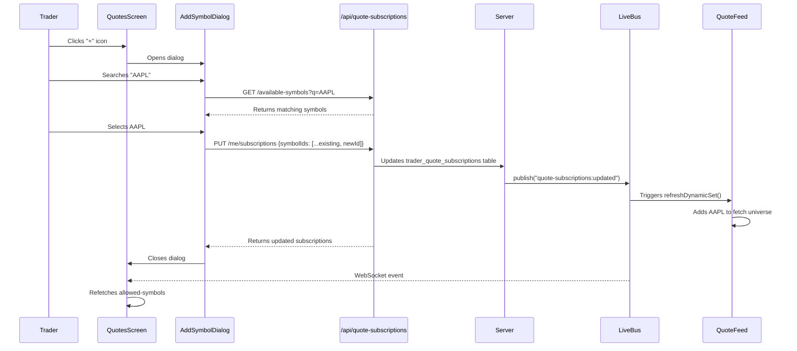
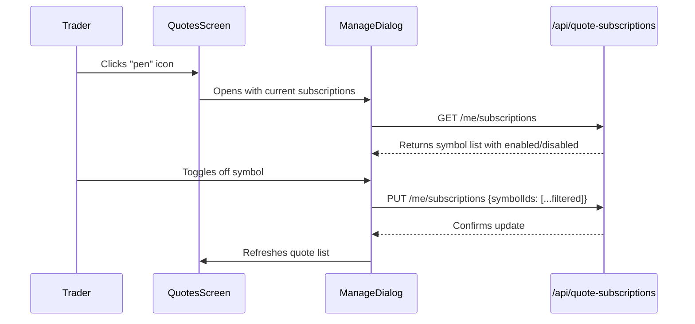

# Quote Customization Front-End Feature - PRD, Algorithm & Implementation Plan

> **Date**: 2026-02-07  
> **Type**: Feature Enhancement  
> **Scope**: Front-end quote screen customization icons with admin-controlled visibility and batched quote aggregation

---

## 1. Product Requirements Document (PRD)

### 1.1 Background & Context

The TQ trading platform already has a working **quote subscription system** that supports three trader modes:

| Mode | Description |
|------|-------------|
| `BASIC_ONLY` | Trader receives only baseline (enabled) symbols |
| `BASIC_PLUS_CUSTOM` | Trader receives baseline + can subscribe to additional symbols |
| `CUSTOM_ONLY` | Trader receives only their custom subscribed symbols |

The admin controls these modes via the **Instruments → Quote Subscriptions** panel in the admin dashboard. The backend (`server/services/quoteSubscriptions.ts`) and API endpoints (`/api/quote-subscriptions/*`) are already fully implemented.

**Current Gap**: The front-end `QuotesScreen.tsx` does not expose any UI affordances for traders to:
1. Add new symbols (+ icon)
2. Edit/manage their subscribed symbols (pen icon)

These icons should **only appear** when the trader's effective mode supports customization (`BASIC_PLUS_CUSTOM` or `CUSTOM_ONLY`) and should **disappear instantly** when admin disables customization.

### 1.2 Objectives

1. **Add "+" Icon**: Allow traders to search and add symbols from the ingested instrument database
2. **Add "Pen" Icon**: Allow traders to manage (edit/delete) their subscribed symbols
3. **Admin-Controlled Visibility**: Icons appear/disappear instantly based on admin enablement
4. **Real-Time Propagation**: Use existing `quote-subscriptions:updated` WebSocket event for instant UI updates
5. **MetaTrader 5-Like UX**: Similar to MT5 Market Watch symbol management (search → add, right-click → hide)
6. **Batching Aggregator**: The quote ingestion system must aggregate all unique symbols from custom subscriptions across traders for external provider fetching

### 1.3 User Stories

| ID | As a... | I want to... | So that... |
|----|---------|--------------|------------|
| US1 | Trader with customization enabled | See a "+" icon on the quote screen | I can add new symbols to my watchlist |
| US2 | Trader with customization enabled | See a "pen" icon on the quote screen | I can manage my custom subscriptions |
| US3 | Trader with BASIC_ONLY mode | NOT see any + or pen icons | I'm not confused by disabled features |
| US4 | Admin | Toggle customization system-wide | All traders instantly see/lose the icons |
| US5 | Admin | Set per-trader or batch mode overrides | Individual traders have appropriate access |
| US6 | System | Aggregate all custom symbols for batched fetching | Quotes are fetched efficiently for all subscribers |

### 1.4 Success Metrics

- Icons appear within **< 1 second** of admin action (via WebSocket event)
- Zero UI flash/flicker during permission changes
- Symbol search returns results within **< 500ms**
- Subscription updates propagate to quote feed within **< 2 seconds**

---

## 2. Algorithm Design

### 2.1 Icon Visibility Algorithm

```
┌─────────────────────────────────────────────────────────────────────┐
│                     ICON VISIBILITY ALGORITHM                       │
├─────────────────────────────────────────────────────────────────────┤
│                                                                     │
│  INPUT:                                                             │
│    - effectiveMode: QuoteMode (from /api/quote-subscriptions/me)   │
│    - supportsCustom: boolean (derived from mode)                   │
│                                                                     │
│  ALGORITHM:                                                         │
│    1. Fetch user's quote mode summary on initial load               │
│    2. Listen for WebSocket event "quote-subscriptions:updated"     │
│    3. On event, invalidate and refetch /api/quote-subscriptions/me │
│    4. Compute visibility:                                           │
│       showIcons = supportsCustom                                   │
│                 = (effectiveMode === "BASIC_PLUS_CUSTOM" ||        │
│                    effectiveMode === "CUSTOM_ONLY")                │
│                                                                     │
│  REAL-TIME PROPAGATION:                                            │
│    - Admin action → server publishes "quote-subscriptions:updated" │
│    - Client WebSocket receives event                               │
│    - React-Query cache invalidated                                 │
│    - Component re-renders with new visibility state                │
│                                                                     │
└─────────────────────────────────────────────────────────────────────┘
```

### 2.2 Symbol Addition Flow (+ Icon)



### 2.3 Symbol Management Flow (Pen Icon)



### 2.4 Batching Aggregator Algorithm

The existing `server/feeds/quoteFeed.ts` already implements this via `refreshDynamicSet()`:

```
┌─────────────────────────────────────────────────────────────────────┐
│                 BATCHING AGGREGATOR ALGORITHM                       │
├─────────────────────────────────────────────────────────────────────┤
│                                                                     │
│  TRIGGERED BY:                                                      │
│    - "quote-subscriptions:updated" LiveBus event                   │
│    - "symbols:updated" LiveBus event                               │
│    - Periodic refresh (SYMBOL_REFRESH_INTERVAL_MS)                 │
│                                                                     │
│  ALGORITHM (refreshDynamicSet):                                    │
│    1. Load baseline symbols (enabled in symbol_configs)            │
│    2. Load custom universe via getCustomUniverseInstruments()      │
│       - Query all trader_quote_subscriptions                       │
│       - Join with trader_quote_prefs to get effective mode         │
│       - Filter where mode != BASIC_ONLY                            │
│       - Return DISTINCT symbols                                    │
│    3. Merge baseline + custom into dynamicSet                      │
│    4. Build provider symbol map for HTTP/WebSocket fetching        │
│    5. Update quote ingestion universe                              │
│                                                                     │
│  OUTPUT:                                                            │
│    - Unified set of symbols to fetch from external providers       │
│    - Quotes distributed to traders based on their allowed set      │
│                                                                     │
└─────────────────────────────────────────────────────────────────────┘
```

---

## 3. Implementation Plan

### 3.1 Overview

This implementation adds **front-end UI components only**. The backend is already complete.

---

### 3.2 Proposed Changes

#### Client Components

---

##### [NEW] [SymbolSubscriptionDialog.tsx](file:///\\wsl.localhost\Ubuntu\home\bcodex\TD.2.ANTIGRAVITY\client\src\components\SymbolSubscriptionDialog.tsx)

A reusable dialog component for adding and managing symbol subscriptions:

- **Add Mode**: Search available symbols, select to add
- **Manage Mode**: View subscribed symbols, toggle to remove
- Uses existing `/api/quote-subscriptions/available-symbols` endpoint
- Uses existing `/api/quote-subscriptions/me/subscriptions` endpoint for updates
- Debounced search input with loading states
- Shows symbol name, category, and subscription status

---

##### [MODIFY] [QuotesScreen.tsx](file:///\\wsl.localhost\Ubuntu\home\bcodex\TD.2.ANTIGRAVITY\client\src\pages\QuotesScreen.tsx#L1-L303)

Changes:
1. Add query for `/api/quote-subscriptions/me` to get `supportsCustom` status
2. Add `Plus` and `Pencil` icons from lucide-react (already imported for other icons)
3. Icons positioned in header area next to "Live Quotes" title
4. Icons wrapped in conditional render: `{supportsCustom && <IconButtons />}`
5. Icons open `SymbolSubscriptionDialog` in respective modes
6. Subscribe to WebSocket `quote-subscriptions:updated` events for instant visibility toggle

**Key Addition to Header (lines ~89-127)**:
```tsx
// After "Live Quotes" title, before connection status
{supportsCustom && (
  <div className="flex items-center gap-2">
    <Button variant="ghost" size="icon" onClick={() => setShowAddDialog(true)}>
      <Plus className="h-4 w-4" />
    </Button>
    <Button variant="ghost" size="icon" onClick={() => setShowManageDialog(true)}>
      <Pencil className="h-4 w-4" />
    </Button>
  </div>
)}
```

---

##### [MODIFY] [QuotesProvider.tsx](file:///\\wsl.localhost\Ubuntu\home\bcodex\TD.2.ANTIGRAVITY\client\src\live\QuotesProvider.tsx#L38-L43)

Changes:
1. Export `supportsCustom` and `effectiveMode` from context state
2. These are already returned by `/api/quote-subscriptions/allowed-symbols`
3. Make them available to consuming components

**Extended State Interface**:
```tsx
type QuotesState = {
  quotes: Quote[];
  isConnected: boolean;
  isLoading: boolean;
  hasStaleData: boolean;
  // New fields:
  supportsCustom: boolean;
  effectiveMode: "BASIC_ONLY" | "BASIC_PLUS_CUSTOM" | "CUSTOM_ONLY";
};
```

---

##### [MODIFY] [LiveUpdatesProvider.tsx](file:///\\wsl.localhost\Ubuntu\home\bcodex\TD.2.ANTIGRAVITY\client\src\live\LiveUpdatesProvider.tsx)

Changes:
1. Add handler for `quote-subscriptions:updated` WebSocket event type
2. Invalidate React Query cache for `/api/quote-subscriptions/*` keys
3. This triggers automatic refetch and UI update

---

### 3.3 File Summary Table

| File | Action | Purpose |
|------|--------|---------|
| `SymbolSubscriptionDialog.tsx` | NEW | Reusable add/manage symbols dialog |
| `QuotesScreen.tsx` | MODIFY | Add + and pen icons with visibility logic |
| `QuotesProvider.tsx` | MODIFY | Expose supportsCustom in context |
| `LiveUpdatesProvider.tsx` | MODIFY | Handle quote-subscriptions:updated event |

---

## 4. Verification Plan

### 4.1 Automated Tests

> **Note**: The project uses Vitest for unit tests and Playwright for e2e tests.

#### Unit Tests (Vitest)

```bash
# Run all client unit tests
cd /home/bcodex/TD.2.ANTIGRAVITY
npm run test:client
```

**New test file to create**: `client/src/components/__tests__/SymbolSubscriptionDialog.test.tsx`
- Test search debounce behavior
- Test symbol selection/deselection
- Test submission with correct payload
- Test visibility conditions

#### E2E Tests (Playwright)

```bash
# Run Playwright tests  
cd /home/bcodex/TD.2.ANTIGRAVITY
npm run test:e2e
```

**New test file to create**: `e2e/quote-customization.spec.ts`
- Navigate to quotes screen
- Verify icons are NOT visible for BASIC_ONLY user
- Log in as customizable trader
- Verify icons ARE visible
- Test add symbol flow
- Test remove symbol flow

### 4.2 Manual Verification

#### Test 1: Icon Visibility Based on Mode

1. Start the development server:
   ```bash
   cd /home/bcodex/TD.2.ANTIGRAVITY
   npm run dev
   ```

2. Open browser to `http://localhost:5000`

3. Log in as a **BASIC_ONLY** trader
   - Navigate to Quotes screen
   - **Expected**: NO + or pen icons should appear

4. In another browser/incognito, log in as **admin**
   - Navigate to Admin → Instruments → Quote Subscriptions
   - Find the test trader
   - Change mode to "Basic + Customizable"
   - **Expected**: Original browser should show + and pen icons within ~1 second (WebSocket propagation)

#### Test 2: Add Symbol Flow

1. Log in as a customizable trader
2. Click the "+" icon
3. Search for a symbol (e.g., "GOLD" or "SPX")
4. Select the symbol and confirm
5. **Expected**: Symbol appears in the quote list after ~2 seconds

#### Test 3: Remove Symbol Flow

1. Log in as a customizable trader with custom subscriptions
2. Click the "pen" icon
3. Toggle off a subscribed symbol
4. Confirm
5. **Expected**: Symbol disappears from quote list

#### Test 4: Admin Withdrawal Propagation

1. Have a trader with customization enabled and the icons visible
2. As admin, change system-wide setting to disable customization
3. **Expected**: Icons disappear from trader's screen immediately (no page refresh needed)

---

## 5. Technical Considerations

### 5.1 Performance

- Search uses existing `available-symbols` endpoint with debounce (300ms)
- WebSocket event prevents polling; instant propagation
- React Query caching minimizes redundant API calls

### 5.2 Security

- All symbol updates go through authenticated `/api/quote-subscriptions/*` endpoints
- Server validates user has `supportsCustom` mode before accepting changes
- Symbol IDs must exist in `symbol_configs` table (enforced server-side)

### 5.3 Edge Cases

| Scenario | Handling |
|----------|----------|
| Admin disables mid-subscription | Dialog closes, icons disappear |
| Symbol deleted from DB | Cascade delete removes from subscriptions |
| Network disconnection | REST polling fallback maintains state |
| Empty symbol search | Show helpful message |

---

## 6. Dependencies

All dependencies are already present in the project:
- `lucide-react` (Plus, Pencil icons)
- `@tanstack/react-query` (data fetching)
- `@/components/ui/*` (shadcn Dialog, Button, Input components)

---

## 7. Out of Scope

- Mobile native apps (NATIVE/ and MOBILE/ directories)
- Backend API changes (already complete)
- Admin dashboard changes (already implemented)
- WebSocket protocol changes (already implemented)
