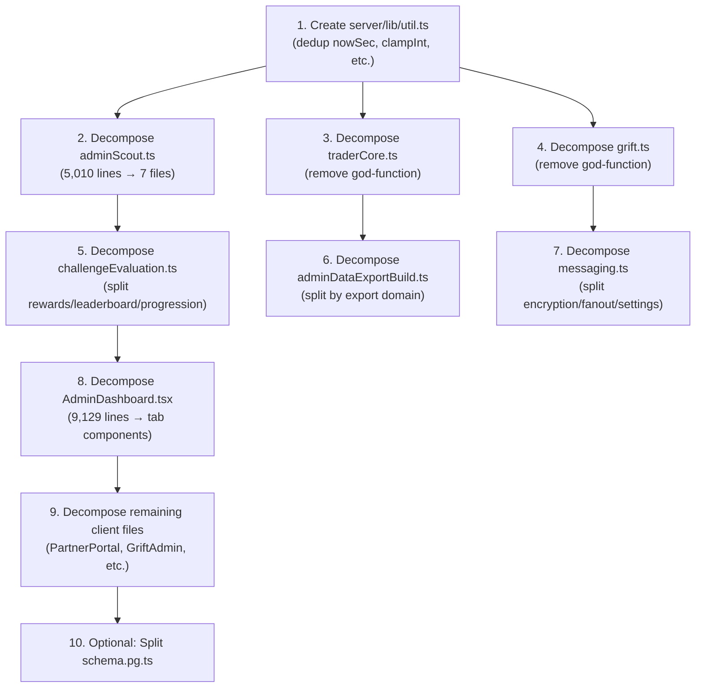

# Enhanced Codebase Deep Audit: Large Files Decomposition (v2)

## Self-Critique of the Initial Audit

The initial audit had several gaps:

> [!CAUTION]
> **5 critical issues were found in the original report:**

| # | Issue | Impact |
|---|-------|--------|
| 1 | **Missed client-side files entirely** — only scanned `server/` and `shared/` | The largest file in the codebase (`AdminDashboard.tsx` at **9,129 lines**) was not flagged |
| 2 | **Failed to detect cross-file utility duplication** — `nowSec()` is copy-pasted in **16 files**, `clampInt()` in **10 files** | Decomposition without deduplication just moves the problem |
| 3 | **Missed `@ts-nocheck` suppression** — 50+ server files suppress TypeScript checking entirely | Large files with no type-checking are doubly dangerous |
| 4 | **No analysis of god-function sizes** — `registerTraderCoreRoutes` is **1,981 lines** in a single function body | The report flagged file size but not function-level bloat |
| 5 | **Generic recommendations** — "split into X and Y" without specifying which functions belong where | Not actionable without concrete migration plans |

---

## Revised File Inventory

### Files > 2,000 Lines (Source Code Only)

| File | Lines | Outline Items | Largest Single Function | `@ts-nocheck` |
|------|------:|:-----:|------------------------|:---:|
| [AdminDashboard.tsx](file:///\\wsl.localhost/Ubuntu/home/bcodex/TD.2.ANTIGRAVITY/client/src/pages/AdminDashboard.tsx) | **9,129** | — | (entire component) | No |
| [adminScout.ts](file:///\\wsl.localhost/Ubuntu/home/bcodex/TD.2.ANTIGRAVITY/server/routes/adminScout.ts) | **5,010** | 342 | (inline route handlers) | **Yes** |
| [schema.pg.ts](file:///\\wsl.localhost/Ubuntu/home/bcodex/TD.2.ANTIGRAVITY/shared/schema.pg.ts) | **3,178** | 258 | N/A (declarative) | No |
| [PartnerPortal.tsx](file:///\\wsl.localhost/Ubuntu/home/bcodex/TD.2.ANTIGRAVITY/client/src/pages/PartnerPortal.tsx) | **3,298** | — | — | No |
| [GriftAdmin.tsx](file:///\\wsl.localhost/Ubuntu/home/bcodex/TD.2.ANTIGRAVITY/client/src/components/admin/GriftAdmin.tsx) | **2,853** | — | — | No |
| [ScoutChallengesPanel.tsx](file:///\\wsl.localhost/Ubuntu/home/bcodex/TD.2.ANTIGRAVITY/client/src/components/admin/ScoutChallengesPanel.tsx) | **2,712** | — | — | No |
| [adminDataExportBuild.ts](file:///\\wsl.localhost/Ubuntu/home/bcodex/TD.2.ANTIGRAVITY/server/services/adminDataExportBuild.ts) | **2,592** | 60 | `buildDeactivatedAccountsExport` (342 lines) | No |
| [ScoutWorkbench.tsx](file:///\\wsl.localhost/Ubuntu/home/bcodex/TD.2.ANTIGRAVITY/client/src/components/admin/ScoutWorkbench.tsx) | **2,444** | — | — | No |
| [challengeEvaluation.ts](file:///\\wsl.localhost/Ubuntu/home/bcodex/TD.2.ANTIGRAVITY/server/recruitment/challengesV4/challengeEvaluation.ts) | **2,406** | 44 | `evaluateChallengesTick` (617 lines) | No |
| [TradeScreen.tsx](file:///\\wsl.localhost/Ubuntu/home/bcodex/TD.2.ANTIGRAVITY/client/src/pages/TradeScreen.tsx) | **2,340** | — | — | No |
| [grift.ts](file:///\\wsl.localhost/Ubuntu/home/bcodex/TD.2.ANTIGRAVITY/server/routes/grift.ts) | **2,171** | 12 | `registerGriftRoutes` (**1,998 lines**) | No |
| [traderTalent.ts](file:///\\wsl.localhost/Ubuntu/home/bcodex/TD.2.ANTIGRAVITY/server/routes/traderTalent.ts) | **2,138** | 38 | (multiple route handlers) | **Yes** |
| [messaging.ts](file:///\\wsl.localhost/Ubuntu/home/bcodex/TD.2.ANTIGRAVITY/server/services/messaging.ts) | **2,128** | 72 | `createNotification` (108 lines) | No |
| [traderCore.ts](file:///\\wsl.localhost/Ubuntu/home/bcodex/TD.2.ANTIGRAVITY/server/routes/traderCore.ts) | **2,047** | 6 | `registerTraderCoreRoutes` (**1,981 lines**) | **Yes** |

### Near-Threshold Files (1,000–2,000 lines, client-side)

| File | Lines |
|------|------:|
| [ProfileSettings.tsx](file:///\\wsl.localhost/Ubuntu/home/bcodex/TD.2.ANTIGRAVITY/client/src/pages/ProfileSettings.tsx) | 1,868 |
| [AdminCommunications.tsx](file:///\\wsl.localhost/Ubuntu/home/bcodex/TD.2.ANTIGRAVITY/client/src/pages/AdminCommunications.tsx) | 1,259 |
| [AdminData.tsx](file:///\\wsl.localhost/Ubuntu/home/bcodex/TD.2.ANTIGRAVITY/client/src/pages/AdminData.tsx) | 1,159 |
| [HistoryScreen.tsx](file:///\\wsl.localhost/Ubuntu/home/bcodex/TD.2.ANTIGRAVITY/client/src/pages/HistoryScreen.tsx) | 1,104 |
| [LoginPage.tsx](file:///\\wsl.localhost/Ubuntu/home/bcodex/TD.2.ANTIGRAVITY/client/src/pages/LoginPage.tsx) | 1,005 |

---

## Cross-Cutting Issue: Utility Function Duplication

> [!WARNING]
> Before decomposing any individual file, the codebase has a **systemic copy-paste duplication problem** that must be addressed first, or decomposition will multiply the copies.

| Function | Duplicate Count | Files |
|----------|:-:|------|
| `nowSec()` | **16** | challengeEvents, inquiryRouting, onboarding, challengeService, botChallenge, pipelineService, adminMarketData, requirePartner, adminDataExportMetrics, traderTalent, adminScout, partnerPortal, adminDataRollups, accountLifecycle, messaging, adminDataExportRepo |
| `clampInt()` | **10** | adminScout, griftRetention, adminActivity, adminInstitutionalAudit, grift, evaluateChallenges, adminAuditTrail, rememberMe, globalSettingsAdmin, messaging |
| `toFiniteNumber()` | **5** | allocationEngine, adminScout, clickhouseSync, adminDataExportBuildClickhouse, grift |
| `normalizeChallengeMailboxCategory()` | **3** | challengeEvaluation, traderTalent, adminScout |

**Recommendation:** Create `server/lib/util.ts` exporting `nowSec`, `clampInt`, `toFiniteNumber`, and `roundMoney`. Then do a sweep to replace all local copies with the import. This is a prerequisite for other decompositions.

---

## Revised Decomposition Recommendations

### 🔴 Priority 1 — Critical (God Functions & God Files)

#### 1. `AdminDashboard.tsx` — 9,129 lines

This is the most critical file. A single React component file approaching **10,000 lines** is essentially an entire application inlined into one file.

**Concrete plan:**
- Extract each admin tab/section into its own component under `client/src/components/admin/`:
  - `AdminOverview.tsx`, `AdminUserManagement.tsx`, `AdminTradeMonitor.tsx`, `AdminSystemConfig.tsx`, etc.
- Move shared admin hooks to `client/src/hooks/useAdmin*.ts`
- Keep `AdminDashboard.tsx` as a thin shell that renders a tab router

---

#### 2. `traderCore.ts` — 2,047 lines (1,981-line single function)

`registerTraderCoreRoutes` is a single function that spans **96.8%** of the file. Has `@ts-nocheck`.

**Concrete plan:**
- Each route handler callback should become its own function in a controller file:
  - `server/routes/trader/orders.ts` — open trade, close trade, modify trade
  - `server/routes/trader/positions.ts` — list positions, position details
  - `server/routes/trader/account.ts` — balance, equity, margin queries
- The registration function becomes a thin composer importing sub-routers
- Remove `@ts-nocheck` and add proper types during refactor

---

#### 3. `grift.ts` — 2,171 lines (1,998-line single function)

Identical anti-pattern. `registerGriftRoutes` wraps **92%** of the file.

**Concrete plan:**
- `server/grift/griftControllers.ts` — extract handler logic
- `server/grift/griftRoutes.ts` — thin route registration
- `sanitizeConfigPatch` already exists as a standalone helper — extract to `server/grift/griftValidation.ts`

---

#### 4. `adminScout.ts` — 5,010 lines, 342 outline items

342 items in one file is architecturally untenable.

**Concrete plan, split by domain:**

| New File | Content to Move |
|----------|----------------|
| `server/routes/adminScout/validation.ts` | All 10+ Zod schemas (challengeUpsertSchema, challengeSettingsPatchSchema, etc.) |
| `server/routes/adminScout/challenges.ts` | Challenge CRUD, phase management, enrollment actions |
| `server/routes/adminScout/partners.ts` | Partner portal management, inquiry routing |
| `server/routes/adminScout/pipeline.ts` | Watchlist, pipeline stats, candidate listing |
| `server/routes/adminScout/badges.ts` | Badge and certificate template CRUD |
| `server/routes/adminScout/scope.ts` | `enforceAdminResourceScope`, `resolveScopedIds`, `hasGlobalAdminScope` |
| `server/routes/adminScout/index.ts` | Thin composer importing sub-routers |

---

### 🟡 Priority 2 — High

#### 5. `challengeEvaluation.ts` — 2,406 lines

Contains two god-functions:
- `evaluateChallengesTick` — **617 lines** (the core eval loop)
- `applyCompletionRewards` — **308 lines** (reward orchestration)

**Concrete plan:**

| New File | Functions to Move |
|----------|------------------|
| `challengeRewards.ts` | `applyCompletionRewards`, `awardBadge`, `issueCertificate`, `awardSelectionBoost`, `claimCustomRewardLedger`, `executeCustomRewardAction`, `applyCustomRewardsForTrigger` |
| `challengeLeaderboard.ts` | `refreshChallengeLeaderboard`, `maybeRefreshChallengeLeaderboard`, `rankPrizeCandidates`, `recomputePrizeAwards`, `notifyPrizeAwardsForChallenge` |
| `challengeProgression.ts` | `parseTierRules`, `resolveProgressionTierName`, `updateUserProgression`, `upsertPipelineVisibility` |
| `challengeEvaluation.ts` (reduced) | `evaluateChallengesTick`, `computePhaseStats`, `persistPhaseSnapshot` + types/interfaces |

---

#### 6. `adminDataExportBuild.ts` — 2,592 lines

Each `build*Export` function is 200-400 lines with embedded SQL.

**Concrete plan:**

| New File | Functions to Move |
|----------|------------------|
| `adminDataExportWriters.ts` | `writeParquetRows`, `createStreamingExportWriter`, `writeStreamChunk`, `closeWriteStream`, `safeCsv`, `writeJsonlLine` |
| `adminDataExportTraderScouting.ts` | `buildTraderScoutingExport`, `normalizeTraderScoutingExportRow`, `TRADER_SCOUT_SEARCH_SQL` |
| `adminDataExportUsers.ts` | `buildUsersExport`, `buildUserTimelineExport`, `USERS_EXPORT_COLUMNS` |
| `adminDataExportBuild.ts` (reduced) | `buildExportArtifact` (main dispatcher), common utility functions |

---

#### 7. Client-side: `PartnerPortal.tsx` (3,298), `GriftAdmin.tsx` (2,853), `ScoutChallengesPanel.tsx` (2,712), `ScoutWorkbench.tsx` (2,444), `TradeScreen.tsx` (2,340)

These all exceed 2,000 lines and likely contain embedded sub-panels, modals, and utilities.

**Concrete plan (pattern for all):**
- Extract modal dialogs into dedicated components
- Extract data-fetching hooks into `hooks/` files
- Extract table/list renderers into sub-components
- Keep the page file as a layout/composition shell

---

### 🟢 Priority 3 — Low

#### 8. `schema.pg.ts` — 3,178 lines

This is a declarative schema file. Large, but its nature is inherently additive and grep-friendly.

**Optional refactor:** Split into `shared/schema/users.ts`, `shared/schema/trades.ts`, `shared/schema/challenges.ts`, `shared/schema/messaging.ts`, with `shared/schema/index.ts` re-exporting everything.

#### 9. `messaging.ts` — 2,128 lines

72 outline items across distinct concerns.

**Concrete plan:**

| New File | Functions to Move |
|----------|------------------|
| `messagingEncryption.ts` | `encodeMailboxBodyForStorage`, `encodeMailboxBodyForE2eeStorage`, `decodeMailboxBodyFromRow`, `encodeNotificationContentForStorage`, `encodeNotificationContentForE2eeStorage`, `decodeNotificationContentFromRow`, `normalizeMailboxPublicKeyPem` |
| `messagingFanout.ts` | `enqueueBroadcastFanout`, `processBroadcastFanoutQueue`, `resolveMailboxRecipientIds`, `resolveMailboxRecipientsWithKeys` |
| `messagingSettings.ts` | `normalizeCommunicationSettings`, `getCommunicationSettings`, `updateCommunicationSettings`, `loadCommunicationSettingsFromDb` |
| `messaging.ts` (reduced) | `createNotification`, `listNotificationsForUser`, `markNotificationsReadForUser`, mailbox thread operations |

---

## `@ts-nocheck` Debt

> [!IMPORTANT]
> **50+ files** across the server use `// @ts-nocheck`. The project's own `AGENTS.md` already states: *"Do not use @ts-nocheck in new route modules."* — yet the legacy files remain unchecked.

Any decomposition of `traderCore.ts`, `traderTalent.ts`, or `adminScout.ts` should include removing `@ts-nocheck` and adding proper typing as part of the refactor. These files are **the three largest route files** and also the ones most likely to harbor latent type errors.

---

## Recommended Execution Order

