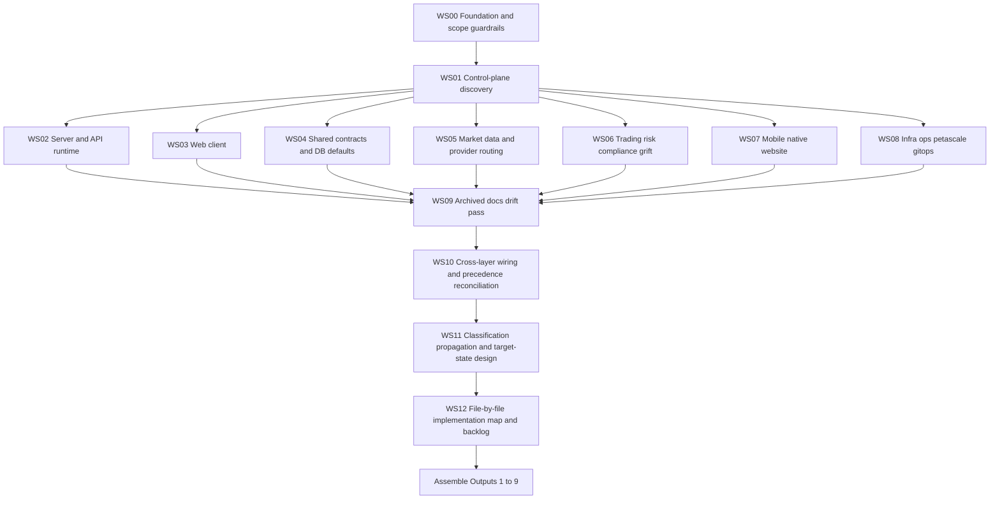

# Master Flow And Workstreams

## Flow structure

## Phase order

### Phase 0 - Foundation

- Confirm repo guidance, scope, and audit rules.
- Freeze the classification model and finding schema before collecting evidence.

### Phase 1 - Control-plane discovery

- Identify every known config entrypoint, source-of-truth candidate, cache layer, live event path, and deployment surface.
- Produce a source-of-truth map before scanning for literals.

### Phase 2 - Domain passes

- Audit domain-specific hardcoding in bounded workstreams.
- Record raw findings without prematurely deciding everything should become admin config.

### Phase 3 - Drift and reconciliation

- Compare live code with archived reports and docs.
- Detect wiring gaps across DB, API, UI, worker, websocket, mobile, native, and deployment.

### Phase 4 - Classification and propagation design

- Assign each finding to Class 1-7.
- Define runtime, reload, restart, deploy, or migration scope.
- Define invalidation, refresh, and rollback model.

### Phase 5 - Output assembly

- Build the nine required outputs using the canonical finding ledger.
- Convert findings into implementation map and backlog.

## Manageable workstreams

| WS ID | Section | Primary scope | Exact paths to start with | Depends on | Main deliverables |
| --- | --- | --- | --- | --- | --- |
| `WS00` | Foundation | Audit rules, schema, evidence standards | `AGENTS.md`, `PROJECT_STRUCTURE.md`, `.agents/*` | None | Audit operating model, finding schema |
| `WS01` | Control-plane discovery | All known config stores and propagation layers | `shared/schema.pg.base.ts`, `shared/schema.pg.recruitment.ts`, `server/services/*Config*`, `server/routes/admin*.ts`, `server/services/liveBus.ts`, `client/src/live/ConfigSync.tsx` | `WS00` | Control-plane map, source-of-truth candidates |
| `WS02` | Server and API runtime | Routes, services, cron, workers, boot, middleware | `server/index.ts`, `server/routes.ts`, `server/routes/*`, `server/services/*`, `server/cron/*`, `server/security/*` | `WS01` | Server hardcoded inventory, runtime/reload assessment |
| `WS03` | Web client | React pages, hooks, live layer, query tuning, local storage | `client/src/pages/*`, `client/src/hooks/*`, `client/src/live/*`, `client/src/lib/*` | `WS01` | Client-only config inventory, UI-vs-backend wiring gaps |
| `WS04` | Shared and DB | Shared defaults, schema defaults, migrations, seeds, transport contracts | `shared/*`, `db/migrations/*`, `db/seed.ts`, `db/schema.pg.sql` | `WS01` | Default-value map, schema/runtime drift findings |
| `WS05` | Market data | Provider registry, feed behavior, provider files, symbol universe rules | `config/marketdata/*`, `server/marketdata/*`, `server/feeds/*`, `server/routes/adminMarketData.ts`, `server/services/quoteService.ts` | `WS01` | Provider precedence matrix, reload vs runtime map |
| `WS06` | Trading, risk, compliance, grift | Risk thresholds, lifecycle timing, policy/jurisdiction, KYC, abuse | `server/risk.ts`, `server/engine/*`, `server/policy/*`, `server/legal/*`, `server/grift/*`, `server/recruitment/challengesV4/*`, `shared/policyDecision.ts` | `WS01` | High-risk rules inventory, invariant vs policy split |
| `WS07` | Mobile, native, website | Alternate hosts, session/auth defaults, reconnect/cache rules, deep links | `MOBILE/*`, `MOBILE/src/mobile/*`, `NATIVE/src/services/*`, `WEBSITE/client/src/lib/app-config.ts`, `WEBSITE/server/*` | `WS01` | Cross-surface drift matrix, mobile/native runtime config map |
| `WS08` | Infra, ops, petascale, gitops | ConfigMap/Secret boundaries, probes, HPA, monitoring, retention | `k8s/*`, `k8s/base/*`, `gitops/*`, `ops/*`, `petascale/*`, `docker-compose*.yml` | `WS01` | Deployment config inventory, env-vs-admin separation |
| `WS09` | Archived docs drift pass | Reports and design docs vs live implementation | `REPORTS AND REVIEWS/*` relevant to each domain | `WS02`-`WS08` | Drift log: documented-only, code-only, partial, stale |
| `WS10` | Wiring and precedence reconciliation | UI/API/DB/worker/websocket/mobile alignment | Findings from `WS02`-`WS09` | `WS02`-`WS09` | Wired vs not wired matrix, precedence conflict list |
| `WS11` | Classification and propagation design | Class 1-7 assignment and propagation paths | Canonical finding ledger | `WS10` | Final class assignment, propagation model |
| `WS12` | Implementation and backlog | Concrete change map and prioritization | All prior workstreams | `WS11` | File-by-file implementation map, prioritized backlog, final recommendation |

## Workstream completion rules

Each workstream is complete only when it produces:

- exact file references,
- raw finding rows,
- source-of-truth assessment,
- surfaced/not-surfaced status,
- runtime scope assessment,
- duplicate-source notes,
- tests needed to prevent drift.

## Cross-workstream joins that must happen

- `WS02` + `WS03`: backend config vs client controls
- `WS02` + `WS04`: runtime behavior vs schema defaults and seed values
- `WS05` + `WS08`: provider config files/env/deploy precedence
- `WS06` + `WS03` + `WS07`: compliance/risk rules vs client/mobile/native presentation
- `WS07` + `WS08`: hostnames, origins, deep links, push environment, TLS assumptions
- `WS09` + all others: report drift validation

## Stop conditions

Do not move to `WS11` until:

- every domain has been scanned,
- at least one source-of-truth candidate is assigned per finding,
- propagation dependencies are noted for runtime-eligible settings,
- doc drift has been checked for major subsystems.
