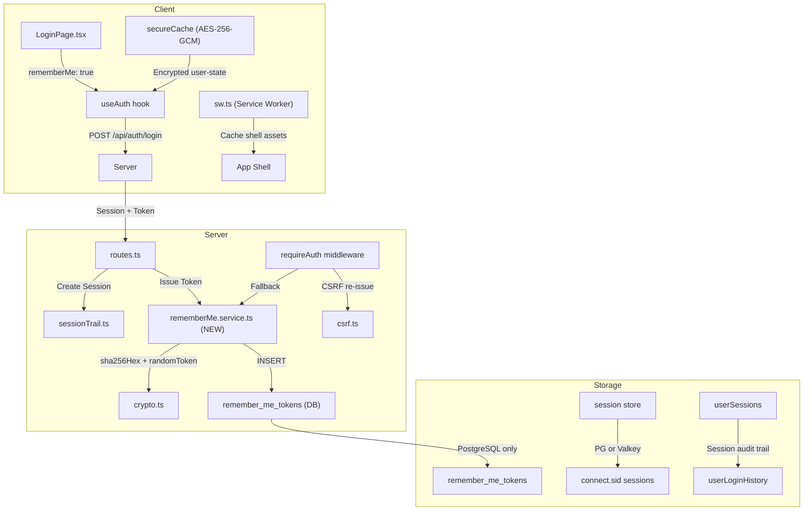
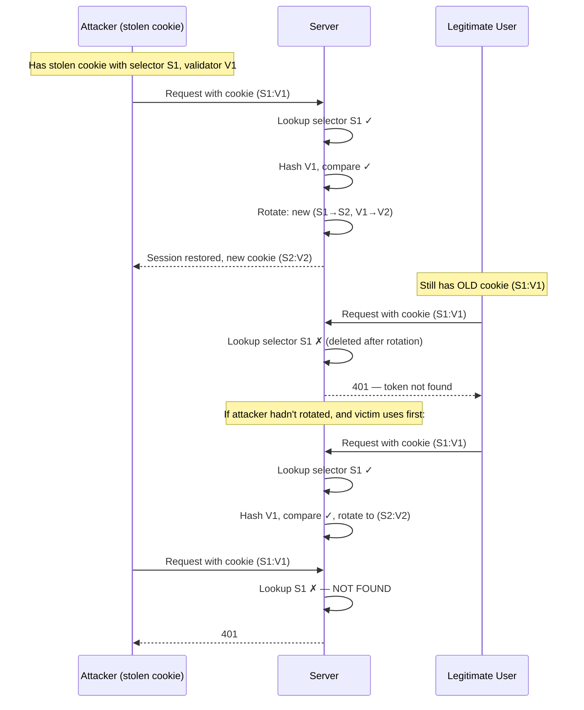

# Technical Design Document: Trusted Device & Persistent Login System

> **Version**: 2.2 — Implementation + Regression Hardening  
> **Last Updated**: 2026-02-16  
> **Status**: Draft — Pending Review

---

## 1. Architecture Overview



### Dual-Layer Authentication
| Layer | Mechanism | Lifetime | Store | Purpose |
|---|---|---|---|---|
| **Session** | `connect.sid` cookie + `express-session` | 24 hours (configurable) | PostgreSQL or Valkey | Active request authentication |
| **Persistent** | `tq_rm` cookie + `remember_me_tokens` table | 30 days (configurable) | PostgreSQL ONLY | Long-lived session restoration |

> [!IMPORTANT]
> Persistent tokens are stored **only** in PostgreSQL — never in Valkey/Redis. This prevents token loss due to cache eviction or Valkey restart.

---

## 1.1 Pre-Implementation Design Gap Closure

| Gap ID | Design Gap | Resolution |
|---|---|---|
| D-GAP-01 | Middleware-only token fallback ignored `ensureAuth` routes. | Introduce a shared restoration helper used by both `requireAuth` and `ensureAuth`. |
| D-GAP-02 | Logout, logout-others, and security lock flows could leave remember tokens valid. | Add explicit token revocation hooks in all high-risk state transitions. |
| D-GAP-03 | Config values lacked strict runtime bounds. | Add server-side clamp/validation for remember/session controls before persistence. |
| D-GAP-04 | Trusted devices API was defined, but UI integration point was vague. | Bind to `ProfileSettings` Devices section with dedicated trusted-device actions. |
| D-GAP-05 | Requested 14-cycle hardening flow had no artifact trail. | Add a cycle ledger section that maps each cycle to code, tests, and fixes. |
| D-GAP-06 | Root route health behavior could emit plaintext and collide with app shell caching semantics. | Move plaintext probe to `/status` and keep `/` strictly for SPA shell. |
| D-GAP-07 | Service-worker shell cache accepted non-HTML navigation responses. | Cache only HTML `index` responses; avoid fallback poisoning. |
| D-GAP-08 | Admin role middleware bypassed shared auth restore/revoke path. | `requireAdmin` now composes shared auth validation before role check. |
| D-GAP-09 | Challenge visibility state mapping was inconsistent across payload naming styles. | Normalize both camelCase and snake_case fields before editor hydration/save. |

---

## 2. Database Schema

### 2.1 New Table: `remember_me_tokens`

```typescript
// Add to shared/schema.pg.ts

export const rememberMeTokens = pgTable("remember_me_tokens", {
  id: serial("id").primaryKey(),
  userId: integer("user_id")
    .notNull()
    .references(() => users.id, { onDelete: "cascade" }),

  // Series-Token Security Model
  selector: text("selector").notNull().unique(), // 16 bytes hex (32 chars) — public lookup key
  validatorHash: text("validator_hash").notNull(), // SHA-256 of 32-byte secret

  // Lifecycle (unix seconds internally; day-resolution for admin config)
  expiresAt: integer("expires_at").notNull(),
  lastUsedAt: integer("last_used_at").notNull().default(nowUnix),
  createdAt: integer("created_at").notNull().default(nowUnix),

  // Device metadata (captured at issuance, for user's "Trusted Devices" list)
  userAgent: text("user_agent"),
  ip: text("ip"),
  deviceType: text("device_type"),     // desktop | mobile | tablet
  browser: text("browser"),
  os: text("os"),
  deviceFp: text("device_fp"),         // Hashed browser fingerprint
  deviceInstallId: text("device_install_id"), // Client-generated UUID

  // Geo-enrichment (for location display in device list)
  countryCode: text("country_code"),
  city: text("city"),
}, (table) => ({
  selectorIdx: uniqueIndex("remember_me_tokens_selector_idx").on(table.selector),
  userIdIdx: index("remember_me_tokens_user_id_idx").on(table.userId),
  expiresIdx: index("remember_me_tokens_expires_at_idx").on(table.expiresAt),
}));

export const rememberMeTokensRelations = relations(rememberMeTokens, ({ one }) => ({
  user: one(users, {
    fields: [rememberMeTokens.userId],
    references: [users.id],
  }),
}));

export const insertRememberMeTokenSchema = createInsertSchema(rememberMeTokens);
```

### 2.2 New Columns on `system_config`

```typescript
// Add to systemConfig table definition in shared/schema.pg.ts

// Remember Me / Persistent Login controls
rememberMeEnabled: boolean("remember_me_enabled").notNull().default(true),
rememberMeMaxAgeDays: integer("remember_me_max_age_days").notNull().default(30),
rememberMeMaxDevicesPerUser: integer("remember_me_max_devices_per_user").notNull().default(10),
rememberMeReauthAfterAbsenceDays: integer("remember_me_reauth_after_absence_days").notNull().default(7),
rememberMeTokenRotationEnabled: boolean("remember_me_token_rotation_enabled").notNull().default(true),
rememberMeTheftAutoRevokeAll: boolean("remember_me_theft_auto_revoke_all").notNull().default(true),
// Session security (existing maxAge surfaced here for admin configurability)
sessionCookieMaxAgeHours: integer("session_cookie_max_age_hours").notNull().default(24),
sessionIdleTimeoutMinutes: integer("session_idle_timeout_minutes").notNull().default(0), // 0 = disabled
logoutClearAllDeviceTokens: boolean("logout_clear_all_device_tokens").notNull().default(false),
```

---

## 3. Server-Side Implementation

### 3.1 New Service: `server/services/rememberMe.ts`

```typescript
import crypto from "crypto";
import { eq, and, lt, desc } from "drizzle-orm";
import { db } from "@db";
import { rememberMeTokens, users } from "@shared/schema";
import { sha256Hex, randomToken } from "./crypto";
import {
  getClientIp, getUserAgent, parseDevice, buildGeoContext,
  extractClientIdentity, extractGeoHints
} from "../security/sessionTrail";

const SELECTOR_BYTES = 16;
const VALIDATOR_BYTES = 32;
const COOKIE_NAME = "tq_rm";

export interface RememberMeConfig {
  enabled: boolean;
  maxAgeDays: number;
  maxDevicesPerUser: number;
  reauthAfterAbsenceDays: number;
  tokenRotationEnabled: boolean;
  theftAutoRevokeAll: boolean;
}

// --- Token Generation ---

export function generateSelector(): string {
  return crypto.randomBytes(SELECTOR_BYTES).toString("hex");
}

export function generateValidator(): string {
  return crypto.randomBytes(VALIDATOR_BYTES).toString("hex");
}

export function hashValidator(validator: string): string {
  return sha256Hex(validator);
}

export function encodeCookieValue(selector: string, validator: string): string {
  return Buffer.from(`${selector}:${validator}`).toString("base64url");
}

export function decodeCookieValue(encoded: string): {
  selector: string;
  validator: string;
} | null {
  try {
    const decoded = Buffer.from(encoded, "base64url").toString("utf8");
    const colonIdx = decoded.indexOf(":");
    if (colonIdx < 1) return null;
    const selector = decoded.slice(0, colonIdx);
    const validator = decoded.slice(colonIdx + 1);
    if (!selector || !validator) return null;
    // Validate format: selector = 32 hex chars, validator = 64 hex chars
    if (!/^[a-f0-9]{32}$/.test(selector)) return null;
    if (!/^[a-f0-9]{64}$/.test(validator)) return null;
    return { selector, validator };
  } catch {
    return null;
  }
}

// --- Constant-time comparison ---

export function safeCompare(a: string, b: string): boolean {
  if (a.length !== b.length) return false;
  const bufA = Buffer.from(a, "utf8");
  const bufB = Buffer.from(b, "utf8");
  return crypto.timingSafeEqual(bufA, bufB);
}

// --- Token CRUD ---

export async function issueToken(args: {
  userId: number;
  maxAgeDays: number;
  req: any;
}): Promise<{ cookieValue: string; expiresAt: number }> {
  const selector = generateSelector();
  const validator = generateValidator();
  const validatorHash = hashValidator(validator);
  const nowSec = Math.floor(Date.now() / 1000);
  const expiresAt = nowSec + args.maxAgeDays * 86400;

  const ip = getClientIp(args.req);
  const ua = getUserAgent(args.req);
  const device = parseDevice(ua);
  const identity = extractClientIdentity(args.req);
  const geoHints = extractGeoHints(args.req);
  const geo = buildGeoContext(ip, geoHints);

  await db.insert(rememberMeTokens).values({
    userId: args.userId,
    selector,
    validatorHash,
    expiresAt,
    lastUsedAt: nowSec,
    createdAt: nowSec,
    userAgent: ua,
    ip,
    deviceType: device.deviceType,
    browser: device.browser,
    os: device.os,
    deviceFp: identity.deviceFp || null,
    deviceInstallId: identity.deviceInstallId || null,
    countryCode: geo.countryCode || null,
    city: geo.city || null,
  });

  return {
    cookieValue: encodeCookieValue(selector, validator),
    expiresAt,
  };
}

export type TokenVerifyResult =
  | { status: "VALID"; tokenRow: any; userId: number }
  | { status: "NOT_FOUND" }
  | { status: "EXPIRED"; tokenRow: any }
  | { status: "THEFT_DETECTED"; tokenRow: any; userId: number }
  | { status: "ABSENCE_REAUTH"; tokenRow: any; userId: number };

export async function verifyToken(
  encoded: string,
  config: RememberMeConfig,
): Promise<TokenVerifyResult> {
  const parsed = decodeCookieValue(encoded);
  if (!parsed) return { status: "NOT_FOUND" };

  const [row] = await db
    .select()
    .from(rememberMeTokens)
    .where(eq(rememberMeTokens.selector, parsed.selector))
    .limit(1);

  if (!row) return { status: "NOT_FOUND" };

  const nowSec = Math.floor(Date.now() / 1000);

  // Check expiration
  if (nowSec > row.expiresAt) {
    await db.delete(rememberMeTokens).where(eq(rememberMeTokens.id, row.id));
    return { status: "EXPIRED", tokenRow: row };
  }

  // Constant-time validator comparison
  const incomingHash = hashValidator(parsed.validator);
  if (!safeCompare(incomingHash, row.validatorHash)) {
    // THEFT DETECTED: correct selector but wrong validator
    return { status: "THEFT_DETECTED", tokenRow: row, userId: row.userId };
  }

  // Check absence threshold
  if (config.reauthAfterAbsenceDays > 0) {
    const absenceThresholdSec = config.reauthAfterAbsenceDays * 86400;
    if (nowSec - row.lastUsedAt > absenceThresholdSec) {
      return { status: "ABSENCE_REAUTH", tokenRow: row, userId: row.userId };
    }
  }

  return { status: "VALID", tokenRow: row, userId: row.userId };
}

export async function rotateToken(args: {
  oldTokenId: number;
  userId: number;
  maxAgeDays: number;
  req: any;
}): Promise<{ cookieValue: string; expiresAt: number }> {
  // Atomic: delete old, issue new
  await db.delete(rememberMeTokens)
    .where(eq(rememberMeTokens.id, args.oldTokenId));
  return issueToken({
    userId: args.userId,
    maxAgeDays: args.maxAgeDays,
    req: args.req,
  });
}

export async function revokeTokenById(tokenId: number, userId: number) {
  await db.delete(rememberMeTokens)
    .where(and(
      eq(rememberMeTokens.id, tokenId),
      eq(rememberMeTokens.userId, userId),
    ));
}

export async function revokeAllTokensForUser(userId: number) {
  await db.delete(rememberMeTokens)
    .where(eq(rememberMeTokens.userId, userId));
}

export async function purgeExpiredTokens() {
  const nowSec = Math.floor(Date.now() / 1000);
  await db.delete(rememberMeTokens)
    .where(lt(rememberMeTokens.expiresAt, nowSec));
}

export async function enforceDeviceLimit(userId: number, maxDevices: number) {
  const tokens = await db
    .select({ id: rememberMeTokens.id })
    .from(rememberMeTokens)
    .where(eq(rememberMeTokens.userId, userId))
    .orderBy(desc(rememberMeTokens.lastUsedAt));

  if (tokens.length > maxDevices) {
    const toDelete = tokens.slice(maxDevices);
    for (const t of toDelete) {
      await db.delete(rememberMeTokens)
        .where(eq(rememberMeTokens.id, t.id));
    }
  }
}

export async function getUserDevices(userId: number) {
  return db
    .select({
      id: rememberMeTokens.id,
      deviceType: rememberMeTokens.deviceType,
      browser: rememberMeTokens.browser,
      os: rememberMeTokens.os,
      lastUsedAt: rememberMeTokens.lastUsedAt,
      createdAt: rememberMeTokens.createdAt,
      countryCode: rememberMeTokens.countryCode,
      city: rememberMeTokens.city,
      ip: rememberMeTokens.ip,
    })
    .from(rememberMeTokens)
    .where(eq(rememberMeTokens.userId, userId))
    .orderBy(desc(rememberMeTokens.lastUsedAt));
}

export { COOKIE_NAME };
```

### 3.2 Middleware Integration: `server/middleware/auth.ts`

Add a persistent token fallback **inside `requireAuth`**:

```typescript
// After the existing "if (!req.session.userId)" block,
// before returning 401:

// --- Remember Me Fallback ---
const rmCookie = req.cookies?.[COOKIE_NAME];
if (rmCookie && rmConfig.enabled) {
  const result = await verifyToken(rmCookie, rmConfig);

  switch (result.status) {
    case "VALID": {
      // Restore session
      await new Promise<void>((resolve, reject) => {
        req.session.regenerate((err) => err ? reject(err) : resolve());
      });
      req.session.userId = result.userId;

      // Rotate token (if enabled)
      if (rmConfig.tokenRotationEnabled) {
        const rotated = await rotateToken({
          oldTokenId: result.tokenRow.id,
          userId: result.userId,
          maxAgeDays: rmConfig.maxAgeDays,
          req,
        });
        res.cookie(COOKIE_NAME, rotated.cookieValue, buildCookieOptions(rmConfig.maxAgeDays));
      } else {
        // Just touch lastUsedAt
        await db.update(rememberMeTokens)
          .set({ lastUsedAt: Math.floor(Date.now() / 1000) })
          .where(eq(rememberMeTokens.id, result.tokenRow.id));
      }

      // Re-create session trail entry
      await createUserSession({ ... });
      // Record audit event
      await recordLoginAttempt({ ..., eventType: "SESSION_RESTORED_VIA_TOKEN" });

      return next();
    }

    case "THEFT_DETECTED": {
      // Nuclear option: revoke everything
      if (rmConfig.theftAutoRevokeAll) {
        await revokeAllTokensForUser(result.userId);
        await revokeAllSessionsForUser({
          actorUserId: result.userId,
          targetUserId: result.userId,
          reason: "TOKEN_THEFT_DETECTED",
        });
      }
      await recordLoginAttempt({ ..., eventType: "TOKEN_THEFT_DETECTED" });
      res.clearCookie(COOKIE_NAME);
      return res.status(401).json({
        message: "Security alert: session terminated",
        code: "TOKEN_THEFT_DETECTED",
      });
    }

    case "ABSENCE_REAUTH": {
      await recordLoginAttempt({ ..., eventType: "ABSENCE_REAUTH_REQUIRED" });
      res.clearCookie(COOKIE_NAME);
      return res.status(401).json({
        message: "Please log in again — it's been a while",
        code: "ABSENCE_REAUTH_REQUIRED",
      });
    }

    case "EXPIRED":
    case "NOT_FOUND":
      res.clearCookie(COOKIE_NAME);
      break;
  }
}
```

### 3.3 Route Changes: `server/routes.ts`

#### `POST /api/auth/login`
```diff
 const { email, password } = loginSchema.parse(req.body);
+const rememberMe = Boolean(req.body.rememberMe);

 // ... existing login logic ...

+// After successful authentication and session creation:
+if (rememberMe && rmConfig.enabled) {
+  const { cookieValue, expiresAt } = await issueToken({
+    userId: user.id,
+    maxAgeDays: rmConfig.maxAgeDays,
+    req,
+  });
+  await enforceDeviceLimit(user.id, rmConfig.maxDevicesPerUser);
+  res.cookie(COOKIE_NAME, cookieValue, buildCookieOptions(rmConfig.maxAgeDays));
+  await recordLoginAttempt({ ..., eventType: "PERSISTENT_TOKEN_ISSUED" });
+}
```

#### `POST /api/auth/logout`
```diff
+// Clear remember-me token
+const rmCookie = req.cookies?.[COOKIE_NAME];
+if (rmCookie) {
+  const parsed = decodeCookieValue(rmCookie);
+  if (parsed) {
+    const [row] = await db.select({ id: rememberMeTokens.id })
+      .from(rememberMeTokens)
+      .where(eq(rememberMeTokens.selector, parsed.selector))
+      .limit(1);
+    if (row) {
+      if (logoutClearAllDeviceTokens) {
+        await revokeAllTokensForUser(req.session.userId);
+      } else {
+        await revokeTokenById(row.id, req.session.userId);
+      }
+    }
+  }
+  res.clearCookie(COOKIE_NAME);
+}
```

#### New: Device Management Endpoints
```typescript
// GET /api/auth/devices — list trusted devices
app.get("/api/auth/devices", requireAuth, async (req, res) => {
  const devices = await getUserDevices(req.session.userId);
  res.json(devices);
});

// DELETE /api/auth/devices/:id — revoke a specific device
app.delete("/api/auth/devices/:id", requireAuth, async (req, res) => {
  const tokenId = parseInt(req.params.id);
  await revokeTokenById(tokenId, req.session.userId);
  res.json({ ok: true });
});

// DELETE /api/auth/devices — revoke all devices
app.delete("/api/auth/devices", requireAuth, async (req, res) => {
  await revokeAllTokensForUser(req.session.userId);
  res.json({ ok: true });
});
```

### 3.4 Post-Integration Regression Hardening

- **Root health route isolation**:
  - `/status` now serves plaintext probe response (`OK`).
  - `/` remains app-shell only, preventing SPA replacement with health payloads.
- **Admin auth composition**:
  - `requireAdmin` now runs shared request-auth validation (`ensureRequestAuthenticated`) before role checks.
  - This aligns admin enforcement with revoked-session, idle-timeout, and remember-token restoration logic.
- **Challenge exposure policy alignment**:
  - Trader challenge browse/detail exposure now requires both `visibleToTraders` and `isActive`.
  - Admin challenge draft hydration normalizes snake_case/camelCase state to prevent accidental visibility flips.

---

## 4. Client-Side Implementation

### 4.1 `LoginPage.tsx` — Checkbox Addition

```tsx
// Add state
const [rememberMe, setRememberMe] = useState(
  Capacitor?.isNativePlatform?.() ?? false // Pre-checked on mobile
);

// Add to login form (below password field)
<label className="login-remember-me">
  <input
    type="checkbox"
    checked={rememberMe}
    onChange={(e) => setRememberMe(e.target.checked)}
  />
  <span>Stay logged in on this device</span>
</label>

// Pass to login call
await login(email, password, { rememberMe });
```

### 4.2 `use-auth.tsx` — Hook Updates

```typescript
// Update login function signature
const login = useCallback(async (
  email: string,
  password: string,
  opts?: { rememberMe?: boolean },
) => {
  const res = await apiRequest("POST", "/api/auth/login", {
    email,
    password,
    rememberMe: opts?.rememberMe ?? false,
  });
  // ... existing response handling ...
}, []);

// Update checkAuth to handle new 401 codes
const checkAuth = useCallback(async () => {
  try {
    const res = await apiRequest("GET", "/api/auth/current-user");
    // ... existing success handling ...
  } catch (err: any) {
    const code = err?.response?.data?.code;
    if (code === "ABSENCE_REAUTH_REQUIRED") {
      // Show friendly message
      setAbsenceReauthRequired(true);
    }
    if (code === "TOKEN_THEFT_DETECTED") {
      // Show security alert
      setSecurityAlert("suspicious_activity");
    }
    await secureClearAll();
    setUser(null);
  }
}, []);
```

### 4.3 Service Worker Hardening

The `sw.ts` now hardens shell behavior by:
- Caching shell HTML from `/index.html` only (no direct `/` shell cache key)
- Accepting cache writes only when response `content-type` is HTML
- Avoiding non-HTML navigation fallback poisoning in stale-while-revalidate logic
- Preserving cookie transparency (cookies continue flowing through `fetch()` without custom handling)

### 4.4 `secureCache` Integration — Existing Flows Sufficient

| Event | secureCache Action | Already Exists? |
|---|---|---|
| Login success | `securePut("user-state", ...)` | ✅ Yes |
| Logout | `secureClearAll()` | ✅ Yes |
| Token-based session restoration | `securePut("user-state", ...)` via `checkAuth` success path | ✅ Yes |
| User scope change | `setSecureCacheUserScope(userId)` | ✅ Yes |

---

## 5. Cookie Specification

| Attribute | Value | Rationale |
|---|---|---|
| **Name** | `tq_rm` | Short, non-descriptive (avoids fingerprinting) |
| **Value** | `base64url(selector:validator)` | ~128 chars |
| **HttpOnly** | `true` | **Prevents XSS-based token theft** |
| **Secure** | `true` (production) / per `COOKIE_SECURE` env | **Prevents MITM sniffing** |
| **SameSite** | `Lax` | **Prevents CSRF** while allowing top-level navigations |
| **Path** | `/` | Available to all routes |
| **MaxAge** | `rememberMeMaxAgeDays * 86400 * 1000` ms | Admin-configurable (default 30 days) |
| **Domain** | Not set (defaults to current host) | **Prevents subdomain leakage** |

---

## 6. Security Deep-Dive

### 6.1 Session Fixation Prevention
- **Implemented**: `req.session.regenerate()` is now called after both password-based login/registration and token-based restoration.
- **Effect**: Session fixation risk is reduced by guaranteeing new session identifiers after auth establishment.
- **CSRF**: The `issueCsrfToken` middleware (from `csrf.ts`) automatically issues a new CSRF token for the new session via cookie.

### 6.2 Token Theft Detection Flow



> [!NOTE]
> With rotation, a stolen token becomes single-use. The first user to present it "wins" and the other gets 401'd, effectively detecting the theft. Future enhancement: if we keep a `previousSelector` column, we can detect reuse of an already-rotated selector and trigger `THEFT_DETECTED` with nuclear revocation.

### 6.3 Timing Attack Prevention
- DB lookup uses `selector` (public) — fast index scan, no timing leak.
- Validator comparison uses `crypto.timingSafeEqual` — constant-time regardless of where bytes differ.

### 6.4 Rate Limiting
- The existing bot detection / PoW system (`botGuard.ts`, `botChallenge.ts`) protects `/api/auth/login`.
- Token verification happens inside `requireAuth` middleware on regular API calls — no new brute-force surface.
- Recommendation: Add rate limiting specifically on "token not found" events to detect selector enumeration.

### 6.5 Data-at-Rest Security
| Data | Location | Protection |
|---|---|---|
| `validatorHash` | PostgreSQL `remember_me_tokens` | SHA-256 (irreversible) |
| `selector` | PostgreSQL | Plaintext (public identifier, not secret) |
| Raw cookie value | Browser cookie jar | `HttpOnly` (no JS access), TLS in transit |
| User state cache | Client IndexedDB (`secureCache`) | AES-256-GCM + PBKDF2 (100k iter) |
| Session data | PG `session` table or Valkey | Server-controlled, no client access |

### 6.6 CSRF Interaction
After token-based session restoration:
1. New session created via `req.session.regenerate()`.
2. Existing `issueCsrfToken` middleware runs on next response → issues new CSRF cookie + session key.
3. Client fetches `/csrf` or receives CSRF cookie → stores in JS for header injection.
4. All subsequent mutating requests include the new CSRF token in `X-CSRF-Token` header.

> [!CAUTION]
> Token-based restoration happens **before** CSRF enforcement in the middleware chain. The first restored request must be a safe method (GET) to allow CSRF token bootstrapping. The existing `checkAuth → GET /api/auth/current-user` flow satisfies this.

### 6.7 Account Lifecycle Events That Invalidate Tokens

| Event | Action | Implementation Point |
|---|---|---|
| Password change | `revokeAllTokensForUser` + `revokeAllSessionsForUser` | Password update route |
| Account freeze | `revokeAllTokensForUser` + `revokeAllSessionsForUser` | `accountLifecycle.ts` |
| Account disable | `revokeAllTokensForUser` + `revokeAllSessionsForUser` | `accountLifecycle.ts` |
| Account deletion | Cascade via FK `ON DELETE CASCADE` | Automatic |
| Admin-initiated session revoke | Optional: also revoke tokens | Admin session management API |

---

## 7. Admin UI: System Config Card

### Card: "Session & Device Security"
**Location**: System Config page → Controls minitab → New card

```
┌──────────────────────────────────────────────────────┐
│  🔐 Session & Device Security                       │
├──────────────────────────────────────────────────────┤
│                                                      │
│  REMEMBER ME                                         │
│  ┌────────────────────────────────┐                  │
│  │ Enabled              [toggle] │                  │
│  │ Max Duration (days)   [  30 ] │                  │
│  │ Max Devices / User    [  10 ] │                  │
│  │ Token Rotation        [toggle] │                  │
│  │ Auto-Revoke on Theft  [toggle] │                  │
│  └────────────────────────────────┘                  │
│                                                      │
│  ABSENCE RE-AUTH                                     │
│  ┌────────────────────────────────┐                  │
│  │ Re-auth After Absence (days) [  7 ] │            │
│  └────────────────────────────────┘                  │
│                                                      │
│  SESSION CONTROLS                                    │
│  ┌────────────────────────────────┐                  │
│  │ Session Cookie Max Age (hrs) [ 24 ] │            │
│  │ Idle Timeout (min, 0=off)    [  0 ] │            │
│  │ Logout Clears All Devices    [toggle] │          │
│  └────────────────────────────────┘                  │
│                                                      │
│  [ Save Changes ]                                    │
└──────────────────────────────────────────────────────┘
```

---

## 8. Scheduled Maintenance

### Token Cleanup Cron
- Run daily (or on existing `accountLifecycleSweepScheduler.ts` interval).
- `purgeExpiredTokens()` — DELETE all records where `expiresAt < now()`.
- Log count of purged records.

---

## 9. Vulnerability Checklist

| # | Vulnerability | Status | Control |
|---|---|---|---|
| V-01 | Plaintext token in DB | ✅ Mitigated | SHA-256 hash of validator |
| V-02 | XSS token theft | ✅ Mitigated | `HttpOnly` cookie |
| V-03 | CSRF with persistent cookie | ✅ Mitigated | Double-submit CSRF pattern re-issued on restoration |
| V-04 | Session fixation | ✅ Mitigated | `req.session.regenerate()` on restoration |
| V-05 | Timing attack on validator | ✅ Mitigated | `crypto.timingSafeEqual` |
| V-06 | Token replay after theft | ✅ Mitigated | Single-use rotation + theft detection |
| V-07 | Stale token after password change | ✅ Mitigated | All tokens invalidated on password change |
| V-08 | Unbounded device registration | ✅ Mitigated | `maxDevicesPerUser` with LRU eviction |
| V-09 | Expired token accumulation | ✅ Mitigated | Scheduled purge cron |
| V-10 | Missing audit trail | ✅ Mitigated | New event types in `userLoginHistory` |
| V-11 | MITM cookie interception | ✅ Mitigated | `Secure` flag + HTTPS enforcement |
| V-12 | Subdomain cookie leakage | ✅ Mitigated | No `Domain` attribute set on cookie |
| V-13 | IndexedDB data leakage | ✅ Mitigated | AES-256-GCM encryption via `secureCache` |
| V-14 | Absence-based account takeover | ✅ Mitigated | Configurable forced re-auth threshold |
| V-15 | Race condition during rotation | ✅ Mitigated | Rotation now executes in DB transaction |

---

## 10. Files to Create or Modify

| Action | File | Changes |
|---|---|---|
| **NEW** | `server/services/rememberMe.ts` | Token generation, verification, rotation, CRUD |
| **MODIFY** | [schema.pg.ts](file:///wsl.localhost/Ubuntu/home/bcodex/TD.2.ANTIGRAVITY/shared/schema.pg.ts) | Add `rememberMeTokens` table + `systemConfig` columns |
| **MODIFY** | [routes.ts](file:///wsl.localhost/Ubuntu/home/bcodex/TD.2.ANTIGRAVITY/server/routes.ts) | Login/logout + device management endpoints |
| **MODIFY** | [meSessions.ts](file:///wsl.localhost/Ubuntu/home/bcodex/TD.2.ANTIGRAVITY/server/routes/meSessions.ts) | Logout-others/logout token revocation behavior |
| **MODIFY** | [auth.ts](file:///wsl.localhost/Ubuntu/home/bcodex/TD.2.ANTIGRAVITY/server/middleware/auth.ts) | Token fallback in `requireAuth` |
| **MODIFY** | [sessionTrail.ts](file:///wsl.localhost/Ubuntu/home/bcodex/TD.2.ANTIGRAVITY/server/security/sessionTrail.ts) | New event types for audit trail |
| **MODIFY** | [admin.ts](file:///wsl.localhost/Ubuntu/home/bcodex/TD.2.ANTIGRAVITY/server/routes/admin.ts) | System-config contract + validation bounds for remember/session controls |
| **MODIFY** | [LoginPage.tsx](file:///wsl.localhost/Ubuntu/home/bcodex/TD.2.ANTIGRAVITY/client/src/pages/LoginPage.tsx) | "Stay logged in" checkbox |
| **MODIFY** | [use-auth.tsx](file:///wsl.localhost/Ubuntu/home/bcodex/TD.2.ANTIGRAVITY/client/src/hooks/use-auth.tsx) | Pass `rememberMe` flag, handle new 401 codes |
| **MODIFY** | [ProfileSettings.tsx](file:///wsl.localhost/Ubuntu/home/bcodex/TD.2.ANTIGRAVITY/client/src/pages/ProfileSettings.tsx) | Integrated trusted devices UI in Devices section |
| **MODIFY** | [AdminDashboard.tsx](file:///wsl.localhost/Ubuntu/home/bcodex/TD.2.ANTIGRAVITY/client/src/pages/AdminDashboard.tsx) | New Session & Device Security card |

---

## 11. Fourteen-Cycle Integration Ledger

| Cycle | Area | Build/Test/Fix Activity | Result |
|---|---|---|---|
| 1 | Documentation | Gap matrix added to PRD and design docs | Completed |
| 2 | Shared schema | Added login contract + remember/session config fields | Completed |
| 3 | DB migration | Added `0030_remember_me_tokens_and_session_controls.sql` | Completed |
| 4 | Service layer | Implemented `rememberMe` token service and cookie helpers | Completed |
| 5 | Auth middleware | Added restoration helper across `requireAuth` + route-local auth | Completed |
| 6 | Login/logout routes | Token issuance/revocation integrated | Completed |
| 7 | Security invalidation | Password/deactivate/delete/freeze/disable revoke persistent tokens | Completed |
| 8 | Device APIs | Added `/api/auth/devices` list/revoke endpoints | Completed |
| 9 | Session policy controls | Added server-side validation bounds in admin config update path | Completed |
| 10 | Login UX | Added remember-me checkbox with mobile-default behavior | Completed |
| 11 | Profile UX | Added trusted-device management card | Completed |
| 12 | Admin UX | Added Session & Device Security controls card | Completed |
| 13 | Unit checks | `npx vitest run server/services/rememberMe.test.ts server/security/proxyHeaders.test.ts` | Passed |
| 14 | End-to-end verification | `npm run check`, `npm run build`, `npm run db:migrate:drizzle`, `npm run db:audit`, `npm run e2e` | Passed |

## 11.1 Post-Integration Regression Cycles (7-10 Request Fulfillment)

| Cycle | Area | Build/Test/Fix Activity | Result |
|---|---|---|---|
| RH-1 | Route behavior audit | Reproduced `/` and `/login` boot-path behavior with accept/header checks | Root health collision identified |
| RH-2 | Root + health route separation | Moved plaintext probe response to `/status`; kept SPA on `/` | Implemented |
| RH-3 | Shell cache hardening | Updated `sw.ts` to cache HTML index only; reject non-HTML shell writes | Implemented |
| RH-4 | Boot retry hardening | Added deterministic splash retry fallback + startup failure reset path | Implemented |
| RH-5 | Admin enforcement path | Composed shared auth checks into `requireAdmin` middleware | Implemented |
| RH-6 | Challenge visibility state integrity | Fixed admin editor hydration for camel/snake visibility fields | Implemented |
| RH-7 | Trader challenge policy enforcement | Enforced `visibleToTraders && isActive` in trader browse/detail exposure | Implemented |
| RH-8 | Integrated retest | `npm run check`, `npm run build`, `vitest`, `npm run smoke:admin`, `npm run e2e` | Passed (E2E rerun after freeing occupied port 5000) |

