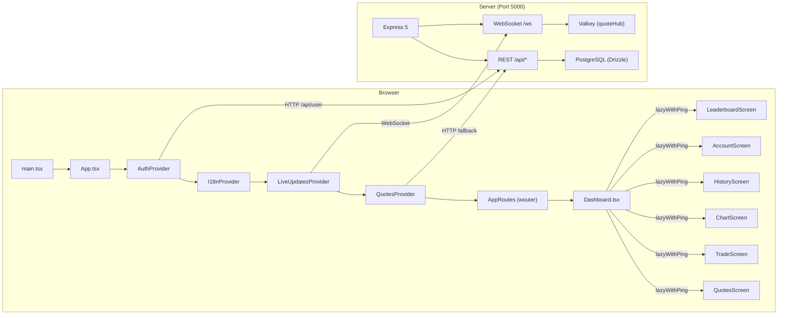
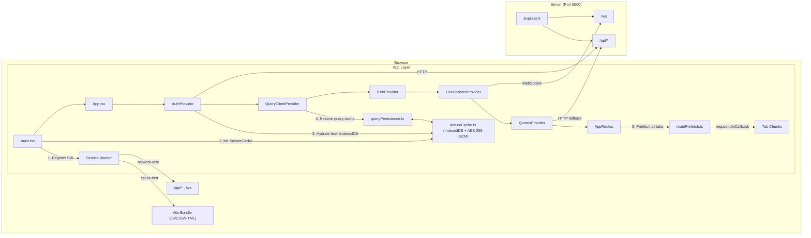
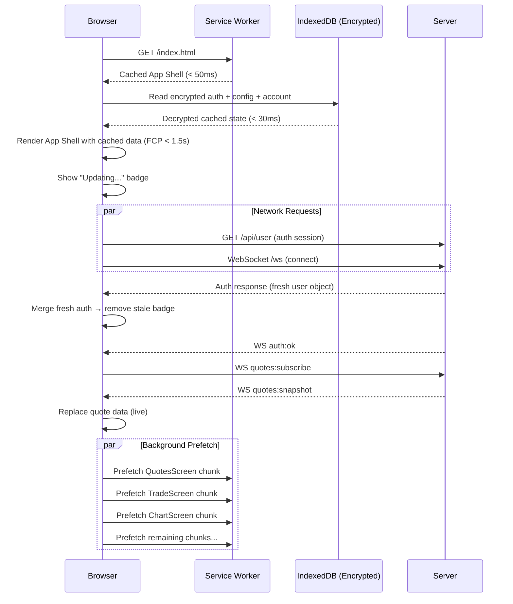

# PRD: TradeQuip Slow-4G Instant-Load Performance System

> **Product:** TradeQuip (TD.2.ANTIGRAVITY)
> **Document Version:** 1.0
> **Date:** 2026-02-15
> **Author:** Performance Architecture Team
> **Status:** Draft — Pending Review

---

## Table of Contents

1. [Executive Summary](#1-executive-summary)
2. [Problem Statement](#2-problem-statement)
3. [Goals & Success Criteria](#3-goals--success-criteria)
4. [Scope & Boundaries](#4-scope--boundaries)
5. [System Architecture Overview](#5-system-architecture-overview)
6. [Feature Specifications](#6-feature-specifications)
   - 6.1 [Service Worker & App Shell](#61-feature-1-service-worker--app-shell-cache)
   - 6.2 [Aggressive Route Prefetching](#62-feature-2-aggressive-route-prefetching)
   - 6.3 [Secure Encrypted Cache (IndexedDB)](#63-feature-3-secure-encrypted-cache-indexeddb)
   - 6.4 [Tanstack Query Persistence](#64-feature-4-tanstack-query-persistence-layer)
   - 6.5 [Hybrid State Hydration & Merging](#65-feature-5-hybrid-state-hydration--merging)
7. [Data Classification & Caching Policy](#7-data-classification--caching-policy)
8. [Security Requirements](#8-security-requirements)
9. [Implementation Plan](#9-implementation-plan)
10. [File Manifest](#10-file-manifest)
11. [Code Specifications](#11-code-specifications)
12. [Verification & Acceptance Criteria](#12-verification--acceptance-criteria)
13. [Rollback & Feature Flags](#13-rollback--feature-flags)
14. [Risks & Mitigations](#14-risks--mitigations)
15. [Dependencies & Constraints](#15-dependencies--constraints)

---

## 1. Executive Summary

TradeQuip is a full-stack trading platform (React 19 / Express 5 / PostgreSQL / WebSocket). On **Slow 4G networks** (~400ms RTT, ~1.5 Mbps), traders experience 2–5 second load times and 1–3 second delays when switching between Dashboard tabs. This PRD defines a four-layer performance system — **Service Worker App Shell**, **Aggressive Route Prefetching**, **Encrypted IndexedDB Caching**, and **Hybrid State Hydration** — to achieve sub-1.5-second cold loads and sub-100ms tab switches.

---

## 2. Problem Statement

### 2.1 Current Performance Bottlenecks

| Bottleneck | Root Cause | Impact |
|---|---|---|
| **Cold Load Spinner** | `AuthProvider` → API calls → rendering is serial; no offline data | 2–5s white spinner (`FullScreenLoading` in [App.tsx:71–77](file:///wsl.localhost/Ubuntu/home/bcodex/TD.2.ANTIGRAVITY/client/src/App.tsx#L71-L77)) |
| **Tab Switch Lag** | All 6 Dashboard tabs are code-split via `lazyWithPing`; chunks fetched on-demand | 1–3s per tab on first visit ([Dashboard.tsx:9–14](file:///wsl.localhost/Ubuntu/home/bcodex/TD.2.ANTIGRAVITY/client/src/pages/Dashboard.tsx#L9-L14)) |
| **No Offline Shell** | No Service Worker; every page load requires full network fetch | Complete failure on network interruption |
| **No Persistent State** | Tanstack Query cache (`staleTime: Infinity`) lives only in memory; lost on refresh | Full re-fetch of all config/state on every refresh |
| **E2EE Key Storage** | `localStorage` is synchronous, blocks main thread, 5–10MB limit | Scalability ceiling for cached data ([e2ee.ts:105](file:///wsl.localhost/Ubuntu/home/bcodex/TD.2.ANTIGRAVITY/client/src/lib/e2ee.ts#L105)) |

### 2.2 Target Users

- **Primary:** Traders on mobile devices (Capacitor Android/iOS) or web browsers in regions with slow 4G (emerging markets, mobile-first users).
- **Secondary:** All users — even on fast connections, the optimizations improve perceived performance.

### 2.3 Network Profile (Slow 4G)

| Metric | Value |
|---|---|
| Round-Trip Time (RTT) | 300–500ms |
| Downlink Bandwidth | 1.0–2.0 Mbps |
| `navigator.connection.effectiveType` | `"4g"` with `rtt > 350` or `downlink < 1.6` |
| `perfHints.isConstrained` | `true` (per existing [perfHints.ts:33–43](file:///wsl.localhost/Ubuntu/home/bcodex/TD.2.ANTIGRAVITY/client/src/lib/perfHints.ts#L33-L43)) |

---

## 3. Goals & Success Criteria

### 3.1 Performance Targets

| Metric | Current (Slow 4G) | Target | Method |
|---|---|---|---|
| First Contentful Paint (FCP) | ~3.5s | **< 1.5s** | Service Worker App Shell |
| Time to Interactive (TTI) | ~5.0s | **< 2.5s** | Cached state hydration |
| Tab Switch Latency (post-prefetch) | 1–3s | **< 100ms** | Route chunk prefetching |
| Tab Switch Latency (first visit, no prefetch) | 1–3s | **< 500ms** | SW-cached chunks |
| Offline Shell Render | ❌ Fails | **✅ Renders** | Service Worker + IndexedDB |
| Lighthouse Performance Score (throttled) | ~55 | **> 90** | All optimizations combined |

### 3.2 Functional Goals

| ID | Goal |
|---|---|
| **G1** | Trader sees the App Shell (Header, Navigation, Tab Bar) within 1.5s on cold load |
| **G2** | Last-known account data (balance, equity, margin) renders immediately from cache |
| **G3** | All 6 Dashboard tab panels are fully prefetched in background within 10s of login |
| **G4** | Cached data is AES-256-GCM encrypted in IndexedDB; unreadable if device is compromised |
| **G5** | Live data (quotes, trades, margin) seamlessly replaces cached data via existing WS layer |
| **G6** | System degrades gracefully on 2G/slow-2G: fewer prefetches, larger intervals, same core UX |
| **G7** | Zero regressions to existing functionality, security, or data integrity |

---

## 4. Scope & Boundaries

### 4.1 In Scope

- Service Worker App Shell for static asset caching
- Route chunk prefetching for all Dashboard tabs and top-level routes
- Encrypted IndexedDB cache for API response data
- Tanstack Query persistence adapter
- Hybrid state hydration (cache → render → merge live updates)
- Migration of E2EE key storage from `localStorage` to IndexedDB
- Stale-data visual indicators in the UI

### 4.2 Out of Scope

- Server-side rendering (SSR) or static site generation (SSG)
- Push notifications (Web Push API)
- Background Sync API for offline trade execution
- Changes to the WebSocket protocol or server-side quote pipeline
- Changes to the PostgreSQL schema or Valkey caching layer
- Admin Dashboard (`/admin`) performance — admin users are assumed to have fast connections
- Capacitor-native offline storage (this PRD covers web-layer; Capacitor bridge is separate)

---

## 5. System Architecture Overview

### 5.1 Current Architecture



### 5.2 Target Architecture (with Performance Layer)



### 5.3 Data Flow Sequence (Cold Load on Slow 4G)



---

## 6. Feature Specifications

### 6.1 Feature 1: Service Worker & App Shell Cache

#### 6.1.1 Overview

A Service Worker intercepts network requests for static assets (`/assets/*`, `index.html`) and serves them from the browser's Cache API, eliminating network round-trips for the App Shell on subsequent loads.

#### 6.1.2 Functional Requirements

| ID | Requirement |
|---|---|
| **SW-1** | The Service Worker MUST be registered in `client/src/main.tsx` on app bootstrap, before `ReactDOM.createRoot`. |
| **SW-2** | On `install` event, the SW MUST pre-cache the current `index.html` and the Vite manifest of hashed assets. |
| **SW-3** | For requests matching `/assets/*`, the SW MUST use a **cache-first** strategy (serve from cache, no network). These assets are content-hashed and immutable. |
| **SW-4** | For `index.html` (navigation requests), the SW MUST use **stale-while-revalidate** (serve cached, fetch update in background, swap on next navigation). |
| **SW-5** | The SW MUST NOT intercept requests to `/api/*`, `/ws`, or any path containing `__vite`. These MUST always go to the network. |
| **SW-6** | On `activate` event, the SW MUST delete stale cache entries from previous builds. |
| **SW-7** | The SW MUST expose a versioned cache name (e.g., `tq-shell-v{BUILD_HASH}`) to enable clean upgrades. |
| **SW-8** | In development mode (`import.meta.env.DEV`), the SW MUST NOT be registered. |

#### 6.1.3 Technical Specification

**File:** `client/src/sw.ts` (compiled separately by Vite)

```typescript
// Pseudocode structure
const CACHE_NAME = `tq-shell-${__BUILD_HASH__}`;
const SHELL_URLS = ['/', '/index.html'];

self.addEventListener('install', (event) => {
  event.waitUntil(
    caches.open(CACHE_NAME).then(cache => cache.addAll(SHELL_URLS))
  );
  self.skipWaiting();
});

self.addEventListener('activate', (event) => {
  event.waitUntil(
    caches.keys().then(keys =>
      Promise.all(keys.filter(k => k !== CACHE_NAME).map(k => caches.delete(k)))
    )
  );
  self.clients.claim();
});

self.addEventListener('fetch', (event) => {
  const url = new URL(event.request.url);

  // Never intercept API or WebSocket
  if (url.pathname.startsWith('/api/') || url.pathname === '/ws') return;
  if (url.pathname.includes('__vite')) return;

  // Cache-first for immutable /assets/*
  if (url.pathname.startsWith('/assets/')) {
    event.respondWith(caches.match(event.request).then(r => r || fetch(event.request)));
    return;
  }

  // Stale-while-revalidate for navigation (index.html)
  if (event.request.mode === 'navigate') {
    event.respondWith(
      caches.match('/index.html').then(cached => {
        const fetchPromise = fetch(event.request).then(response => {
          caches.open(CACHE_NAME).then(cache => cache.put('/index.html', response.clone()));
          return response;
        });
        return cached || fetchPromise;
      })
    );
  }
});
```

**Registration** (in `client/src/main.tsx`):

```typescript
if ('serviceWorker' in navigator && !import.meta.env.DEV) {
  window.addEventListener('load', () => {
    navigator.serviceWorker.register('/sw.js').catch(console.warn);
  });
}
```

**Vite build config** (`vite.config.ts` addition):

```typescript
build: {
  rollupOptions: {
    input: {
      main: path.resolve(__dirname, 'client/index.html'),
      sw: path.resolve(__dirname, 'client/src/sw.ts'),
    },
    output: {
      entryFileNames: (chunk) =>
        chunk.name === 'sw' ? 'sw.js' : 'assets/[name]-[hash].js',
    },
  },
},
```

#### 6.1.4 Integration Points

| Existing Module | Integration |
|---|---|
| [server/vite.ts](file:///wsl.localhost/Ubuntu/home/bcodex/TD.2.ANTIGRAVITY/server/vite.ts) `serveStatic()` | Add `sw.js` to the list of files served with `Cache-Control: no-cache` (not immutable — SW must be re-fetched by the browser on each visit to detect updates). |
| [server/vite.ts](file:///wsl.localhost/Ubuntu/home/bcodex/TD.2.ANTIGRAVITY/server/vite.ts) SPA fallback | Exclude `/sw.js` from the catch-all `index.html` fallback. |

---

### 6.2 Feature 2: Aggressive Route Prefetching

#### 6.2.1 Overview

Silently prefetch all code-split route chunks in the background immediately after user authentication, so that tab navigation is instant.

#### 6.2.2 Functional Requirements

| ID | Requirement |
|---|---|
| **RP-1** | Prefetching MUST trigger when `isAuthenticated` transitions to `true` in `AuthProvider`. |
| **RP-2** | All 6 Dashboard tab chunks MUST be prefetched: `QuotesScreen`, `TradeScreen`, `ChartScreen`, `HistoryScreen`, `AccountScreen`, `LeaderboardScreen`. |
| **RP-3** | Top-level route chunks MUST also be prefetched: `JournalPage`, `ProfileSettings`, `PartnerPortal`. |
| **RP-4** | Prefetch order MUST follow usage priority: Quotes → Trade → Chart → History → Account → Leaderboard → Journal → Profile → Partner. |
| **RP-5** | Each `import()` call MUST be scheduled via `requestIdleCallback` (with a 2-second timeout fallback) to avoid blocking the main thread. |
| **RP-6** | On constrained networks (`perfHints.isConstrained === true` AND `effectiveType` is `"slow-2g"` or `"2g"`), ONLY the first 3 chunks (Quotes, Trade, Chart) MUST be prefetched. |
| **RP-7** | On `saveData === true`, NO prefetch MUST occur. |
| **RP-8** | Prefetch failures MUST be silently caught (no user-visible error). The chunk will be fetched on-demand when the user navigates. |
| **RP-9** | The prefetcher MUST be idempotent — if called multiple times, it MUST NOT re-fetch already-loaded chunks. |

#### 6.2.3 Technical Specification

**File:** `client/src/lib/routePrefetch.ts`

```typescript
import { getPerfHints } from './perfHints';

const ALL_CHUNKS = [
  () => import('@/pages/QuotesScreen'),
  () => import('@/pages/TradeScreen'),
  () => import('@/pages/ChartScreen'),
  () => import('@/pages/HistoryScreen'),
  () => import('@/pages/AccountScreen'),
  () => import('@/pages/LeaderboardScreen'),
  () => import('@/pages/JournalPage'),
  () => import('@/pages/ProfileSettings'),
  () => import('@/pages/PartnerPortal'),
];

let prefetched = false;

export function prefetchAllRoutes(): void {
  if (prefetched) return;
  prefetched = true;

  const hints = getPerfHints();
  if (hints.saveData) return;

  const severelyConstrained =
    hints.effectiveType === 'slow-2g' || hints.effectiveType === '2g';
  const chunks = severelyConstrained ? ALL_CHUNKS.slice(0, 3) : ALL_CHUNKS;

  let index = 0;
  const scheduleNext = () => {
    if (index >= chunks.length) return;
    const importer = chunks[index++];
    const run = () => {
      importer().catch(() => {});
      scheduleNext();
    };
    if ('requestIdleCallback' in window) {
      requestIdleCallback(run, { timeout: 2000 });
    } else {
      setTimeout(run, 100);
    }
  };
  scheduleNext();
}
```

#### 6.2.4 Integration Points

| Existing Module | Integration |
|---|---|
| [App.tsx](file:///wsl.localhost/Ubuntu/home/bcodex/TD.2.ANTIGRAVITY/client/src/App.tsx) `AppRoutes()` | Add `useEffect(() => { if (isAuthenticated) prefetchAllRoutes(); }, [isAuthenticated]);` |
| [Dashboard.tsx](file:///wsl.localhost/Ubuntu/home/bcodex/TD.2.ANTIGRAVITY/client/src/pages/Dashboard.tsx) | Tab components remain `lazyWithPing` — prefetching warms the import cache; `Suspense` still works as fallback if prefetch hasn't completed. |
| [lazyWithPing.ts](file:///wsl.localhost/Ubuntu/home/bcodex/TD.2.ANTIGRAVITY/client/src/lib/lazyWithPing.ts) | No changes needed. The `lazyWithPing` wrapper still fires its "ping" when the chunk resolves, regardless of whether it was prefetched. |

---

### 6.3 Feature 3: Secure Encrypted Cache (IndexedDB)

#### 6.3.1 Overview

A thin IndexedDB wrapper that encrypts all stored data using AES-256-GCM via the Web Crypto API. This is the local storage backbone for all cached API data.

#### 6.3.2 Functional Requirements

| ID | Requirement |
|---|---|
| **SC-1** | All data written to IndexedDB MUST be encrypted with AES-256-GCM before storage. |
| **SC-2** | Encryption keys MUST be derived using PBKDF2 from a user-specific secret (session-derived) and stored as non-extractable `CryptoKey` objects. |
| **SC-3** | Each encrypted entry MUST store: `{ iv: Uint8Array, ciphertext: Uint8Array, tag: implicit in GCM, version: number }`. |
| **SC-4** | A fresh random 12-byte IV MUST be generated for every write operation. IVs MUST NEVER be reused with the same key. |
| **SC-5** | The IndexedDB database MUST be named `tq-secure-cache-v1` with object stores: `query-cache`, `user-state`, `e2ee-keys`. |
| **SC-6** | Reading a corrupt or undecryptable entry MUST return `null` (fail-open for UX, fail-closed for security). |
| **SC-7** | On user logout, ALL entries in ALL object stores MUST be deleted. |
| **SC-8** | The module MUST expose: `securePut(store, key, plaintext)`, `secureGet(store, key)`, `secureDelete(store, key)`, `secureClearAll()`. |
| **SC-9** | Maximum individual entry size: 5 MB (enforced before encryption). |
| **SC-10** | The module MUST work in both browser and Capacitor WebView environments. |

#### 6.3.3 Technical Specification

**File:** `client/src/lib/secureCache.ts`

**Core API:**

```typescript
export interface SecureCacheOptions {
  dbName?: string;        // default: 'tq-secure-cache-v1'
  dbVersion?: number;     // default: 1
}

export class SecureCache {
  constructor(private userSecret: string, options?: SecureCacheOptions);

  /** Initialize DB + derive encryption key via PBKDF2 */
  async init(): Promise<void>;

  /** Encrypt and store JSON-serializable value */
  async put<T>(store: StoreNames, key: string, value: T): Promise<void>;

  /** Read and decrypt a stored value, returns null if missing/corrupt */
  async get<T>(store: StoreNames, key: string): Promise<T | null>;

  /** Delete a specific entry */
  async delete(store: StoreNames, key: string): Promise<void>;

  /** Wipe all stores (used on logout) */
  async clearAll(): Promise<void>;

  /** Close the DB connection */
  close(): void;
}

export type StoreNames = 'query-cache' | 'user-state' | 'e2ee-keys';
```

**Encryption internals** (reusing patterns from existing [e2ee.ts](file:///wsl.localhost/Ubuntu/home/bcodex/TD.2.ANTIGRAVITY/client/src/lib/e2ee.ts)):

```typescript
// Key derivation
const salt = new TextEncoder().encode(`tq:${userId}:cache`);
const keyMaterial = await crypto.subtle.importKey(
  'raw',
  new TextEncoder().encode(userSecret),
  'PBKDF2',
  false,
  ['deriveKey'],
);
const aesKey = await crypto.subtle.deriveKey(
  { name: 'PBKDF2', salt, iterations: 100_000, hash: 'SHA-256' },
  keyMaterial,
  { name: 'AES-GCM', length: 256 },
  false, // non-extractable
  ['encrypt', 'decrypt'],
);

// Encryption
const iv = crypto.getRandomValues(new Uint8Array(12));
const ciphertext = await crypto.subtle.encrypt(
  { name: 'AES-GCM', iv, tagLength: 128 },
  aesKey,
  new TextEncoder().encode(JSON.stringify(value)),
);

// Storage format in IndexedDB
{ key, iv: Array.from(iv), data: Array.from(new Uint8Array(ciphertext)), v: 1 }
```

#### 6.3.4 E2EE Key Migration

| Current (e2ee.ts) | Target (secureCache.ts) |
|---|---|
| `localStorage.setItem('tq.mailbox.e2ee.v1.{userId}', JSON.stringify(keyMaterial))` | `secureCache.put('e2ee-keys', userId, keyMaterial)` |
| `localStorage.getItem(...)` | `secureCache.get('e2ee-keys', userId)` |
| `localStorage.removeItem(...)` | `secureCache.delete('e2ee-keys', userId)` |

> [!IMPORTANT]
> Backward compatibility: On first load after migration, if IndexedDB has no E2EE key but `localStorage` does, auto-migrate the key to IndexedDB and then delete the `localStorage` entry.

---

### 6.4 Feature 4: Tanstack Query Persistence Layer

#### 6.4.1 Overview

Serialize selected Tanstack Query cache entries to encrypted IndexedDB on write, and hydrate them on app startup — so that previously fetched API data is instantly available before any network request completes.

#### 6.4.2 Functional Requirements

| ID | Requirement |
|---|---|
| **QP-1** | ONLY the following query keys MUST be persisted (whitelist approach): |
|  | — `/api/config/symbols` |
|  | — `/api/global-settings` |
|  | — `/api/account/summary` |
|  | — `/api/quote-subscriptions/allowed-symbols` |
|  | — `/api/user` (auth session) |
|  | — `/api/trades/open` (open positions) |
| **QP-2** | Persisted entries MUST be encrypted via `SecureCache.put('query-cache', ...)`. |
| **QP-3** | On app init, the persistence layer MUST hydrate persisted entries into `queryClient` BEFORE the first render. |
| **QP-4** | Hydrated entries MUST be marked with `dataUpdatedAt` from the last write, enabling Tanstack Query to treat them as stale and trigger background revalidation. |
| **QP-5** | Persistence writes MUST be debounced (500ms) — do not write to IndexedDB on every query update. |
| **QP-6** | If hydration takes > 200ms (e.g., slow device), the app MUST proceed without cached data rather than blocking render. |
| **QP-7** | Persisted data MUST include a schema version. If the schema version mismatches, discard the cache. |

#### 6.4.3 Technical Specification

**File:** `client/src/lib/queryPersistence.ts`

```typescript
import { SecureCache } from './secureCache';
import type { QueryClient } from '@tanstack/react-query';

const PERSIST_KEYS = [
  '/api/config/symbols',
  '/api/global-settings',
  '/api/account/summary',
  '/api/quote-subscriptions/allowed-symbols',
  '/api/user',
  '/api/trades/open',
];

const SCHEMA_VERSION = 1;
const DEBOUNCE_MS = 500;

export class QueryPersistence {
  constructor(
    private queryClient: QueryClient,
    private cache: SecureCache,
  ) {}

  /** Hydrate query cache from IndexedDB. Resolves in < 200ms or skips. */
  async hydrate(): Promise<void> {
    const deadline = Date.now() + 200;
    for (const key of PERSIST_KEYS) {
      if (Date.now() > deadline) break;
      const entry = await this.cache.get<PersistedEntry>('query-cache', key);
      if (!entry || entry.schemaVersion !== SCHEMA_VERSION) continue;
      this.queryClient.setQueryData([key], entry.data, {
        updatedAt: entry.updatedAt,
      });
    }
  }

  /** Start listening for query cache updates and persisting them. */
  subscribe(): () => void {
    let timer: ReturnType<typeof setTimeout> | null = null;
    const unsubscribe = this.queryClient.getQueryCache().subscribe(() => {
      if (timer) clearTimeout(timer);
      timer = setTimeout(() => this.persistAll(), DEBOUNCE_MS);
    });
    return () => {
      if (timer) clearTimeout(timer);
      unsubscribe();
    };
  }

  private async persistAll(): Promise<void> {
    for (const key of PERSIST_KEYS) {
      const state = this.queryClient.getQueryState([key]);
      if (!state?.data) continue;
      await this.cache.put('query-cache', key, {
        schemaVersion: SCHEMA_VERSION,
        data: state.data,
        updatedAt: state.dataUpdatedAt,
      });
    }
  }
}

type PersistedEntry = {
  schemaVersion: number;
  data: unknown;
  updatedAt: number;
};
```

#### 6.4.4 Integration Points

| Existing Module | Integration |
|---|---|
| [queryClient.ts](file:///wsl.localhost/Ubuntu/home/bcodex/TD.2.ANTIGRAVITY/client/src/lib/queryClient.ts) | Import `QueryPersistence`, call `hydrate()` before `QueryClientProvider` mounts, call `subscribe()` after. |
| [App.tsx](file:///wsl.localhost/Ubuntu/home/bcodex/TD.2.ANTIGRAVITY/client/src/App.tsx) | `QueryPersistence.hydrate()` should run in `main.tsx` before `ReactDOM.createRoot()`, or as an async initialization step. |

---

### 6.5 Feature 5: Hybrid State Hydration & Merging

#### 6.5.1 Overview

On cold load, render the UI immediately using cached data from IndexedDB, then seamlessly merge fresh data from the server as it arrives via HTTP and WebSocket.

#### 6.5.2 Functional Requirements

| ID | Requirement |
|---|---|
| **HM-1** | The App Shell (Header, Navigation, Tab Bar) MUST render from the Service Worker cache without any API dependency. |
| **HM-2** | Account data (balance, equity, free margin, used margin) MUST render from the encrypted IndexedDB cache within 100ms of shell render. |
| **HM-3** | A **stale-data indicator** (subtle pulsing dot or "Updating..." text) MUST be visible on any data rendered from cache before live data arrives. |
| **HM-4** | The stale-data indicator MUST disappear within 1 render frame of receiving fresh data (from HTTP response or WS message). |
| **HM-5** | Live quotes MUST NEVER be served from IndexedDB cache (stale prices are dangerous in trading). `QuotesProvider` MUST always start from WS `quotes:snapshot` or HTTP `/api/quotes/latest`. |
| **HM-6** | Open trade positions (from `/api/trades/open`) MAY be hydrated from IndexedDB as "last known" with a clear visual indicator, then replaced by live data. |
| **HM-7** | If the cached auth session is expired (server returns 401), the app MUST redirect to `/login` normally — do not show stale data for a logged-out user. |

#### 6.5.3 Stale-Data Indicator Design

**Visual specification:**

```
┌────────────────────────────────────────┐
│  Balance: $1,000,432.50  ● Updating   │  ← pulsing cyan dot + "Updating" text
│  Equity:  $1,002,100.00               │
│  Free Margin: $980,200.00             │
└────────────────────────────────────────┘

After live data arrives (< 2s):

┌────────────────────────────────────────┐
│  Balance: $1,000,432.50               │  ← dot and text disappear
│  Equity:  $1,002,150.00               │     values update in-place
│  Free Margin: $980,250.00             │
└────────────────────────────────────────┘
```

**CSS class:** `tq-stale-indicator` — a `@keyframes` pulsing animation on a small circle + `opacity: 0.7` on the data text.

#### 6.5.4 Merge Sequence (Exact Order)

```
1. SW serves index.html                              → Shell renders (blank tabs)
2. SecureCache.init() + QueryPersistence.hydrate()    → Cached data injected into QueryClient
3. React renders App with cached data                 → User sees last-known balances/positions
4. AuthProvider fires GET /api/user                   → Validates session
   ├── 401 → redirect to /login, clear IndexedDB
   └── 200 → merge fresh user object into context
5. LiveUpdatesProvider connects WebSocket             → WS auth:hello
6. QuotesProvider sends quotes:subscribe              → Server responds with quotes:snapshot
7. ConfigSync listens for symbols:updated             → Invalidates /api/config/symbols query
8. AccountSummarySync polls /api/account/summary      → Merges fresh equity/margin
9. All stale indicators removed                       → UI shows fully live data
```

---

## 7. Data Classification & Caching Policy

| Data Category | Source | Sensitivity | Cache Location | Cache Strategy | TTL | Encryption |
|---|---|---|---|---|---|---|
| App Shell (HTML/CSS/JS) | Vite bundle | None | Service Worker Cache API | cache-first / stale-while-revalidate | Immutable (hashed) | No |
| Symbol configs | `/api/config/symbols` | Low | IndexedDB `query-cache` | Cache + revalidate on WS `symbols:updated` | 24h max | **AES-256-GCM** |
| Global settings | `/api/global-settings` | Low | IndexedDB `query-cache` | Cache + revalidate on WS `global-settings:updated` | 24h max | **AES-256-GCM** |
| Auth session | `/api/user` | **High** | IndexedDB `user-state` | Cache during session, clear on logout | Session lifetime | **AES-256-GCM** |
| Account summary | `/api/account/summary` | **High** | IndexedDB `query-cache` | Cache + live WS overlay via `AccountSummarySync` | 5 min max | **AES-256-GCM** |
| Open positions | `/api/trades/open` | **High** | IndexedDB `query-cache` | Cache + live WS overlay via `trades:update` | 5 min max | **AES-256-GCM** |
| Live quotes | WS `quotes:update` | Medium | **In-memory only** | NEVER cache | N/A | N/A |
| Trade history | `/api/trades/history` | Medium | Not cached | Fetch on-demand | N/A | N/A |
| Notifications | `/api/notifications` | Low | Not cached | Fetch on-demand | N/A | N/A |
| E2EE key material | Client-generated | **Critical** | IndexedDB `e2ee-keys` | Persistent + migrate from localStorage | Until rotated | **AES-256-GCM** |

---

## 8. Security Requirements

| ID | Requirement | Rationale |
|---|---|---|
| **SEC-1** | All IndexedDB data MUST be encrypted with AES-256-GCM (256-bit key, 128-bit auth tag, 96-bit IV). | Protects cached financial data on compromised devices. |
| **SEC-2** | Encryption keys MUST be derived via PBKDF2 with ≥100,000 iterations and a user-specific salt. | Resistant to brute-force attacks on stolen IndexedDB dumps. |
| **SEC-3** | Encryption keys MUST be `CryptoKey` objects with `extractable: false`. | Prevents JavaScript-level key exfiltration. |
| **SEC-4** | On logout, ALL IndexedDB stores MUST be cleared (`secureClearAll()`). | Prevents next user from reading stale session data. |
| **SEC-5** | The Service Worker MUST NOT cache `/api/*` responses. Only static assets. | API responses contain sensitive financial data. |
| **SEC-6** | The Service Worker MUST be served with `Cache-Control: no-cache` to ensure browser always checks for updates. | Prevents stale SW code from running indefinitely. |
| **SEC-7** | The E2EE localStorage → IndexedDB migration MUST delete the localStorage entry after successful migration. | Reduces attack surface. |
| **SEC-8** | Cached data MUST include a `schemaVersion`; mismatched versions MUST be discarded, not parsed. | Prevents deserialization of incompatible/tampered data. |

---

## 9. Implementation Plan

### Phase 1: Foundation (Service Worker + Secure Cache)

| Step | Task | File(s) | Est. Effort |
|---|---|---|---|
| 1.1 | Create `SecureCache` class with IndexedDB + AES-256-GCM wrapper | `client/src/lib/secureCache.ts` | 4h |
| 1.2 | Write unit tests for SecureCache (encrypt → store → read → decrypt, corrupt data, clear) | `client/src/lib/secureCache.test.ts` | 2h |
| 1.3 | Create Service Worker with install/activate/fetch handlers | `client/src/sw.ts` | 3h |
| 1.4 | Add SW build to Vite config (separate entry point) | `vite.config.ts` | 1h |
| 1.5 | Register SW in `main.tsx` (production only) | `client/src/main.tsx` | 0.5h |
| 1.6 | Update `server/vite.ts` `serveStatic()` to serve `sw.js` with correct headers and exclude from SPA fallback | `server/vite.ts` | 1h |
| 1.7 | Migrate E2EE key storage from localStorage to IndexedDB with backward-compat auto-migration | `client/src/lib/e2ee.ts` | 2h |

**Phase 1 Exit Criteria:**
- SW caches and serves App Shell on second load
- `SecureCache` encrypts/decrypts data in IndexedDB correctly
- E2EE keys migrate transparently; mailbox encryption still works

---

### Phase 2: Route Prefetching

| Step | Task | File(s) | Est. Effort |
|---|---|---|---|
| 2.1 | Create `routePrefetch.ts` with prioritized import queue + `requestIdleCallback` | `client/src/lib/routePrefetch.ts` | 2h |
| 2.2 | Wire `prefetchAllRoutes()` into `AppRoutes` in `App.tsx` | `client/src/App.tsx` | 0.5h |
| 2.3 | Verify via Chrome DevTools Network tab that all chunks load in background after auth | Manual verification | 1h |

**Phase 2 Exit Criteria:**
- All 6 Dashboard tab chunks are visible in the Network panel as prefetched within 10s of login
- Tab switches show no chunk-loading network requests
- On `saveData: true`, no prefetch occurs

---

### Phase 3: Query Persistence + Hydration

| Step | Task | File(s) | Est. Effort |
|---|---|---|---|
| 3.1 | Create `QueryPersistence` class with `hydrate()` and `subscribe()` | `client/src/lib/queryPersistence.ts` | 3h |
| 3.2 | Wire hydrate into app bootstrap (before render) | `client/src/main.tsx` or `client/src/App.tsx` | 1h |
| 3.3 | Wire subscribe (post-render) to persist whitelist queries on update | `client/src/App.tsx` | 0.5h |
| 3.4 | Add stale-data indicator component | `client/src/components/StaleDataBadge.tsx` | 1h |
| 3.5 | Add stale-data badge to `AccountScreen`, `Header` (balance display), and `Dashboard` (open positions) | Various components | 2h |
| 3.6 | Update `AccountSummarySync.tsx` to remove stale badge once fresh data arrives | `client/src/live/AccountSummarySync.tsx` | 1h |
| 3.7 | Add logout cleanup: call `SecureCache.clearAll()` in `AuthProvider` logout flow | `client/src/hooks/use-auth.tsx` | 0.5h |

**Phase 3 Exit Criteria:**
- On cold load (with prior cache), balances/positions render from cache with stale badge
- Stale badge disappears within 2s of WS reconnect
- Logout clears all IndexedDB data
- Refresh on flight-mode shows cached data with "Updating..." indicator

---

### Phase 4: Integration Testing & Performance Validation

| Step | Task | Est. Effort |
|---|---|---|
| 4.1 | Lighthouse audit on Slow 4G (Chrome throttling) — target > 90 | 2h |
| 4.2 | Measure FCP, TTI, tab-switch latency with `performance.mark`/`performance.measure` | 2h |
| 4.3 | E2E test: cold load → login → tab navigation → all 6 tabs (Playwright with throttling) | 3h |
| 4.4 | Security review: verify IndexedDB blobs are unreadable, keys are non-extractable | 1h |
| 4.5 | Regression test: existing features (trading, mailbox, admin) work unchanged | 2h |
| 4.6 | Capacitor test: verify SW + IndexedDB work in Android WebView | 2h |

---

## 10. File Manifest

### New Files

| File | Purpose | Phase |
|---|---|---|
| `client/src/lib/secureCache.ts` | IndexedDB + AES-256-GCM encrypted cache | 1 |
| `client/src/lib/secureCache.test.ts` | Unit tests for SecureCache | 1 |
| `client/src/sw.ts` | Service Worker (App Shell cache) | 1 |
| `client/src/lib/routePrefetch.ts` | Background route chunk prefetcher | 2 |
| `client/src/lib/queryPersistence.ts` | Tanstack Query ↔ IndexedDB persistence adapter | 3 |
| `client/src/components/StaleDataBadge.tsx` | Visual indicator for cached/stale data | 3 |

### Modified Files

| File | Changes | Phase |
|---|---|---|
| `vite.config.ts` | Add SW as separate build entry | 1 |
| `client/src/main.tsx` | Register SW, init SecureCache, hydrate QueryPersistence | 1, 3 |
| `server/vite.ts` | Serve `sw.js` with `no-cache`, exclude from SPA fallback | 1 |
| `client/src/lib/e2ee.ts` | Migrate key storage from localStorage → IndexedDB | 1 |
| `client/src/App.tsx` | Wire `prefetchAllRoutes()`, wire `QueryPersistence.subscribe()` | 2, 3 |
| `client/src/hooks/use-auth.tsx` | Call `SecureCache.clearAll()` on logout | 3 |
| `client/src/live/AccountSummarySync.tsx` | Hydrate from IndexedDB on init, emit stale-data event | 3 |
| `client/src/components/Header.tsx` | Add `StaleDataBadge` next to balance display | 3 |

---

## 11. Code Specifications

### 11.1 Naming Conventions

| Item | Convention | Example |
|---|---|---|
| IndexedDB database name | `tq-secure-cache-v{N}` | `tq-secure-cache-v1` |
| IndexedDB object stores | kebab-case | `query-cache`, `user-state`, `e2ee-keys` |
| Service Worker cache name | `tq-shell-{BUILD_HASH}` | `tq-shell-a3f2b9c` |
| CSS class for stale indicator | `tq-stale-indicator` | `.tq-stale-indicator` |
| Env flag for SW | `VITE_ENABLE_SW` | Default: `true` in production |

### 11.2 Error Handling Philosophy

| Scenario | Behavior |
|---|---|
| IndexedDB not available (private browsing) | Gracefully degrade: app works normally without cache, every load is a network fetch. |
| Decryption failure (corrupt cache) | Return `null`, delete the corrupt entry, log warning — never block render. |
| SW registration failure | Log warning, app works without SW — all requests go to network normally. |
| Prefetch failure (network error) | Silently catch, chunk will be fetched on-demand when user navigates. |
| Hydration timeout (> 200ms) | Skip remaining entries, render with whatever was hydrated. |

### 11.3 Browser Compatibility

| API | Required By | Fallback |
|---|---|---|
| Service Worker | App Shell cache | No SW → normal network loading |
| IndexedDB | SecureCache | No IDB → no persistent cache, app works without it |
| Web Crypto API (AES-GCM, PBKDF2) | SecureCache encryption | Already required by existing `e2ee.ts` — no fallback needed |
| `requestIdleCallback` | Route prefetching | `setTimeout(fn, 100)` |
| `navigator.connection` | perfHints (network detection) | Already handled: returns `"unknown"` + no constraint flags |

---

## 12. Verification & Acceptance Criteria

### 12.1 Performance Acceptance Tests

| Test | Method | Pass Criteria |
|---|---|---|
| Cold load FCP on Slow 4G | Chrome DevTools → Performance → Throttle to "Slow 4G" | FCP < 1.5s |
| Cold load TTI on Slow 4G | Lighthouse with applied throttling | TTI < 2.5s |
| Tab switch after prefetch | `performance.measure('tab-switch')` from click to render | < 100ms |
| Lighthouse score | Lighthouse → Performance tab, Slow 4G throttle | > 90 |
| Offline shell render | Disable network in DevTools → refresh | App Shell renders with cached data |

### 12.2 Functional Acceptance Tests

| Test | Pass Criteria |
|---|---|
| Login → all 6 tabs prefetched | Network panel shows 6 chunk requests within 10s post-login |
| Cached balance renders on cold load | Balance visible within 500ms of TTI, with stale badge |
| Stale badge disappears | Badge gone within 2s of WebSocket reconnect |
| Logout clears IndexedDB | DevTools → Application → IndexedDB → all stores empty after logout |
| IndexedDB data is encrypted | Raw IndexedDB values are opaque binary, not readable JSON |
| E2EE mailbox still works after migration | Can send/receive encrypted mailbox messages after localStorage → IndexedDB migration |
| `saveData` respected | Enable `Save Data` in Chrome → no prefetch occurs |
| Corrupt cache recovery | Manually corrupt an IndexedDB entry → app loads normally from network |

### 12.3 Security Acceptance Tests

| Test | Pass Criteria |
|---|---|
| Non-extractable keys | Attempt `crypto.subtle.exportKey('raw', key)` → throws `InvalidAccessError` |
| IV uniqueness | Store 1000 entries → all IVs are unique |
| SW does not cache API | Network tab → `/api/*` requests never served from SW cache |
| SW serves with no-cache | `sw.js` response header includes `Cache-Control: no-cache` |

---

## 13. Rollback & Feature Flags

| Feature | Flag | Default | Rollback Mechanism |
|---|---|---|---|
| Service Worker | `VITE_ENABLE_SW` | `true` (prod) | Set to `"false"` → SW not registered; existing registered SW will be unregistered on next load via `navigator.serviceWorker.getRegistrations().then(r => r.forEach(r => r.unregister()))` |
| Route Prefetching | `VITE_ENABLE_PREFETCH` | `true` | Set to `"false"` → `prefetchAllRoutes()` returns immediately |
| IndexedDB Cache | `VITE_ENABLE_SECURE_CACHE` | `true` | Set to `"false"` → `SecureCache.init()` becomes a no-op; all reads return `null` |
| Query Persistence | `VITE_ENABLE_QUERY_PERSISTENCE` | `true` | Set to `"false"` → `QueryPersistence.hydrate()` and `subscribe()` become no-ops |

All flags are build-time Vite env vars. In an emergency, deploy with flags disabled — the app reverts to its current behavior with zero code changes.

---

## 14. Risks & Mitigations

| Risk | Likelihood | Impact | Mitigation |
|---|---|---|---|
| IndexedDB quota exceeded on low-end devices | Medium | Cache writes fail silently | Enforce 5 MB per-entry limit; LRU eviction if total > 50 MB |
| SW caching stale `index.html` causing broken app | Medium | Users stuck on old version | Stale-while-revalidate ensures update on next nav; SW version tied to build hash |
| PBKDF2 100k iterations slow on old phones (>500ms) | Medium | Delayed first render | Run key derivation in parallel with shell render; cache the derived `CryptoKey` in session memory |
| Capacitor WebView SW support varies | Low | No SW caching on some devices | Detect Capacitor environment; skip SW, rely on IndexedDB + prefetch only |
| Prefetching increases data usage on metered connections | Medium | User complaints | Respect `saveData` flag and `effectiveType`; don't prefetch on 2G/slow-2G |
| Encrypted IndexedDB data visible in DevTools | Low | Security concern raised | By design: data is encrypted binary, not plaintext. Document this for security auditors. |

---

## 15. Dependencies & Constraints

### 15.1 No New Dependencies Required

All features use **built-in browser APIs** already present in the codebase's target browsers:

| API | Used By | Already Used In Codebase? |
|---|---|---|
| Service Worker API | App Shell caching | **New** (but browser-native) |
| Cache API | SW static asset storage | **New** (but browser-native) |
| IndexedDB | SecureCache | **New** (but browser-native) |
| Web Crypto API (AES-GCM, PBKDF2) | Encryption | ✅ [e2ee.ts](file:///wsl.localhost/Ubuntu/home/bcodex/TD.2.ANTIGRAVITY/client/src/lib/e2ee.ts) |
| `requestIdleCallback` | Prefetch scheduling | **New** (with `setTimeout` fallback) |
| `navigator.connection` | Network detection | ✅ [perfHints.ts](file:///wsl.localhost/Ubuntu/home/bcodex/TD.2.ANTIGRAVITY/client/src/lib/perfHints.ts) |

> [!TIP]
> Zero new npm packages. This entire performance system is built on browser-native APIs, keeping the bundle size unchanged.

### 15.2 Constraints

- **No SSR.** The app is a client-side SPA served via Express. This PRD does not introduce SSR.
- **No protocol changes.** The WebSocket protocol (`shared/ws/protocol.ts`) remains unchanged.
- **No schema changes.** The PostgreSQL schema (`shared/schema.pg.ts`) remains unchanged.
- **No server API changes.** All existing REST endpoints remain unchanged.
- **Backward compatible.** Users whose browsers don't support Service Workers or IndexedDB will have the same experience as today.
