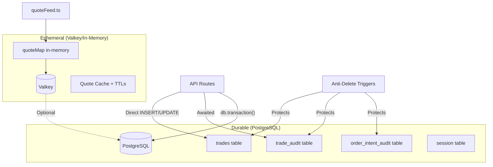
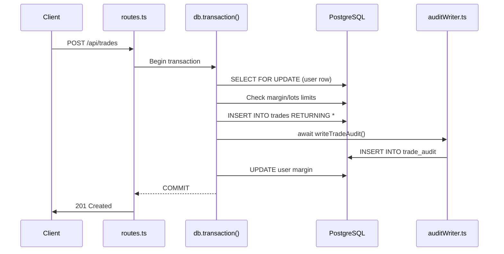

# Database System Deep Audit Report

**Project:** TD.2.ANTIGRAVITY  
**Date:** Comprehensive persistence and data integrity audit  
**Scope:** Trade data retention, Valkey→PostgreSQL flow, unauthorized deletion prevention, audit trail integrity

---

## Executive Summary

| Area | Risk Level | Status |
|------|------------|--------|
| Trade Persistence | 🟢 LOW | Synchronous to PostgreSQL with transactions |
| Deletion Prevention | 🟢 LOW | DB triggers + startup verification |
| Audit Trail | 🟢 LOW | Hash-chained, properly awaited |
| Quote Persistence | 🟡 MEDIUM | Intentionally ephemeral (cache) |
| Session Persistence | 🟢 LOW | PostgreSQL-backed by default |
| Error Handling | 🟡 MEDIUM | 1 silent catch found (fingerprint) |

---

## Architecture Overview



---

## Finding 1: Trade Persistence Architecture ✅

**Status:** ROBUST

Trades persist **directly and synchronously** to PostgreSQL. Valkey is NOT in the critical trade path.

### Evidence

From [routes.ts](file:///\\wsl.localhost\Ubuntu\home\bcodex\TD.2.ANTIGRAVITY\server\routes.ts#L3121-3180):
- Trade creation uses `db.transaction()` with `FOR UPDATE` row locks
- All INSERT operations use `.returning()` to confirm write success
- Transaction includes margin reservation atomically

From [autoClose.ts](file:///\\wsl.localhost\Ubuntu\home\bcodex\TD.2.ANTIGRAVITY\server\cron\autoClose.ts#L110-208):
- Auto-close uses `FOR UPDATE` locks on both trade and user rows
- `writeTradeAudit()` is **awaited inside the transaction**
- Balance/margin updates are atomic within same transaction

### Trade Flow



---

## Finding 2: Anti-Deletion Protection ✅

**Status:** EXCELLENT

### Database-Level Triggers

From [0010_trade_delete_guards.sql](file:///\\wsl.localhost\Ubuntu\home\bcodex\TD.2.ANTIGRAVITY\db\migrations\0010_trade_delete_guards.sql):

6 triggers protect critical tables:
| Trigger | Table | Operation |
|---------|-------|-----------|
| `tradequip_no_delete_trades` | trades | DELETE |
| `tradequip_no_truncate_trades` | trades | TRUNCATE |
| `tradequip_no_delete_trade_audit` | trade_audit | DELETE |
| `tradequip_no_truncate_trade_audit` | trade_audit | TRUNCATE |
| `tradequip_no_delete_order_intent_audit` | order_intent_audit | DELETE |
| `tradequip_no_truncate_order_intent_audit` | order_intent_audit | TRUNCATE |

Operations fail unless `SET tradequip.allow_destructive = '1'` is explicitly set.

### Startup Verification

From [index.ts](file:///\\wsl.localhost\Ubuntu\home\bcodex\TD.2.ANTIGRAVITY\server\index.ts#L20-64):

```typescript
const REQUIRED_TRADE_GUARD_TRIGGERS = [
  "tradequip_no_delete_trades",
  "tradequip_no_truncate_trades",
  // ... all 6 triggers
];

async function assertTradeLedgerGuardrails() {
  // Queries pg_trigger, verifies all exist and are enabled
  // process.exit(1) if any missing or disabled
}
```

> [!IMPORTANT]
> Server **refuses to start** if any guard trigger is missing or disabled.

### Seed Script Safeguards

From [db/seed.ts](file:///\\wsl.localhost\Ubuntu\home\bcodex\TD.2.ANTIGRAVITY\db\seed.ts):
- Requires `SEED_RESET_TRADES=1` + `SEED_RESET_TRADES_CONFIRM=1`
- Refuses in production (`NODE_ENV=production`)
- Refuses on non-localhost without `SEED_DESTRUCTIVE_NONLOCAL_OK=1`
- Writes audit entry **before** any deletion with row counts

---

## Finding 3: Audit Trail Integrity ✅

**Status:** ROBUST

### Hash-Chain Implementation

From [auditWriter.ts](file:///\\wsl.localhost\Ubuntu\home\bcodex\TD.2.ANTIGRAVITY\server\lib\auditWriter.ts):

- Each audit record includes `prevHash` (previous record's hash)
- Uses SHA-256 for tamper evidence
- `verifyTradeAuditChain()` function available
- Supports both trade and order intent audit trails

### Proper `await` Usage

| Location | Function | Status |
|----------|----------|--------|
| routes.ts line 3252 | `writeTradeAudit` (ORDER_PLACED) | ✅ Awaited |
| routes.ts line 3291 | `writeTradeAudit` (ORDER_FILLED) | ✅ Awaited |
| routes.ts line 3542 | `writeTradeAudit` (CLOSE_REJECTED) | ✅ Awaited |
| autoClose.ts line 166 | `writeTradeAudit` (inside tx) | ✅ Awaited |

---

## Finding 4: Quote Persistence (Ephemeral by Design) ℹ️

**Status:** AS DESIGNED

Quotes are **intentionally ephemeral** - they are market data for display/execution, not business records.

### Persistence Hierarchy

1. **In-Memory** (`quoteMap`): Primary source, fastest access
2. **Valkey**: Snapshot cache with TTLs (30-60s)
3. **PostgreSQL** (optional): Only if `QUOTE_DB_WRITE_MODE` enabled

### Recovery on Restart

From [quoteFeed.ts](file:///\\wsl.localhost\Ubuntu\home\bcodex\TD.2.ANTIGRAVITY\server\feeds\quoteFeed.ts#L206-263):

```typescript
async function bootstrapQuoteSnapshotCacheFromPersistence(symbols) {
  // 1. Try Valkey snapshot
  // 2. Fallback: Valkey per-symbol keys
  // 3. Last resort: DB quotes table
}
```

> [!NOTE]
> Quote loss on restart is acceptable - fresh quotes are fetched immediately from upstream providers.

---

## Finding 5: Session Persistence ✅

**Status:** GOOD

From [sessionStore.ts](file:///\\wsl.localhost\Ubuntu\home\bcodex\TD.2.ANTIGRAVITY\server\services\sessionStore.ts):

- Defaults to PostgreSQL (`connect-pg-simple`)
- Optionally configurable to Valkey via `SESSION_STORE=valkey`
- Auto-creates table if missing
- Prunes stale sessions every 15 minutes

> [!TIP]
> PostgreSQL-backed sessions survive server restarts by default.

---

## Finding 6: Error Handling Audit ⚠️

### Silent Catch Found

From [storage.ts](file:///\\wsl.localhost\Ubuntu\home\bcodex\TD.2.ANTIGRAVITY\server\storage.ts#L143-150):

```typescript
try {
  // Insert fingerprint record
  await db.insert(fingerprints).values({ ... });
} catch (err) {
  console.error("[FP] Failed to persist fingerprint:", err);
  // SILENT: User creation continues
}
```

**Impact:** LOW - This is a secondary enrichment feature, not critical trade data. User creation correctly succeeds.

### Other Error Paths

| Location | Behavior | Risk |
|----------|----------|------|
| routes.ts trade creation | Transaction rollback on error | ✅ Safe |
| autoClose.ts per-trade | Logs and continues to next | ✅ Safe |
| quoteFeed.ts WS errors | Logged, fallback to REST | ✅ Safe |

---

## Bug Hunting Checklist Results

| Check | Status | Notes |
|-------|--------|-------|
| Unhandled Promise rejections | ✅ | All critical `writeTradeAudit` calls awaited |
| Race conditions on lots/margin | ✅ | `FOR UPDATE` locks prevent TOC/TOU |
| Transaction boundary violations | ✅ | Audit writes inside same tx |
| Fire-and-forget writes | ✅ | Not found in trade paths |
| DELETE without guards | ✅ | Triggers block at DB level |
| Silent error swallowing | ⚠️ | 1 found (fingerprint, low risk) |

---

## Recommendations

### High Priority
None - architecture is sound.

### Medium Priority

1. **Fingerprint Error**: Consider failing user creation if fingerprint storage fails (behavioral change, discuss with team)

2. **Add Audit Verification Cron**: Run `verifyTradeAuditChain()` periodically to detect tampering

### Low Priority

3. **Quote Persistence**: If regulatory compliance requires quote snapshots, enable `QUOTE_DB_WRITE_MODE=batch`

---

## Conclusion

The database system demonstrates **institutional-grade** trade persistence:

- ✅ Trades go directly to PostgreSQL in transactions
- ✅ Anti-deletion triggers verified at every startup
- ✅ Hash-chained audit trail with proper awaits
- ✅ Session persistence to PostgreSQL by default
- ℹ️ Quote caching is ephemeral by design (correct for market data)

No critical data loss bugs were found. The system correctly separates durable trade records from ephemeral market data caches.
